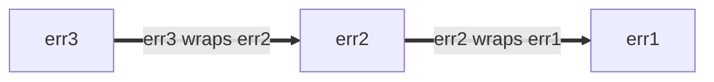

<!--* toc_depth: 3 *-->

# Go 語言風格最佳實踐

https://google.github.io/styleguide/go/best-practices (英文版)

[概覽](index) | [指南](guide) | [決策](decisions) |
[最佳實踐](best-practices)

**注意：** 這是一系列文件的一部分，概述了 Google 的 [Go 風格](index)。本文件**既不是 [規範性的](index#normative) 也不是 [權威性的](index#canonical)**，它是 [核心風格指南](guide) 的輔助文件。更多信息請參見 [概述](index#about)。

<a id="about"></a>

## 關於

本文件記錄了**如何最佳應用 Go 風格指南的指導**。這些建議旨在針對經常出現的常見情況，但可能不適用於每一種情況。在可能的情況下，討論了多種替代方法以及決定何時以及何時不應用它們的考量。

查看 [概述](index#about) 以獲得完整的風格指南文件集。

<a id="naming"></a>

## 命名

<a id="function-names"></a>

### 函數和方法名稱

<a id="function-name-repetition"></a>

#### 避免重複

在為函數或方法選擇名稱時，請考慮名稱將在何種上下文中被讀取。考慮以下建議，以避免在調用地點過度[重複](decisions#repetition)：

- 以下通常可以從函數和方法名稱中省略：

  - 輸入和輸出的類型（當沒有衝突時）
  - 方法接收者的類型
  - 輸入或輸出是否為指針

- 對於函數，不要[重複包的名稱](decisions#repetitive-with-package)。

  ```go
  // 不佳：
  package yamlconfig

  func ParseYAMLConfig(input string) (*Config, error)
  ```

  ```go
  // 較佳：
  package yamlconfig

  func Parse(input string) (*Config, error)
  ```

- 對於方法，不要重複方法接收者的名稱。

  ```go
  // 不佳：
  func (c *Config) WriteConfigTo(w io.Writer) (int64, error)
  ```

  ```go
  // 較佳：
  func (c *Config) WriteTo(w io.Writer) (int64, error)
  ```

- 不要重複作為參數傳遞的變量名稱。

  ```go
  // 不佳：
  func OverrideFirstWithSecond(dest, source *Config) error
  ```

  ```go
  // 較佳：
  func Override(dest, source *Config) error
  ```

- 不要重複返回值的名稱和類型。

  ```go
  // 不佳：
  func TransformYAMLToJSON(input *Config) *jsonconfig.Config
  ```

  ```go
  // 較佳：
  func Transform(input *Config) *jsonconfig.Config
  ```

當需要區分同名的函數時，可以包含額外的信息。

```go
// 較佳：
func (c *Config) WriteTextTo(w io.Writer) (int64, error)
func (c *Config) WriteBinaryTo(w io.Writer) (int64, error)
```

<a id="function-name-conventions"></a>

#### 命名慣例 Naming conventions

在為函數和方法選擇名稱時，有一些其他常見的慣例：

- 返回某物的函數給予類似名詞的名稱。

  ```go
  // 較佳：
  func (c *Config) JobName(key string) (value string, ok bool)
  ```

  這的推論是函數和方法名稱應該[避免使用前綴 `Get`](decisions#getters)。

  ```go
  // 不佳：
  func (c *Config) GetJobName(key string) (value string, ok bool)
  ```

- 做某事的函數給予類似動詞的名稱。

  ```go
  // 較佳：
  func (c *Config) WriteDetail(w io.Writer) (int64, error)
  ```

- 僅由涉及的類型不同的相同函數，在名稱的末尾包含類型名稱。

  ```go
  // 較佳：
  func ParseInt(input string) (int, error)
  func ParseInt64(input string) (int64, error)
  func AppendInt(buf []byte, value int) []byte
  func AppendInt64(buf []byte, value int64) []byte
  ```

  如果有一個明確的“主要”版本，可以從該版本的名稱中省略類型：

  ```go
  // 較佳：
  func (c *Config) Marshal() ([]byte, error)
  func (c *Config) MarshalText() (string, error)
  ```

<a id="naming-doubles"></a>

### 測試雙套件和類型 Test double packages and types

在為提供測試輔助工具，特別是[測試雙元件]的包和類型命名時，您可以應用幾種紀律。測試雙元件可以是存根（stub）、假物件（fake）、模擬物件（mock）或間諜（spy）。

這些例子大多使用存根。如果您的代碼使用假物件或其他類型的測試雙元件，請相應更新您的名稱。

[命名]: guide#naming
[測試雙元件]: https://abseil.io/resources/swe-book/html/ch13.html#basic_concepts

假設您有一個專注的包，提供類似於以下的生產代碼：

```go
package creditcard

import (
    "errors"

    "path/to/money"
)

// ErrDeclined indicates that the issuer declines the charge.
var ErrDeclined = errors.New("creditcard: declined")

// Card contains information about a credit card, such as its issuer,
// expiration, and limit.
type Card struct {
    // omitted
}

// Service allows you to perform operations with credit cards against external
// payment processor vendors like charge, authorize, reimburse, and subscribe.
type Service struct {
    // omitted
}

func (s *Service) Charge(c *Card, amount money.Money) error { /* omitted */ }
```

<a id="naming-doubles-helper-package"></a>

#### 創建測試輔助套件 Creating test helper packages

假設您想創建一個包含另一個包的測試雙元件的包。我們將使用上面的 `package creditcard` 作為這個例子：

一種方法是基於生產包為測試引入一個新的 Go 包。一個安全的選擇是將單詞 `test` 附加到原始包名（"creditcard" + "test"）：

```go
// 較佳：
package creditcardtest
```

除非另有明確說明，下面各節的所有示例都在 `package creditcardtest` 中。

<a id="naming-doubles-simple"></a>

#### 簡單情況 Simple case

您想為 `Service` 添加一組測試雙元件。因為 `Card` 實際上是一種簡單的數據類型，類似於協議緩衝消息，所以在測試中不需要特殊處理，因此不需要雙元件。如果您預計只有一種類型（如 `Service`）的測試雙元件，您可以採取簡潔的命名方法：

```go
// 較佳：
import (
    "path/to/creditcard"
    "path/to/money"
)

// Stub stubs creditcard.Service and provides no behavior of its own.
type Stub struct{}

func (Stub) Charge(*creditcard.Card, money.Money) error { return nil }
```

這絕對比像 `StubService` 或非 ��� 差的 `StubCreditCardService` 這樣的命名選擇更好，因為基礎包名和其領域類型暗示了 `creditcardtest.Stub` 是什麼。

最後，如果包是用 Bazel 構建的，請確保新的 `go_library` 規則標記為 `testonly`：

```build
# 較佳：
go_library(
    name = "creditcardtest",
    srcs = ["creditcardtest.go"],
    deps = [
        ":creditcard",
        ":money",
    ],
    testonly = True,
)
```

上述方法是常規的，其他工程師將會相當理解。

另見：

- [Go 提示 #42：編寫用於測試的存根](https://google.github.io/styleguide/go/index.html#gotip)

#### 多種測試雙元件行為 Multiple test double behaviors

當一種存根不夠時（例如，您還需要一個總是失敗的），我們建議根據它們模擬的行為命名存根。在這裡，我們將 `Stub` 重命名為 `AlwaysCharges`，並引入一個名為 `AlwaysDeclines` 的新存根：

```go
// 較佳：
// AlwaysCharges stubs creditcard.Service and simulates success.
type AlwaysCharges struct{}

func (AlwaysCharges) Charge(*creditcard.Card, money.Money) error { return nil }

// AlwaysDeclines stubs creditcard.Service and simulates declined charges.
type AlwaysDeclines struct{}

func (AlwaysDeclines) Charge(*creditcard.Card, money.Money) error {
    return creditcard.ErrDeclined
}
```

<a id="naming-doubles-multiple-types"></a>

#### 多種類型的多個雙元件 Multiple doubles for multiple types

But now suppose that `package creditcard` contains multiple types worth creating
doubles for, as seen below with `Service` and `StoredValue`:

但現在假設 `package creditcard` 包含多個值得創建雙元件的類型，如下所示的 `Service` 和 `StoredValue`：

```go
package creditcard

type Service struct {
    // omitted
}

type Card struct {
    // omitted
}

// StoredValue manages customer credit balances.  This applies when returned
// merchandise is credited to a customer's local account instead of processed
// by the credit issuer.  For this reason, it is implemented as a separate
// service.
type StoredValue struct {
    // omitted
}

func (s *StoredValue) Credit(c *Card, amount money.Money) error { /* omitted */ }
```

在這種情況下，更明確的測試雙元件命名是合理的：

```go
// 較佳：
type StubService struct{}

func (StubService) Charge(*creditcard.Card, money.Money) error { return nil }

type StubStoredValue struct{}

func (StubStoredValue) Credit(*creditcard.Card, money.Money) error { return nil }
```

<a id="naming-doubles-local-variables"></a>

#### 測試中的局部變量 Local variables in tests

當您的測試中的變量指向雙元件時，選擇一個名稱，根據上下文最清楚地區分雙元件和其他生產類型。考慮一些您想要測試的生產代碼：

```go
package payment

import (
    "path/to/creditcard"
    "path/to/money"
)

type CreditCard interface {
    Charge(*creditcard.Card, money.Money) error
}

type Processor struct {
    CC CreditCard
}

var ErrBadInstrument = errors.New("payment: instrument is invalid or expired")

func (p *Processor) Process(c *creditcard.Card, amount money.Money) error {
    if c.Expired() {
        return ErrBadInstrument
    }
    return p.CC.Charge(c, amount)
}
```

在測試中，一個稱為 "spy" 的 `CreditCard` 測試雙元件與生產類型並置，因此在名稱前加上前綴可能會提高清晰度：

```go
// 較佳：
package payment

import "path/to/creditcardtest"

func TestProcessor(t *testing.T) {
    var spyCC creditcardtest.Spy

    proc := &Processor{CC: spyCC}

    // declarations omitted: card and amount
    if err := proc.Process(card, amount); err != nil {
        t.Errorf("proc.Process(card, amount) = %v, want %v", got, want)
    }

    charges := []creditcardtest.Charge{
        {Card: card, Amount: amount},
    }

    if got, want := spyCC.Charges, charges; !cmp.Equal(got, want) {
        t.Errorf("spyCC.Charges = %v, want %v", got, want)
    }
}
```

這比名稱沒有前綴時更清晰。

```go
// 不佳：
package payment

import "path/to/creditcardtest"

func TestProcessor(t *testing.T) {
    var cc creditcardtest.Spy

    proc := &Processor{CC: cc}

    // declarations omitted: card and amount
    if err := proc.Process(card, amount); err != nil {
        t.Errorf("proc.Process(card, amount) = %v, want %v", got, want)
    }

    charges := []creditcardtest.Charge{
        {Card: card, Amount: amount},
    }

    if got, want := cc.Charges, charges; !cmp.Equal(got, want) {
        t.Errorf("cc.Charges = %v, want %v", got, want)
    }
}
```

<a id="shadowing"></a>

### 變數遮蔽 Shadowing

**注意：** 本解釋使用了兩個非正式術語，_踩踏_ 和 _遮蔽_。它們不是 Go 語言規範中的官方概念。

像許多編程語言一樣，Go 擁有可變變量：對變量進行賦值會改變其值。

```go
// 較佳：
func abs(i int) int {
    if i < 0 {
        i *= -1
    }
    return i
}
```

當使用 [短變量聲明] 與 `:=` 運算符時，在某些情況下不會創建新變量。我們可以稱這為*踩踏*。當原始值不再需要時，這樣做是可以的。

```go
// 較佳：
// innerHandler is a helper for some request handler, which itself issues
// requests to other backends.
func (s *Server) innerHandler(ctx context.Context, req *pb.MyRequest) *pb.MyResponse {
    // Unconditionally cap the deadline for this part of request handling.
    ctx, cancel := context.WithTimeout(ctx, 3*time.Second)
    defer cancel()
    ctxlog.Info(ctx, "Capped deadline in inner request")

    // Code here no longer has access to the original context.
    // This is good style if when first writing this, you anticipate
    // that even as the code grows, no operation legitimately should
    // use the (possibly unbounded) original context that the caller provided.

    // ...
}
```

不過，在新的作用域中使用短變量聲明要小心：這會引入一個新變量。我們可以稱這為*遮蔽*原始變量。塊結束後的代碼指的是原始變量。這是一個錯誤的嘗試，有條件地縮短截止日期：

```go
// 不佳：
func (s *Server) innerHandler(ctx context.Context, req *pb.MyRequest) *pb.MyResponse {
    // Attempt to conditionally cap the deadline.
    if *shortenDeadlines {
        ctx, cancel := context.WithTimeout(ctx, 3*time.Second)
        defer cancel()
        ctxlog.Info(ctx, "Capped deadline in inner request")
    }

    // BUG: "ctx" here again means the context that the caller provided.
    // The above buggy code compiled because both ctx and cancel
    // were used inside the if statement.

    // ...
}
```

一個正確版本的代碼可能是：

```go
// 較佳：
func (s *Server) innerHandler(ctx context.Context, req *pb.MyRequest) *pb.MyResponse {
    if *shortenDeadlines {
        var cancel func()
        // Note the use of simple assignment, = and not :=.
        ctx, cancel = context.WithTimeout(ctx, 3*time.Second)
        defer cancel()
        ctxlog.Info(ctx, "Capped deadline in inner request")
    }
    // ...
}
```

在我們稱為踩踏的情況下，因為沒有新變量，所賦予的類型必須與原始變量的類型匹配。有了遮蔽，就引入了一個全新的實體，所以它可以有不同的類型。故意的遮蔽可以是一種有用的做法，但如果使用新名稱可以提高[清晰度](guide#clarity)，那麼您總是可以使用新名稱。

在非常小的作用域之外使用與標準包同名的變量並不是一個好主意，因為這會使該包中的自由函數和值無法訪問。相反地，當為您的包選擇名稱時，避免使用可能需要[導入重命名](decisions#import-renaming)或在客戶端導致遮蔽其他好的變量名稱的名稱。

```go
// 不佳：
func LongFunction() {
    url := "https://example.com/"
    // Oops, now we can't use net/url in code below.
}
```

[短變量聲明]: https://go.dev/ref/spec#Short_variable_declarations

<a id="util-packages"></a>

### Util 套件

Go 的套件有一個在 `package` 聲明上指定的名稱，與導入路徑分開。對於可讀性來說，套件名稱比路徑更重要。

Go 套件名稱應該[與套件提供的內容相關](decisions#package-names)。僅將一個套件命名為 `util`、`helper`、`common` 或類似的通常是一個糟糕的選擇（雖然可以用作名稱的*一部分*）。不具信息性的名稱使代碼更難閱讀，如果使用得太廣泛，它們可能會導致不必要的[導入衝突](decisions#import-renaming)。

相反，考慮調用點將會看起來像什麼。

```go
// 較佳：
db := spannertest.NewDatabaseFromFile(...)

_, err := f.Seek(0, io.SeekStart)

b := elliptic.Marshal(curve, x, y)
```

您甚至可以在不知道導入列表（`cloud.google.com/go/spanner/spannertest`、`io` 和 `crypto/elliptic`）的情況下大致知道這些各自做什麼。如果使用不夠專注的名稱，這些可能會讀作：

```go
// 不佳：
db := test.NewDatabaseFromFile(...)

_, err := f.Seek(0, common.SeekStart)

b := helper.Marshal(curve, x, y)
```

<a id="package-size"></a>

## 套件大小

如果您在問自己 Go 套件應該有多大，以及是否應該將相關類型放在同一個套件中或將它們分成不同的套件，一個好的起點是 [Go 博客文章關於套件名稱][blog-pkg-names]。儘管文章的標題只是關於命名，但它不僅僅是關於命名。它包含了一些有用的提示，並引用了幾篇有用的文章和演講。

這裡還有一些其他的考慮和筆記。

用戶可以在一個頁面上看到套件的 [godoc]，並且套件提供的類型所導出的任何方法都按類型分組。Godoc 也將構造函數與它們返回的類型分組。如果*客戶端代碼*可能需要兩個不同類型的值互相交互，對用戶來說，將它們放在同一個套件中可能會比較方便。

套件內的代碼可以訪問套件中未導出的標識符。如果您有一些相關的類型，它們的*實現*緊密耦合，將它們放在同一個套件中可以實現這種耦合，而不用在公共 API 中暴露這些細節。對這種耦合的一個好測試是想像兩個套件的假設用戶，這些套件涵蓋了緊密相關的主題：如果用戶必須導入兩個套件才能以任何有意義的方式使用其中任何一個，那麼將它們合併在一起通常是正確的做法。標準庫通常很好地展示了這種範圍和分層。

儘管如此，將整個項目放在一個套件中可能會使該套件過大。當某些東西在概念上是獨立的，給它自己的小套件可以使它更容易使用。套件的短名稱與客戶端所知的導出類型名稱一起工作，形成一個有意義的標識符：例如 `bytes.Buffer`、`ring.New`。[博客文章][blog-pkg-names]有更多例子。

Go 風格對文件大小很靈活，因為維護者可以在套件內將代碼從一個文件移動到另一個文件，而不影響調用者。但作為一般指導原則：通常不是一個好主意在一個文件中有數千行代碼，或者有許多微小的文件。與其他一些語言不同，沒有“一種類型，一個文件”的慣例。作為一個經驗法則，文件應該足夠專注，以至於維護者可以告訴文件中包含了什麼，並且文件應該足夠小，以便一旦到達那裡就容易找到。標準庫經常將大型套件分割為幾個源文件，按文件分組相關代碼。[套件 `bytes`] 的源代碼是一個很好的例子。具有長套件文檔的套件可能會選擇專門用一個名為 `doc.go` 的文件，其中包含[套件文檔](decisions#package-comments)、一個套件聲明，以及其他什麼都沒有，但這不是必需的。

在 Google 代碼庫和使用 Bazel 的項目中，Go 代碼的目錄布局與開源 Go 項目中的不同：您可以在單個目錄中有多個 `go_library` 目標。給每個套件自己的目錄的一個好理由是，如果您期望將來開源您的項目。

另見：

- [測試雙元件套件](#naming-doubles)

[blog-pkg-names]: https://go.dev/blog/package-names
[套件 `bytes`]: https://go.dev/src/bytes/
[godoc]: https://pkg.go.dev/

<a id="imports"></a>

## 引入 Imports

<a id="import-protos"></a>

### Protos and stubs

由於其跨語言特性，Proto 庫的引入與標準 Go 引入的處理方式不同。重新命名 proto 引入的慣例基於生成該套件的規則：

- 一般情況下，`go_proto_library` 規則使用 `pb` 後綴。
- 一般情況下，`go_grpc_library` 規則使用 `grpc` 後綴。

通常使用短的一個或兩個字母的前綴：

```go
// 較佳：
import (
    fspb "path/to/package/foo_service_go_proto"
    fsgrpc "path/to/package/foo_service_go_grpc"
)
```

如果一個套件只使用了一個 proto 或該套件與該 proto 緊密相關，則可以省略前綴：

如果 proto 中的符號是通用的或不是非常自描述的，或者如果使用縮寫縮短套件名稱不清晰，一個短詞可以作為前綴：

```go
// 較佳：
import (
    mapspb "path/to/package/maps_go_proto"
)
```

在這種情況下，如果相關代碼並不已經明確與地圖相關，`mapspb.Address` 可能比 `mpb.Address` 更清晰。

<a id="import-order"></a>

### 引入順序 Import ordering

引入通常按以下兩個（或更多）塊的順序分組：

1.  標準庫引入（例如，`"fmt"`）
1.  專案引入（例如，`"/path/to/somelib"`）
1.  （可選）Protobuf 引入（例如，`fpb "path/to/foo_go_proto"`）
1.  （可選）副作用引入（例如，`_ "path/to/package"`）

如果一個文件沒有上述可選類別中的一個分組，相關的引入將包含在專案引入組中。

任何清晰且易於理解的引入分組通常都是可以的。例如，一個團隊可能選擇將 gRPC 引入與 protobuf 引入分開。

> **注意：** 對於只維護兩個強制分組的代碼（一組用於標準庫，另一組用於所有其他引入），`goimports` 工具產生的輸出與此指導相符。
>
> 然而，`goimports` 對於強制分組之外的分組沒有認識；使用可選分組時，這些分組容易被該工具使無效。當使用可選分組時，作者和審查者都需要注意，以確保分組保持合規。
>
> 兩種方法都可以，但不要讓引入部分處於不一致、部分分組的狀態。

<a id="error-handling"></a>

## 錯誤處理 Error handling

在 Go 中，[錯誤是值]；它們由代碼創建並由代碼消費。錯誤可以是：

- 轉換為顯示給人看的診斷信息
- 由維護者使用
- 被終端用戶解釋

錯誤消息還會出現在包括日誌消息、錯誤轉儲和渲染的 UI 等不同的表面上。

處理（產生或消費）錯誤的代碼應該要有意識地進行。忽略或盲目傳播錯誤返回值可能很誘人。然而，總是值得考慮當前調用棧中的函數是否處於最有效處理錯誤的位置。這是一個大話題，很難給出類別性的建議。使用您的判斷，但請記住以下考慮：

- 創建錯誤值時，決定是否給它任何[結構](#error-structure)。
- 處理錯誤時，考慮[添加信息](#error-extra-info)，您擁有但調用者和/或被調用者可能沒有的信息。
- 另見有關[錯誤日誌記錄](#error-logging)的指南。

雖然通常不適合忽略錯誤，但在協調相關操作時，通常只有第一個錯誤是有用的，這是一個合理的例外。[`errgroup`] 套件為可以作為一組失敗或取消的一組操作提供了方便的抽象。

[錯誤是值]: https://go.dev/blog/errors-are-values
[`errgroup`]: https://pkg.go.dev/golang.org/x/sync/errgroup

另見：

- [Effective Go on errors](https://go.dev/doc/effective_go#errors)
- [A post by the Go Blog on errors](https://go.dev/blog/go1.13-errors)
- [Package `errors`](https://pkg.go.dev/errors)
- [Package `upspin.io/errors`](https://commandcenter.blogspot.com/2017/12/error-handling-in-upspin.html)
- [GoTip #89: When to Use Canonical Status Codes as Errors](https://google.github.io/styleguide/go/index.html#gotip)
- [GoTip #48: Error Sentinel Values](https://google.github.io/styleguide/go/index.html#gotip)
- [GoTip #13: Designing Errors for Checking](https://google.github.io/styleguide/go/index.html#gotip)

<a id="error-structure"></a>

### Error structure

如果呼叫者需要檢查錯誤（例如，區分不同的錯誤情況），請給予錯誤值結構，以便可以通過程式方式完成，而不是讓呼叫者進行字串匹配。這個建議適用於生產代碼以及關心不同錯誤情況的測試。

最簡單的結構化錯誤是無參數的全域值。

```go
type Animal string

var (
    // ErrDuplicate occurs if this animal has already been seen.
    ErrDuplicate = errors.New("duplicate")

    // ErrMarsupial occurs because we're allergic to marsupials outside Australia.
    // Sorry.
    ErrMarsupial = errors.New("marsupials are not supported")
)

func process(animal Animal) error {
    switch {
    case seen[animal]:
        return ErrDuplicate
    case marsupial(animal):
        return ErrMarsupial
    }
    seen[animal] = true
    // ...
    return nil
}
```

呼叫者可以簡單地將函數返回的錯誤值與已知的錯誤值之一進行比較：

```go
// 較佳：
func handlePet(...) {
    switch err := process(an); err {
    case ErrDuplicate:
        return fmt.Errorf("feed %q: %v", an, err)
    case ErrMarsupial:
        // Try to recover with a friend instead.
        alternate = an.BackupAnimal()
        return handlePet(..., alternate, ...)
    }
}
```

上述方法使用了哨兵值，其中錯誤必須等於（在 `==` 的意義上）預期值。在許多情況下，這是完全足夠的。如果 `process` 返回包裝錯誤（如下所述），您可以使用 [`errors.Is`]。

```go
// 較佳：
func handlePet(...) {
    switch err := process(an); {
    case errors.Is(err, ErrDuplicate):
        return fmt.Errorf("feed %q: %v", an, err)
    case errors.Is(err, ErrMarsupial):
        // ...
    }
}
```

Do not attempt to distinguish errors based on their string form. (See
[Go Tip #13: Designing Errors for Checking](https://google.github.io/styleguide/go/index.html#gotip)
for more.)

```go
// 不佳：
func handlePet(...) {
    err := process(an)
    if regexp.MatchString(`duplicate`, err.Error()) {...}
    if regexp.MatchString(`marsupial`, err.Error()) {...}
}
```

如果錯誤中有呼叫者需要以程式方式處理的額外資訊，理想情況下應以結構化方式呈現。例如，[`os.PathError`] 類型的文件說明將失敗操作的路徑名放在結構體欄位中，呼叫者可以輕鬆訪問。

其他錯誤結構可以根據需要使用，例如包含錯誤代碼和詳細字串的專案結構體。[`status` 套件][status] 是一種常見的封裝方式；如果選擇這種方法（您並不必須這樣做），請使用[標準代碼]。請參閱 [Go Tip #89: When to Use Canonical Status Codes as Errors](https://google.github.io/styleguide/go/index.html#gotip) 以了解是否應使用狀態代碼。

[`os.PathError`]: https://pkg.go.dev/os#PathError
[`errors.Is`]: https://pkg.go.dev/errors#Is
[`errors.As`]: https://pkg.go.dev/errors#As
[`package cmp`]: https://pkg.go.dev/github.com/google/go-cmp/cmp
[status]: https://pkg.go.dev/google.golang.org/grpc/status
[canonical codes]: https://pkg.go.dev/google.golang.org/grpc/codes

<a id="error-extra-info"></a>

### 為錯誤添加資訊

任何返回錯誤的函數都應該努力使錯誤值變得有用。通常，該函數位於調用鏈的中間，只是傳播它所調用的其他函數（可能甚至是來自另一個包）的錯誤。在這種情況下，有機會用額外的信息來註釋錯誤，但程序員應確保錯誤中有足夠的信息，而不添加重複或無關的細節。如果不確定，請嘗試在開發過程中觸發錯誤條件：這是一種評估錯誤觀察者（無論是人類還是代碼）最終會得到什麼的好方法。

約定和良好的文檔有助於此。例如，標準包 `os` 宣傳其錯誤在可用時包含路徑信息。這是一種有用的風格，因為調用者在返回錯誤時不需要用他們已經提供給失敗函數的訊息來註釋它。

```go
// 較佳：
if err := os.Open("settings.txt"); err != nil {
    return err
}

// Output:
//
// open settings.txt: no such file or directory
```

如果有關於錯誤的*意義*有什麼有趣的事情要說，當然可以添加。只需考慮哪個呼叫鏈的層級最適合理解這個意義。

```go
// 較佳：
if err := os.Open("settings.txt"); err != nil {
    // 我們傳達這個錯誤對我們的重要性。請注意，目前的函數可能會執行多個可能失敗的文件操作，
    // 因此這些註釋也可以用來向呼叫者澄清到底出了什麼問題。
    return fmt.Errorf("啟動代碼不可用: %v", err)
}

// 輸出:
//
// 啟動代碼不可用: open settings.txt: no such file or directory
```

對比這裡的冗餘信息：

```go
// 不佳：
if err := os.Open("settings.txt"); err != nil {
    return fmt.Errorf("無法打開 settings.txt: %w", err)
}

// 輸出:
//
// 無法打開 settings.txt: open settings.txt: no such file or directory
```

當向傳播的錯誤添加信息時，你可以選擇包裝錯誤或呈現一個新的錯誤。使用 `fmt.Errorf` 中的 `%w` 來包裝錯誤允許呼叫者訪問原始錯誤的數據。這在某些時候非常有用，但在其他情況下，這些細節對呼叫者來說可能是誤導或不感興趣的。請參閱[錯誤包裝的博客文章](https://blog.golang.org/go1.13-errors)以獲取更多信息。包裝錯誤還會以不明顯的方式擴展你的包的 API 表面，如果你更改包的實現細節，這可能會導致破壞。

除非你也記錄（並有測試驗證）你暴露的底層錯誤，否則最好避免使用 `%w`。如果你不期望你的呼叫者調用 `errors.Unwrap`、`errors.Is` 等等，那麼就不要使用 `%w`。

同樣的概念適用於[結構化錯誤](#error-structure)如 [`*status.Status`][status]（請參閱[標準代碼]）。例如，如果你的服務器向後端發送格式錯誤的請求並收到 `InvalidArgument` 代碼，假設客戶端沒有做錯任何事情，這個代碼不應該傳播給客戶端。相反，應該向客戶端返回一個 `Internal` 標準代碼。

然而，註釋錯誤有助於自動化日誌系統保留錯誤的狀態負載。例如，在內部函數中註釋錯誤是合適的：

```go
// 較佳：
func (s *Server) internalFunction(ctx context.Context) error {
    // ...
    if err != nil {
        return fmt.Errorf("無法找到遠程文件: %w", err)
    }
}
```

直接在系統邊界（通常是 RPC、IPC、存儲等）處的代碼應使用標準錯誤空間報告錯誤。這裡的代碼有責任處理特定領域的錯誤並以標準方式表示它們。例如：

```go
// 不佳：
func (*FortuneTeller) SuggestFortune(context.Context, *pb.SuggestionRequest) (*pb.SuggestionResponse, error) {
    // ...
    if err != nil {
        return nil, fmt.Errorf("無法找到遠程文件: %w", err)
    }
}
```

```go
// 較佳：
import (
    "google.golang.org/grpc/codes"
    "google.golang.org/grpc/status"
)
func (*FortuneTeller) SuggestFortune(context.Context, *pb.SuggestionRequest) (*pb.SuggestionResponse, error) {
    // ...
    if err != nil {
        // 或者使用 fmt.Errorf 和 %w 動詞，如果故意包裝一個呼叫者應該解包的錯誤。
        return nil, status.Errorf(codes.Internal, "無法找到財富數據庫", status.ErrInternal)
    }
}
```

另請參閱：

- [錯誤文檔約定](#documentation-conventions-errors)

<a id="error-percent-w"></a>

### %w 在錯誤中的位置

建議將 `%w` 放在錯誤字串的末尾。

錯誤可以使用 [`%w` 動詞](https://blog.golang.org/go1.13-errors) 包裝，或將它們放在實作 `Unwrap() error` 的[結構化錯誤](https://google.github.io/styleguide/go/index.html#gotip)中（例如：[`fs.PathError`](https://pkg.go.dev/io/fs#PathError)）。

包裝的錯誤會形成錯誤鏈：每一層新的包裝都會在錯誤鏈的前端新增一個新條目。錯誤鏈可以使用 `Unwrap() error` 方法遍歷。例如：

```go
err1 := fmt.Errorf("err1")
err2 := fmt.Errorf("err2: %w", err1)
err3 := fmt.Errorf("err3: %w", err2)
```

這形成了一個如下形式的錯誤鏈，



無論 `%w` 動詞放在哪裡，返回的錯誤總是代表錯誤鏈的前端，而 `%w` 是下一個子錯誤。同樣，`Unwrap() error` 總是從最新的錯誤遍歷到最舊的錯誤。

然而，`%w` 動詞的位置會影響錯誤鏈是按最新到最舊、最舊到最新還是既不是最新到最舊也不是最舊到最新的順序打印：

```go
// 較佳：
err1 := fmt.Errorf("err1")
err2 := fmt.Errorf("err2: %w", err1)
err3 := fmt.Errorf("err3: %w", err2)
fmt.Println(err3) // err3: err2: err1
// err3 是一個從最新到最舊的錯誤鏈，按最新到最舊的順序打印。
```

```go
// 不佳：
err1 := fmt.Errorf("err1")
err2 := fmt.Errorf("%w: err2", err1)
err3 := fmt.Errorf("%w: err3", err2)
fmt.Println(err3) // err1: err2: err3
// err3 是一個從最新到最舊的錯誤鏈，按最舊到最新的順序打印。
```

```go
// 不佳：
err1 := fmt.Errorf("err1")
err2 := fmt.Errorf("err2-1 %w err2-2", err1)
err3 := fmt.Errorf("err3-1 %w err3-2", err2)
fmt.Println(err3) // err3-1 err2-1 err1 err2-2 err3-2
// err3 是一個從最新到最舊的錯誤鏈，既不是按最新到最舊也不是按最舊到最新的順序打印。
```

因此，為了使錯誤文本反映錯誤鏈結構，建議將 `%w` 動詞放在末尾，形式為 `[...]: %w`。

<a id="error-logging"></a>

### 錯誤日誌

函式有時需要告訴外部系統發生了錯誤，但不會將錯誤傳遞給它們的呼叫者。此時記錄日誌是一個明顯的選擇；但要注意你記錄錯誤的內容和方式。

- 就像[好的測試失敗訊息]一樣，日誌訊息應該清楚地表達出問題所在，並透過包含相關資訊來幫助維護者診斷問題。

- 避免重複。如果你返回一個錯誤，通常最好不要自己記錄日誌，而是讓呼叫者處理它。呼叫者可以選擇記錄錯誤，或者使用 [`rate.Sometimes`] 來限制日誌記錄的頻率。其他選項包括嘗試恢復或甚至[停止程式]。無論如何，讓呼叫者控制有助於避免日誌垃圾。

  然而，這種方法的缺點是，任何日誌都是使用呼叫者的行號記錄的。

- 小心處理[個人識別資訊 (PII)]。許多日誌接收端並不適合存放敏感的終端使用者資訊。

- 謹慎使用 `log.Error`。ERROR 等級的日誌會觸發刷新，並且比較低等級的日誌更耗費資源。這可能對你的程式碼造成嚴重的效能影響。在決定使用錯誤等級還是警告等級時，考慮最佳實踐，即錯誤等級的訊息應該是可操作的，而不是比警告更「嚴重」。

- 在 Google 內部，我們有監控系統，可以設置更有效的警報，而不是寫入日誌檔案並希望有人注意到它。這類似但不完全等同於標準函式庫中的 [package `expvar`]。

[好的測試失敗訊息]: https://google.github.io/styleguide/go/decisions#useful-test-failures
[停止程式]: #checks-and-panics
[`rate.Sometimes`]: https://pkg.go.dev/golang.org/x/time/rate#Sometimes
[個人識別資訊 (PII)]: https://en.wikipedia.org/wiki/Personal_data
[package `expvar`]: https://pkg.go.dev/expvar

<a id="vlog"></a>

#### 自訂詳細等級

善用詳細日誌記錄（[`log.V`]）。詳細日誌記錄對於開發和追蹤非常有用。建立一個關於詳細等級的慣例會很有幫助。例如：

- 在 `V(1)` 寫入少量額外資訊
- 在 `V(2)` 追蹤更多資訊
- 在 `V(3)` 傾倒大量內部狀態

為了將詳細日誌記錄的成本降到最低，你應該確保即使在 `log.V` 關閉時也不會意外呼叫昂貴的函式。`log.V` 提供了兩種 API。較方便的一種有可能會導致這種意外的開銷。如果有疑慮，請使用稍微冗長的風格。

```go
// 較佳：
for _, sql := range queries {
  log.V(1).Infof("Handling %v", sql)
  if log.V(2) {
    log.Infof("Handling %v", sql.Explain())
  }
  sql.Run(...)
}
```

````go
// 不佳：
// 即使這個日誌沒有被打印，sql.Explain 也會被呼叫。
log.V(2).Infof("處理 %v", sql.Explain())

[`log.V`]: https://pkg.go.dev/github.com/golang/glog#V

<a id="program-init"></a>

### 程式初始化 (Program initialization)

程式初始化錯誤（例如錯誤的標誌和配置）應該向上傳遞到 `main`，`main` 應該調用 `log.Exit` 並附帶解釋如何修復錯誤的訊息。在這些情況下，一般不應使用 `log.Fatal`，因為指向檢查的堆疊追蹤不太可能像人類生成的可操作訊息那樣有用。

<a id="checks-and-panics"></a>

### 程式檢查和恐慌 (Program checks and panics)

如[反對恐慌的決定]所述，標準錯誤處理應圍繞錯誤返回值進行結構化。庫應該更傾向於向調用者返回錯誤，而不是中止程式，特別是對於臨時錯誤。

有時需要對不變量進行一致性檢查，如果違反則終止程式。一般來說，只有當不變量檢查失敗意味著內部狀態已經無法恢復時才會這樣做。在 Google 代碼庫中，最可靠的方法是調用 `log.Fatal`。在這些情況下使用 `panic` 不可靠，因為延遲函數可能會死鎖或進一步損壞內部或外部狀態。

同樣，抵制恢復恐慌以避免崩潰的誘惑，因為這樣做可能會導致傳播損壞的狀態。離恐慌越遠，你對程式狀態的了解就越少，程式可能持有鎖或其他資源。然後程式可能會出現其他意想不到的故障模式，使問題更難診斷。與其嘗試在代碼中處理意外的恐慌，不如使用監控工具來顯示意外的故障，並優先修復相關的錯誤。

**注意：** 標準的 [`net/http` 服務器] 違反了這個建議，並從請求處理程序中恢復恐慌。經驗豐富的 Go 工程師一致認為這是歷史性的錯誤。如果你從其他語言的應用服務器中抽樣服務器日誌，通常會發現大量未處理的堆棧跟踪。在你的服務器中避免這個陷阱。

[反對恐慌的決定]: https://google.github.io/styleguide/go/decisions#dont-panic
[`net/http` 服務器]: https://pkg.go.dev/net/http#Server

<a id="when-to-panic"></a>

### 何時恐慌 (When to panic)

標準庫在 API 誤用時會恐慌。例如，[`reflect`] 在許多情況下發出恐慌，當值以表明它被誤解的方式訪問時。這類似於核心語言錯誤的恐慌，例如訪問超出範圍的切片元素。代碼審查和測試應該發現這些錯誤，這些錯誤不應出現在生產代碼中。這些恐慌充當不依賴於庫的不變量檢查，因為標準庫無法訪問 Google 代碼庫使用的[分級 `log`] 包。

[`reflect`]: https://pkg.go.dev/reflect
[分級 `log`]: decisions#logging

另一種恐慌可能有用的情況，雖然不常見，是作為包的內部實現細節，總是在調用鏈中有匹配的恢復。解析器和類似的深度嵌套、緊密耦合的內部函數組可以從這種設計中受益，其中管道錯誤返回增加了複雜性而沒有價值。這種設計的關鍵屬性是這些恐慌永遠不允許跨包邊界傳播，並且不構成包的 API 的一部分。這通常通過頂層延遲恢復來實現，將傳播的恐慌轉換為在公共 API 表面返回的錯誤。

當編譯器無法識別不可達代碼時，例如使用不會返回的函數

```go
// 較佳：
func answer(i int) string {
    switch i {
    case 42:
        return "yup"
    case 54:
        return "base 13, huh"
    default:
        log.Fatalf("Sorry, %d is not the answer.", i)
        panic("unreachable")
    }
}
````

[在標誌解析之前不要調用 `log` 函數。](https://pkg.go.dev/github.com/golang/glog#pkg-overview)
如果你必須在 `init` 函數中終止，恐慌（panic）是可以接受的，代替記錄調用。

<a id="documentation"></a>

## Documentation (文件)

<a id="documentation-conventions"></a>

### Conventions (慣例)

本節補充了決策文件的[評論]部分。

以熟悉的風格記錄的 Go 代碼更易於閱讀，也不太可能被誤用，而不是被錯誤記錄或根本沒有記錄的代碼。可運行的[示例]會顯示在 Godoc 和代碼搜索中，是解釋如何使用代碼的絕佳方式。

[examples]: decisions#examples

<a id="documentation-conventions-params"></a>

#### Parameters and configuration (參數和配置)

並非每個參數都必須在文檔中列出。這適用於：

- 函數和方法參數
- 結構字段
- 選項的 API

通過說明它們為什麼有趣來記錄容易出錯或不明顯的字段和參數。

在以下代碼片段中，突出顯示的評論對讀者幾乎沒有用處：

```go
// 不佳：
// Sprintf formats according to a format specifier and returns the resulting
// string.
//
// format is the format, and data is the interpolation data.
func Sprintf(format string, data ...any) string
```

然而，這個片段展示了一個類似於前面的代碼場景，其中評論改為說明一些不明顯或對讀者有實質幫助的內容：

```go
// 較佳：
// Sprintf 根據格式規範進行格式化並返回結果字符串。
//
// 提供的數據用於插值格式字符串。如果數據與預期的格式動詞不匹配或數據量不滿足格式規範，該函數將根據上面描述的格式錯誤部分將格式錯誤警告內聯到輸出字符串中。
func Sprintf(format string, data ...any) string
```

在選擇記錄什麼以及記錄到什麼深度時，請考慮你的可能受眾。維護者、團隊的新成員、外部用戶，甚至是六個月後的你自己，可能會欣賞與你首次編寫文檔時所想的略有不同的信息。

另請參見：

- [GoTip #41: 識別函數調用參數]
- [GoTip #51: 配置模式]

[commentary]: decisions#commentary
[GoTip #41: 識別函數調用參數]: https://google.github.io/styleguide/go/index.html#gotip
[GoTip #51: 配置模式]: https://google.github.io/styleguide/go/index.html#gotip

<a id="documentation-conventions-contexts"></a>

#### Contexts

It is implied that the cancellation of a context argument interrupts the
function it is provided to. If the function can return an error, conventionally
it is `ctx.Err()`.

This fact does not need to be restated:

```go
// 不佳：
// Run executes the worker's run loop.
//
// The method will process work until the context is cancelled and accordingly
// returns an error.
func (Worker) Run(ctx context.Context) error
```

Because that is implied, the following is better:

```go
// 較佳：
// Run executes the worker's run loop.
func (Worker) Run(ctx context.Context) error
```

Where context behavior is different or non-obvious, it should be expressly
documented if any of the following are true.

- The function returns an error other than `ctx.Err()` when the context is
  cancelled:

  ```go
  // 較佳：
  // Run executes the worker's run loop.
  //
  // If the context is cancelled, Run returns a nil error.
  func (Worker) Run(ctx context.Context) error
  ```

- The function has other mechanisms that may interrupt it or affect lifetime:

  ```go
  // 較佳：
  // Run executes the worker's run loop.
  //
  // Run processes work until the context is cancelled or Stop is called.
  // Context cancellation is handled asynchronously internally: run may return
  // before all work has stopped. The Stop method is synchronous and waits
  // until all operations from the run loop finish. Use Stop for graceful
  // shutdown.
  func (Worker) Run(ctx context.Context) error

  func (Worker) Stop()
  ```

- The function has special expectations about context lifetime, lineage, or
  attached values:

  ```go
  // 較佳：
  // NewReceiver starts receiving messages sent to the specified queue.
  // The context should not have a deadline.
  func NewReceiver(ctx context.Context) *Receiver

  // Principal returns a human-readable name of the party who made the call.
  // The context must have a value attached to it from security.NewContext.
  func Principal(ctx context.Context) (name string, ok bool)
  ```

  **Warning:** Avoid designing APIs that make such demands (like contexts not
  having deadlines) from their callers. The above is only an example of how to
  document this if it cannot be avoided, not an endorsement of the pattern.

<a id="documentation-conventions-concurrency"></a>

#### Concurrency

Go users assume that conceptually read-only operations are safe for concurrent
use and do not require extra synchronization.

The extra remark about concurrency can safely be removed in this Godoc:

```go
// Len returns the number of bytes of the unread portion of the buffer;
// b.Len() == len(b.Bytes()).
//
// It is safe to be called concurrently by multiple goroutines.
func (*Buffer) Len() int
```

Mutating operations, however, are not assumed to be safe for concurrent use and
require the user to consider synchronization.

Similarly, the extra remark about concurrency can safely be removed here:

```go
// Grow grows the buffer's capacity.
//
// It is not safe to be called concurrently by multiple goroutines.
func (*Buffer) Grow(n int)
```

Documentation is strongly encouraged if any of the following are true.

- It is unclear whether the operation is read-only or mutating:

  ```go
  // 較佳：
  package lrucache

  // Lookup returns the data associated with the key from the cache.
  //
  // This operation is not safe for concurrent use.
  func (*Cache) Lookup(key string) (data []byte, ok bool)
  ```

  Why? A cache hit when looking up the key mutate a LRU cache internally. How
  this is implemented may not be obvious to all readers.

- Synchronization is provided by the API:

  ```go
  // 較佳：
  package fortune_go_proto

  // NewFortuneTellerClient returns an *rpc.Client for the FortuneTeller service.
  // It is safe for simultaneous use by multiple goroutines.
  func NewFortuneTellerClient(cc *rpc.ClientConn) *FortuneTellerClient
  ```

  Why? Stubby provides synchronization.

  **Note:** If the API is a type and the API provides synchronization in
  entirety, conventionally only the type definition documents the semantics.

- The API consumes user-implemented types of interfaces, and the interface's
  consumer has particular concurrency requirements:

  ```go
  // 較佳：
  package health

  // A Watcher reports the health of some entity (usually a backend service).
  //
  // Watcher methods are safe for simultaneous use by multiple goroutines.
  type Watcher interface {
      // Watch sends true on the passed-in channel when the Watcher's
      // status has changed.
      Watch(changed chan<- bool) (unwatch func())

      // Health returns nil if the entity being watched is healthy, or a
      // non-nil error explaining why the entity is not healthy.
      Health() error
  }
  ```

  Why? Whether an API is safe for use by multiple goroutines is part of its
  contract.

<a id="documentation-conventions-cleanup"></a>

#### Cleanup

Document any explicit cleanup requirements that the API has. Otherwise, callers
won't use the API correctly, leading to resource leaks and other possible bugs.

Call out cleanups that are up to the caller:

```go
// 較佳：
// NewTicker returns a new Ticker containing a channel that will send the
// current time on the channel after each tick.
//
// Call Stop to release the Ticker's associated resources when done.
func NewTicker(d Duration) *Ticker

func (*Ticker) Stop()
```

If it is potentially unclear how to clean up the resources, explain how:

```go
// 較佳：
// Get issues a GET to the specified URL.
//
// When err is nil, resp always contains a non-nil resp.Body.
// Caller should close resp.Body when done reading from it.
//
//    resp, err := http.Get("http://example.com/")
//    if err != nil {
//        // handle error
//    }
//    defer resp.Body.Close()
//    body, err := io.ReadAll(resp.Body)
func (c *Client) Get(url string) (resp *Response, err error)
```

See also:

- [GoTip #110: Don’t Mix Exit With Defer]

[GoTip #110: Don’t Mix Exit With Defer]: https://google.github.io/styleguide/go/index.html#gotip

<a id="documentation-conventions-errors"></a>

#### Errors

Document significant error sentinel values or error types that your functions
return to callers so that callers can anticipate what types of conditions they
can handle in their code.

```go
// 較佳：
package os

// Read reads up to len(b) bytes from the File and stores them in b. It returns
// the number of bytes read and any error encountered.
//
// At end of file, Read returns 0, io.EOF.
func (*File) Read(b []byte) (n int, err error) {
```

When a function returns a specific error type, correctly note whether the error
is a pointer receiver or not:

```go
// 較佳：
package os

type PathError struct {
    Op   string
    Path string
    Err  error
}

// Chdir changes the current working directory to the named directory.
//
// If there is an error, it will be of type *PathError.
func Chdir(dir string) error {
```

Documenting whether the values returned are pointer receivers enables callers to
correctly compare the errors using [`errors.Is`], [`errors.As`], and
[`package cmp`]. This is because a non-pointer value is not equivalent to a
pointer value.

**Note:** In the `Chdir` example, the return type is written as `error` rather
than `*PathError` due to
[how nil interface values work](https://go.dev/doc/faq#nil_error).

Document overall error conventions in the
[package's documentation](decisions#package-comments) when the behavior is
applicable to most errors found in the package:

```go
// 較佳：
// Package os provides a platform-independent interface to operating system
// functionality.
//
// Often, more information is available within the error. For example, if a
// call that takes a file name fails, such as Open or Stat, the error will
// include the failing file name when printed and will be of type *PathError,
// which may be unpacked for more information.
package os
```

Thoughtful application of these approaches can add
[extra information to errors](#error-extra-info) without much effort and help
callers avoid adding redundant annotations.

See also:

- [Go Tip #106: Error Naming Conventions](https://google.github.io/styleguide/go/index.html#gotip)
- [Go Tip #89: When to Use Canonical Status Codes as Errors](https://google.github.io/styleguide/go/index.html#gotip)

<a id="documentation-preview"></a>

### Preview

Go features a
[documentation server](https://pkg.go.dev/golang.org/x/pkgsite/cmd/pkgsite). It
is recommended to preview the documentation your code produces both before and
during the code review process. This helps to validate that the
[godoc formatting] is rendered correctly.

[godoc formatting]: #godoc-formatting

<a id="godoc-formatting"></a>

### Godoc formatting

[Godoc] provides some specific syntax to [format documentation].

- A blank line is required to separate paragraphs:

  ```go
  // 較佳：
  // LoadConfig reads a configuration out of the named file.
  //
  // See some/shortlink for config file format details.
  ```

- Test files can contain [runnable examples] that appear attached to the
  corresponding documentation in godoc:

  ```go
  // 較佳：
  func ExampleConfig_WriteTo() {
    cfg := &Config{
      Name: "example",
    }
    if err := cfg.WriteTo(os.Stdout); err != nil {
      log.Exitf("Failed to write config: %s", err)
    }
    // Output:
    // {
    //   "name": "example"
    // }
  }
  ```

- Indenting lines by an additional two spaces formats them verbatim:

  ```go
  // 較佳：
  // Update runs the function in an atomic transaction.
  //
  // This is typically used with an anonymous TransactionFunc:
  //
  //   if err := db.Update(func(state *State) { state.Foo = bar }); err != nil {
  //     //...
  //   }
  ```

  Note, however, that it can often be more appropriate to put code in a
  runnable example instead of including it in a comment.

  This verbatim formatting can be leveraged for formatting that is not native
  to godoc, such as lists and tables:

  ```go
  // 較佳：
  // LoadConfig reads a configuration out of the named file.
  //
  // LoadConfig treats the following keys in special ways:
  //   "import" will make this configuration inherit from the named file.
  //   "env" if present will be populated with the system environment.
  ```

- A single line that begins with a capital letter, contains no punctuation
  except parentheses and commas, and is followed by another paragraph, is
  formatted as a header:

  ```go
  // 較佳：
  // The following line is formatted as a heading.
  //
  // Using headings
  //
  // Headings come with autogenerated anchor tags for easy linking.
  ```

[Godoc]: https://pkg.go.dev/
[format documentation]: https://go.dev/doc/comment
[runnable examples]: decisions#examples

<a id="signal-boost"></a>

### Signal boosting

Sometimes a line of code looks like something common, but actually isn't. One of
the best examples of this is an `err == nil` check (since `err != nil` is much
more common). The following two conditional checks are hard to distinguish:

```go
// 較佳：
if err := doSomething(); err != nil {
    // ...
}
```

```go
// 不佳：
if err := doSomething(); err == nil {
    // ...
}
```

You can instead "boost" the signal of the conditional by adding a comment:

```go
// 較佳：
if err := doSomething(); err == nil { // if NO error
    // ...
}
```

The comment draws attention to the difference in the conditional.

<a id="vardecls"></a>

## Variable declarations

<a id="vardeclinitialization"></a>

### Initialization

For consistency, prefer `:=` over `var` when initializing a new variable with a
non-zero value.

```go
// 較佳：
i := 42
```

```go
// 不佳：
var i = 42
```

<a id="vardeclzero"></a>

### Non-pointer zero values

The following declarations use the [zero value]:

```go
// 較佳：
var (
    coords Point
    magic  [4]byte
    primes []int
)
```

[zero value]: https://golang.org/ref/spec#The_zero_value

You should declare values using the zero value when you want to convey an empty
value that **is ready for later use**. Using composite literals with explicit
initialization can be clunky:

```go
// 不佳：
var (
    coords = Point{X: 0, Y: 0}
    magic  = [4]byte{0, 0, 0, 0}
    primes = []int(nil)
)
```

A common application of zero value declaration is when using a variable as the
output when unmarshalling:

```go
// 較佳：
var coords Point
if err := json.Unmarshal(data, &coords); err != nil {
```

If you need a lock or other field that [must not be copied](decisions#copying)
in your struct, you can make it a value type to take advantage of zero value
initialization. It does mean that the containing type must now be passed via a
pointer and not a value. Methods on the type must take pointer receivers.

```go
// 較佳：
type Counter struct {
    // This field does not have to be "*sync.Mutex". However,
    // users must now pass *Counter objects between themselves, not Counter.
    mu   sync.Mutex
    data map[string]int64
}

// Note this must be a pointer receiver to prevent copying.
func (c *Counter) IncrementBy(name string, n int64)
```

It's acceptable to use value types for local variables of composites (such as
structs and arrays) even if they contain such uncopyable fields. However, if the
composite is returned by the function, or if all accesses to it end up needing
to take an address anyway, prefer declaring the variable as a pointer type at
the outset. Similarly, protobufs should be declared as pointer types.

```go
// 較佳：
func NewCounter(name string) *Counter {
    c := new(Counter) // "&Counter{}" is also fine.
    registerCounter(name, c)
    return c
}

var myMsg = new(pb.Bar) // or "&pb.Bar{}".
```

This is because `*pb.Something` satisfies [`proto.Message`] while `pb.Something`
does not.

```go
// 不佳：
func NewCounter(name string) *Counter {
    var c Counter
    registerCounter(name, &c)
    return &c
}

var myMsg = pb.Bar{}
```

[`proto.Message`]: https://pkg.go.dev/google.golang.org/protobuf/proto#Message

> **Important:** Map types must be explicitly initialized before they can be
> modified. However, reading from zero-value maps is perfectly fine.
>
> For map and slice types, if the code is particularly performance sensitive and
> if you know the sizes in advance, see the [size hints](#vardeclsize) section.

<a id="vardeclcomposite"></a>

### Composite literals

The following are [composite literal] declarations:

```go
// 較佳：
var (
    coords   = Point{X: x, Y: y}
    magic    = [4]byte{'I', 'W', 'A', 'D'}
    primes   = []int{2, 3, 5, 7, 11}
    captains = map[string]string{"Kirk": "James Tiberius", "Picard": "Jean-Luc"}
)
```

You should declare a value using a composite literal when you know initial
elements or members.

In contrast, using composite literals to declare empty or memberless values can
be visually noisy compared to [zero-value initialization](#vardeclzero).

When you need a pointer to a zero value, you have two options: empty composite
literals and `new`. Both are fine, but the `new` keyword can serve to remind the
reader that if a non-zero value were needed, a composite literal wouldn't work:

```go
// 較佳：
var (
  buf = new(bytes.Buffer) // non-empty Buffers are initialized with constructors.
  msg = new(pb.Message) // non-empty proto messages are initialized with builders or by setting fields one by one.
)
```

[composite literal]: https://golang.org/ref/spec#Composite_literals

<a id="vardeclsize"></a>

### Size hints

The following are declarations that take advantage of size hints in order to
preallocate capacity:

```go
// 較佳：
var (
    // Preferred buffer size for target filesystem: st_blksize.
    buf = make([]byte, 131072)
    // Typically process up to 8-10 elements per run (16 is a safe assumption).
    q = make([]Node, 0, 16)
    // Each shard processes shardSize (typically 32000+) elements.
    seen = make(map[string]bool, shardSize)
)
```

Size hints and preallocation are important steps **when combined with empirical
analysis of the code and its integrations**, to create performance-sensitive and
resource-efficient code.

Most code does not need a size hint or preallocation, and can allow the runtime
to grow the slice or map as necessary. It is acceptable to preallocate when the
final size is known (e.g. when converting between a map and a slice) but this is
not a readability requirement, and may not be worth the clutter in small cases.

**Warning:** Preallocating more memory than you need can waste memory in the
fleet or even harm performance. When in doubt, see
[GoTip #3: Benchmarking Go Code] and default to a
[zero initialization](#vardeclzero) or a
[composite literal declaration](#vardeclcomposite).

[GoTip #3: Benchmarking Go Code]: https://google.github.io/styleguide/go/index.html#gotip

<a id="decl-chan"></a>

### Channel direction

Specify [channel direction] where possible.

```go
// 較佳：
// sum computes the sum of all of the values. It reads from the channel until
// the channel is closed.
func sum(values <-chan int) int {
    // ...
}
```

This prevents casual programming errors that are possible without specification:

```go
// 不佳：
func sum(values chan int) (out int) {
    for v := range values {
        out += v
    }
    // values must already be closed for this code to be reachable, which means
    // a second close triggers a panic.
    close(values)
}
```

When the direction is specified, the compiler catches simple errors like this.
It also helps to convey a measure of ownership to the type.

See also Bryan Mills' talk "Rethinking Classical Concurrency Patterns":
[slides][rethinking-concurrency-slides] [video][rethinking-concurrency-video].

[rethinking-concurrency-slides]: https://drive.google.com/file/d/1nPdvhB0PutEJzdCq5ms6UI58dp50fcAN/view?usp=sharing
[rethinking-concurrency-video]: https://www.youtube.com/watch?v=5zXAHh5tJqQ
[channel direction]: https://go.dev/ref/spec#Channel_types

<a id="funcargs"></a>

## Function argument lists

Don't let the signature of a function get too long. As more parameters are added
to a function, the role of individual parameters becomes less clear, and
adjacent parameters of the same type become easier to confuse. Functions with
large numbers of arguments are less memorable and more difficult to read at the
call-site.

When designing an API, consider splitting a highly configurable function whose
signature is growing complex into several simpler ones. These can share an
(unexported) implementation if necessary.

Where a function requires many inputs, consider introducing an [option struct]
for some of the arguments or employing the more advanced [variadic options]
technique. The primary consideration for which strategy to choose should be how
the function call looks across all expected use cases.

The recommendations below primarily apply to exported APIs, which are held to a
higher standard than unexported ones. These techniques may be unnecessary for
your use case. Use your judgment, and balance the principles of [clarity] and
[least mechanism].

See also:
[Go Tip #24: Use Case-Specific Constructions](https://google.github.io/styleguide/go/index.html#gotip)

[option struct]: #option-structure
[variadic options]: #variadic-options
[clarity]: guide#clarity
[least mechanism]: guide#least-mechanism

<a id="option-structure"></a>

### Option structure

An option structure is a struct type that collects some or all of the arguments
of a function or method, that is then passed as the last argument to the
function or method. (The struct should be exported only if it is used in an
exported function.)

Using an option structure has a number of benefits:

- The struct literal includes both fields and values for each argument, which
  makes them self-documenting and harder to swap.
- Irrelevant or "default" fields can be omitted.
- Callers can share the options struct and write helpers to operate on it.
- Structs provide cleaner per-field documentation than function arguments.
- Option structs can grow over time without impacting call-sites.

Here is an example of a function that could be improved:

```go
// 不佳：
func EnableReplication(ctx context.Context, config *replicator.Config, primaryRegions, readonlyRegions []string, replicateExisting, overwritePolicies bool, replicationInterval time.Duration, copyWorkers int, healthWatcher health.Watcher) {
    // ...
}
```

The function above could be rewritten with an option structure as follows:

```go
// 較佳：
type ReplicationOptions struct {
    Config              *replicator.Config
    PrimaryRegions      []string
    ReadonlyRegions     []string
    ReplicateExisting   bool
    OverwritePolicies   bool
    ReplicationInterval time.Duration
    CopyWorkers         int
    HealthWatcher       health.Watcher
}

func EnableReplication(ctx context.Context, opts ReplicationOptions) {
    // ...
}
```

The function can then be called in a different package:

```go
// 較佳：
func foo(ctx context.Context) {
    // Complex call:
    storage.EnableReplication(ctx, storage.ReplicationOptions{
        Config:              config,
        PrimaryRegions:      []string{"us-east1", "us-central2", "us-west3"},
        ReadonlyRegions:     []string{"us-east5", "us-central6"},
        OverwritePolicies:   true,
        ReplicationInterval: 1 * time.Hour,
        CopyWorkers:         100,
        HealthWatcher:       watcher,
    })

    // Simple call:
    storage.EnableReplication(ctx, storage.ReplicationOptions{
        Config:         config,
        PrimaryRegions: []string{"us-east1", "us-central2", "us-west3"},
    })
}
```

**Note:** [Contexts are never included in option structs](decisions#contexts).

This option is often preferred when some of the following apply:

- All callers need to specify one or more of the options.
- A large number of callers need to provide many options.
- The options are shared between multiple functions that the user will call.

<a id="variadic-options"></a>

### Variadic options

Using variadic options, exported functions are created which return closures
that can be passed to the [variadic (`...`) parameter] of a function. The
function takes as its parameters the values of the option (if any), and the
returned closure accepts a mutable reference (usually a pointer to a struct
type) that will be updated based on the inputs.

[variadic (`...`) parameter]: https://golang.org/ref/spec#Passing_arguments_to_..._parameters

Using variadic options can provide a number of benefits:

- Options take no space at a call-site when no configuration is needed.
- Options are still values, so callers can share them, write helpers, and
  accumulate them.
- Options can accept multiple parameters (e.g. `cartesian.Translate(dx, dy
int) TransformOption`).
- The option functions can return a named type to group options together in
  godoc.
- Packages can allow (or prevent) third-party packages to define (or from
  defining) their own options.

**Note:** Using variadic options requires a substantial amount of additional
code (see the following example), so it should only be used when the advantages
outweigh the overhead.

Here is an example of a function that could be improved:

```go
// 不佳：
func EnableReplication(ctx context.Context, config *placer.Config, primaryCells, readonlyCells []string, replicateExisting, overwritePolicies bool, replicationInterval time.Duration, copyWorkers int, healthWatcher health.Watcher) {
  ...
}
```

The example above could be rewritten with variadic options as follows:

```go
// 較佳：
type replicationOptions struct {
    readonlyCells       []string
    replicateExisting   bool
    overwritePolicies   bool
    replicationInterval time.Duration
    copyWorkers         int
    healthWatcher       health.Watcher
}

// A ReplicationOption configures EnableReplication.
type ReplicationOption func(*replicationOptions)

// ReadonlyCells adds additional cells that should additionally
// contain read-only replicas of the data.
//
// Passing this option multiple times will add additional
// read-only cells.
//
// Default: none
func ReadonlyCells(cells ...string) ReplicationOption {
    return func(opts *replicationOptions) {
        opts.readonlyCells = append(opts.readonlyCells, cells...)
    }
}

// ReplicateExisting controls whether files that already exist in the
// primary cells will be replicated.  Otherwise, only newly-added
// files will be candidates for replication.
//
// Passing this option again will overwrite earlier values.
//
// Default: false
func ReplicateExisting(enabled bool) ReplicationOption {
    return func(opts *replicationOptions) {
        opts.replicateExisting = enabled
    }
}

// ... other options ...

// DefaultReplicationOptions control the default values before
// applying options passed to EnableReplication.
var DefaultReplicationOptions = []ReplicationOption{
    OverwritePolicies(true),
    ReplicationInterval(12 * time.Hour),
    CopyWorkers(10),
}

func EnableReplication(ctx context.Context, config *placer.Config, primaryCells []string, opts ...ReplicationOption) {
    var options replicationOptions
    for _, opt := range DefaultReplicationOptions {
        opt(&options)
    }
    for _, opt := range opts {
        opt(&options)
    }
}
```

The function can then be called in a different package:

```go
// 較佳：
func foo(ctx context.Context) {
    // Complex call:
    storage.EnableReplication(ctx, config, []string{"po", "is", "ea"},
        storage.ReadonlyCells("ix", "gg"),
        storage.OverwritePolicies(true),
        storage.ReplicationInterval(1*time.Hour),
        storage.CopyWorkers(100),
        storage.HealthWatcher(watcher),
    )

    // Simple call:
    storage.EnableReplication(ctx, config, []string{"po", "is", "ea"})
}
```

Prefer this option when many of the following apply:

- Most callers will not need to specify any options.
- Most options are used infrequently.
- There are a large number of options.
- Options require arguments.
- Options could fail or be set incorrectly (in which case the option function
  returns an `error`).
- Options require a lot of documentation that can be hard to fit in a struct.
- Users or other packages can provide custom options.

Options in this style should accept parameters rather than using presence to
signal their value; the latter can make dynamic composition of arguments much
more difficult. For example, binary settings should accept a boolean (e.g.
`rpc.FailFast(enable bool)` is preferable to `rpc.EnableFailFast()`). An
enumerated option should accept an enumerated constant (e.g.
`log.Format(log.Capacitor)` is preferable to `log.CapacitorFormat()`). The
alternative makes it much more difficult for users who must programmatically
choose which options to pass; such users are forced to change the actual
composition of the parameters rather than simply changing the arguments to the
options. Don't assume that all users will know the full set of options
statically.

In general, options should be processed in order. If there is a conflict or if a
non-cumulative option is passed multiple times, the last argument should win.

The parameter to the option function is generally unexported in this pattern, to
restrict the options to being defined only within the package itself. This is a
good default, though there may be times when it is appropriate to allow other
packages to define options.

See [Rob Pike's original blog post] and [Dave Cheney's talk] for a more in-depth
look at how these options can be used.

[Rob Pike's original blog post]: http://commandcenter.blogspot.com/2014/01/self-referential-functions-and-design.html
[Dave Cheney's talk]: https://dave.cheney.net/2014/10/17/functional-options-for-friendly-apis

<a id="complex-clis"></a>

## Complex command-line interfaces

Some programs wish to present users with a rich command-line interface that
includes sub-commands. For example, `kubectl create`, `kubectl run`, and many
other sub-commands are all provided by the program `kubectl`. There are at least
the following libraries in common use for achieving this.

If you don't have a preference or other considerations are equal, [subcommands]
is recommended, since it is the simplest and is easy to use correctly. However,
if you need different features that it doesn't provide, pick one of the other
options.

- **[cobra]**

  - Flag convention: getopt
  - Common outside the Google codebase.
  - Many extra features.
  - Pitfalls in usage (see below).

- **[subcommands]**

  - Flag convention: Go
  - Simple and easy to use correctly.
  - Recommended if you don't need extra features.

**Warning**: cobra command functions should use `cmd.Context()` to obtain a
context rather than creating their own root context with `context.Background`.
Code that uses the subcommands package already receives the correct context as a
function parameter.

You are not required to place each subcommand in a separate package, and it is
often not necessary to do so. Apply the same considerations about package
boundaries as in any Go codebase. If your code can be used both as a library and
as a binary, it is usually beneficial to separate the CLI code and the library,
making the CLI just one more of its clients. (This is not specific to CLIs that
have subcommands, but is mentioned here because it is a common place where it
comes up.)

[subcommands]: https://pkg.go.dev/github.com/google/subcommands
[cobra]: https://pkg.go.dev/github.com/spf13/cobra

<a id="tests"></a>

## Tests

<a id="test-functions"></a>

### Leave testing to the `Test` function

<!-- Note to maintainers: This section overlaps with decisions#assert and
decisions#mark-test-helpers. The point is not to repeat information, but
to have one place that summarizes the distinction that newcomers to the
language often wonder about. -->

Go distinguishes between "test helpers" and "assertion helpers":

- **Test helpers** are functions that do setup or cleanup tasks. All failures
  that occur in test helpers are expected to be failures of the environment
  (not from the code under test) — for example when a test database cannot be
  started because there are no more free ports on this machine. For functions
  like these, calling `t.Helper` is often appropriate to
  [mark them as a test helper]. See [error handling in test helpers] for more
  details.

- **Assertion helpers** are functions that check the correctness of a system
  and fail the test if an expectation is not met. Assertion helpers are
  [not considered idiomatic] in Go.

The purpose of a test is to report pass/fail conditions of the code under test.
The ideal place to fail a test is within the `Test` function itself, as that
ensures that [failure messages] and the test logic are clear.

[mark them as a test helper]: decisions#mark-test-helpers
[error handling in test helpers]: #test-helper-error-handling
[not considered idiomatic]: decisions#assert
[failure messages]: decisions#useful-test-failures

As your testing code grows, it may become necessary to factor out some
functionality to separate functions. Standard software engineering
considerations still apply, as _test code is still code_. If the functionality
does not interact with the testing framework, then all of the usual rules apply.
When the common code interacts with the framework, however, some care must be
taken to avoid common pitfalls that can lead to uninformative failure messages
and unmaintainable tests.

If many separate test cases require the same validation logic, arrange the test
in one of the following ways instead of using assertion helpers or complex
validation functions:

- Inline the logic (both the validation and the failure) in the `Test`
  function, even if it is repetitive. This works best in simple cases.
- If inputs are similar, consider unifying them into a [table-driven test]
  while keeping the logic inlined in the loop. This helps to avoid repetition
  while keeping the validation and failure in the `Test`.
- If there are multiple callers who need the same validation function but
  table tests are not suitable (typically because the inputs are not simple
  enough or the validation is required as part of a sequence of operations),
  arrange the validation function so that it returns a value (typically an
  `error`) rather than taking a `testing.T` parameter and using it to fail the
  test. Use logic within the `Test` to decide whether to fail, and to provide
  [useful test failures]. You can also create test helpers to factor out
  common boilerplate setup code.

The design outlined in the last point maintains orthogonality. For example,
[package `cmp`] is not designed to fail tests, but rather to compare (and to
diff) values. It therefore does not need to know about the context in which the
comparison was made, since the caller can supply that. If your common testing
code provides a `cmp.Transformer` for your data type, that can often be the
simplest design. For other validations, consider returning an `error` value.

```go
// 較佳：
// polygonCmp returns a cmp.Option that equates s2 geometry objects up to
// some small floating-point error.
func polygonCmp() cmp.Option {
    return cmp.Options{
        cmp.Transformer("polygon", func(p *s2.Polygon) []*s2.Loop { return p.Loops() }),
        cmp.Transformer("loop", func(l *s2.Loop) []s2.Point { return l.Vertices() }),
        cmpopts.EquateApprox(0.00000001, 0),
        cmpopts.EquateEmpty(),
    }
}

func TestFenceposts(t *testing.T) {
    // This is a test for a fictional function, Fenceposts, which draws a fence
    // around some Place object. The details are not important, except that
    // the result is some object that has s2 geometry (github.com/golang/geo/s2)
    got := Fencepost(tomsDiner, 1*meter)
    if diff := cmp.Diff(want, got, polygonCmp()); diff != "" {
        t.Errorf("Fencepost(tomsDiner, 1m) returned unexpected diff (-want+got):\n%v", diff)
    }
}

func FuzzFencepost(f *testing.F) {
    // Fuzz test (https://go.dev/doc/fuzz) for the same.

    f.Add(tomsDiner, 1*meter)
    f.Add(school, 3*meter)

    f.Fuzz(func(t *testing.T, geo Place, padding Length) {
        got := Fencepost(geo, padding)
        // Simple reference implementation: not used in prod, but easy to
        // reason about and therefore useful to check against in random tests.
        reference := slowFencepost(geo, padding)

        // In the fuzz test, inputs and outputs can be large so don't
        // bother with printing a diff. cmp.Equal is enough.
        if !cmp.Equal(got, reference, polygonCmp()) {
            t.Errorf("Fencepost returned wrong placement")
        }
    })
}
```

The `polygonCmp` function is agnostic about how it's called; it doesn't take a
concrete input type nor does it police what to do in case two objects don't
match. Therefore, more callers can make use of it.

**Note:** There is an analogy between test helpers and plain library code. Code
in libraries should usually [not panic] except in rare circumstances; code
called from a test should not stop the test unless there is
[no point in proceeding].

[table-driven test]: decisions#table-driven-tests
[useful test failures]: decisions#useful-test-failures
[package `cmp`]: https://pkg.go.dev/github.com/google/go-cmp/cmp
[not panic]: decisions#dont-panic
[no point in proceeding]: #t-fatal

<a id="test-validation-apis"></a>

### Designing extensible validation APIs

Most of the advice about testing in the style guide is about testing your own
code. This section is about how to provide facilities for other people to test
the code they write to ensure that it conforms to your library's requirements.

<a id="test-validation-apis-what"></a>

#### Acceptance testing

Such testing is referred to as [acceptance testing]. The premise of this kind of
testing is that the person using the test does not know every last detail of
what goes on in the test; they just hand the inputs over to the testing facility
to do the work. This can be thought of as a form of [inversion of control].

In a typical Go test, the test function controls the program flow, and the
[no assert](decisions#assert) and [test functions](#test-functions) guidance
encourages you to keep it that way. This section explains how to author support
for these tests in a way that is consistent with Go style.

Before diving into how, consider an example from [`io/fs`], excerpted below:

```go
type FS interface {
    Open(name string) (File, error)
}
```

While there exist well-known implementations of `fs.FS`, a Go developer may be
expected to author one. To help validate the user-implemented `fs.FS` is
correct, a generic library has been provided in [`testing/fstest`] called
[`fstest.TestFS`]. This API treats the implementation as a blackbox to make sure
it upholds the most basic parts of the `io/fs` contract.

[acceptance testing]: https://en.wikipedia.org/wiki/Acceptance_testing
[inversion of control]: https://en.wikipedia.org/wiki/Inversion_of_control
[`io/fs`]: https://pkg.go.dev/io/fs
[`testing/fstest`]: https://pkg.go.dev/testing/fstest
[`fstest.TestFS`]: https://pkg.go.dev/testing/fstest#TestFS

<a id="test-validation-apis-writing"></a>

#### Writing an acceptance test

Now that we know what an acceptance test is and why you might use one, let's
explore building an acceptance test for `package chess`, a package used to
simulate chess games. Users of `chess` are expected to implement the
`chess.Player` interface. These implementations are the primary thing we will
validate. Our acceptance test concerns itself with whether the player
implementation makes legal moves, not whether the moves are smart.

1.  Create a new package for the validation behavior,
    [customarily named](#naming-doubles-helper-package) by appending the word
    `test` to the package name (for example, `chesstest`).

1.  Create the function that performs the validation by accepting the
    implementation under test as an argument and exercises it:

    ```go
    // ExercisePlayer tests a Player implementation in a single turn on a board.
    // The board itself is spot checked for sensibility and correctness.
    //
    // It returns a nil error if the player makes a correct move in the context
    // of the provided board. Otherwise ExercisePlayer returns one of this
    // package's errors to indicate how and why the player failed the
    // validation.
    func ExercisePlayer(b *chess.Board, p chess.Player) error
    ```

    The test should note which invariants are broken and how. Your design can
    choose between two disciplines for failure reporting:

    - **Fail fast**: return an error as soon as the implementation violates an
      invariant.

      This is the simplest approach, and it works well if the acceptance test
      is expected to execute quickly. Simple error [sentinels] and
      [custom types] can be used easily here, which conversely makes testing
      the acceptance test easy.

      ```go
      for color, army := range b.Armies {
          // The king should never leave the board, because the game ends at
          // checkmate.
          if army.King == nil {
              return &MissingPieceError{Color: color, Piece: chess.King}
          }
      }
      ```

    - **Aggregate all failures**: collect all failures, and report them all.

      This approach resembles the [keep going](decisions#keep-going) guidance
      in feel and may be preferable if the acceptance test is expected to
      execute slowly.

      How you aggregate the failures should be dictated by whether you want to
      give users the ability or yourself the ability to interrogate individual
      failures (for example, for you to test your acceptance test). Below
      demonstrates using a [custom error type][custom types] that
      [aggregates errors]:

      ```go
      var badMoves []error

      move := p.Move()
      if putsOwnKingIntoCheck(b, move) {
          badMoves = append(badMoves, PutsSelfIntoCheckError{Move: move})
      }

      if len(badMoves) > 0 {
          return SimulationError{BadMoves: badMoves}
      }
      return nil
      ```

The acceptance test should honor the [keep going](decisions#keep-going) guidance
by not calling `t.Fatal` unless the test detects a broken invariant in the
system being exercised.

For example, `t.Fatal` should be reserved for exceptional cases such as
[setup failure](#test-helper-error-handling) as usual:

```go
func ExerciseGame(t *testing.T, cfg *Config, p chess.Player) error {
    t.Helper()

    if cfg.Simulation == Modem {
        conn, err := modempool.Allocate()
        if err != nil {
            t.Fatalf("No modem for the opponent could be provisioned: %v", err)
        }
        t.Cleanup(func() { modempool.Return(conn) })
    }
    // Run acceptance test (a whole game).
}
```

This technique can help you create concise, canonical validations. But do not
attempt to use it to bypass the [guidance on assertions](decisions#assert).

The final product should be in a form similar to this for end users:

```go
// 較佳：
package deepblue_test

import (
    "chesstest"
    "deepblue"
)

func TestAcceptance(t *testing.T) {
    player := deepblue.New()
    err := chesstest.ExerciseGame(t, chesstest.SimpleGame, player)
    if err != nil {
        t.Errorf("Deep Blue player failed acceptance test: %v", err)
    }
}
```

[sentinels]: https://google.github.io/styleguide/go/index.html#gotip
[custom types]: https://google.github.io/styleguide/go/index.html#gotip
[aggregates errors]: https://google.github.io/styleguide/go/index.html#gotip

<a id="use-real-transports"></a>

### Use real transports

When testing component integrations, especially where HTTP or RPC are used as
the underlying transport between the components, prefer using the real
underlying transport to connect to the test version of the backend.

For example, suppose the code you want to test (sometimes referred to as "system
under test" or SUT) interacts with a backend that implements the
[long running operations] API. To test your SUT, use a real [OperationsClient]
that is connected to a
[test double](https://abseil.io/resources/swe-book/html/ch13.html#basic_concepts)
(e.g., a mock, stub, or fake) of the [OperationsServer].

[test double]: https://abseil.io/resources/swe-book/html/ch13.html#basic_concepts
[long running operations]: https://pkg.go.dev/google.golang.org/genproto/googleapis/longrunning
[OperationsClient]: https://pkg.go.dev/google.golang.org/genproto/googleapis/longrunning#OperationsClient
[OperationsServer]: https://pkg.go.dev/google.golang.org/genproto/googleapis/longrunning#OperationsServer

This is recommended over hand-implementing the client, due to the complexity of
imitating client behavior correctly. By using the production client with a
test-specific server, you ensure your test is using as much of the real code as
possible.

**Tip:** Where possible, use a testing library provided by the authors of the
service under test.

<a id="t-fatal"></a>

### `t.Error` vs. `t.Fatal`

As discussed in [decisions](decisions#keep-going), tests should generally not
abort at the first encountered problem.

However, some situations require that the test not proceed. Calling `t.Fatal` is
appropriate when some piece of test setup fails, especially in
[test setup helpers], without which you cannot run the rest of the test. In a
table-driven test, `t.Fatal` is appropriate for failures that set up the whole
test function before the test loop. Failures that affect a single entry in the
test table, which make it impossible to continue with that entry, should be
reported as follows:

- If you're not using `t.Run` subtests, use `t.Error` followed by a `continue`
  statement to move on to the next table entry.
- If you're using subtests (and you're inside a call to `t.Run`), use
  `t.Fatal`, which ends the current subtest and allows your test case to
  progress to the next subtest.

**Warning:** It is not always safe to call `t.Fatal` and similar functions.
[More details here](#t-fatal-goroutine).

[test setup helpers]: #test-helper-error-handling

<a id="test-helper-error-handling"></a>

### Error handling in test helpers

**Note:** This section discusses [test helpers] in the sense Go uses the term:
functions that perform test setup and cleanup, not common assertion facilities.
See the [test functions](#test-functions) section for more discussion.

[test helpers]: decisions#mark-test-helpers

Operations performed by a test helper sometimes fail. For example, setting up a
directory with files involves I/O, which can fail. When test helpers fail, their
failure often signifies that the test cannot continue, since a setup
precondition failed. When this happens, prefer calling one of the `Fatal`
functions in the helper:

```go
// 較佳：
func mustAddGameAssets(t *testing.T, dir string) {
    t.Helper()
    if err := os.WriteFile(path.Join(dir, "pak0.pak"), pak0, 0644); err != nil {
        t.Fatalf("Setup failed: could not write pak0 asset: %v", err)
    }
    if err := os.WriteFile(path.Join(dir, "pak1.pak"), pak1, 0644); err != nil {
        t.Fatalf("Setup failed: could not write pak1 asset: %v", err)
    }
}
```

This keeps the calling side cleaner than if the helper were to return the error
to the test itself:

```go
// 不佳：
func addGameAssets(t *testing.T, dir string) error {
    t.Helper()
    if err := os.WriteFile(path.Join(d, "pak0.pak"), pak0, 0644); err != nil {
        return err
    }
    if err := os.WriteFile(path.Join(d, "pak1.pak"), pak1, 0644); err != nil {
        return err
    }
    return nil
}
```

**Warning:** It is not always safe to call `t.Fatal` and similar functions.
[More details](#t-fatal-goroutine) here.

The failure message should include a description of what happened. This is
important, as you may be providing a testing API to many users, especially as
the number of error-producing steps in the helper increases. When the test
fails, the user should know where, and why.

**Tip:** Go 1.14 introduced a [`t.Cleanup`] function that can be used to
register cleanup functions that run when your test completes. The function also
works with test helpers. See
[GoTip #4: Cleaning Up Your Tests](https://google.github.io/styleguide/go/index.html#gotip)
for guidance on simplifying test helpers.

The snippet below in a fictional file called `paint_test.go` demonstrates how
`(*testing.T).Helper` influences failure reporting in a Go test:

```go
package paint_test

import (
    "fmt"
    "testing"
)

func paint(color string) error {
    return fmt.Errorf("no %q paint today", color)
}

func badSetup(t *testing.T) {
    // This should call t.Helper, but doesn't.
    if err := paint("taupe"); err != nil {
        t.Fatalf("Could not paint the house under test: %v", err) // line 15
    }
}

func mustGoodSetup(t *testing.T) {
    t.Helper()
    if err := paint("lilac"); err != nil {
        t.Fatalf("Could not paint the house under test: %v", err)
    }
}

func TestBad(t *testing.T) {
    badSetup(t)
    // ...
}

func TestGood(t *testing.T) {
    mustGoodSetup(t) // line 32
    // ...
}
```

Here is an example of this output when run. Note the highlighted text and how it
differs:

```text
=== RUN   TestBad
    paint_test.go:15: Could not paint the house under test: no "taupe" paint today
--- FAIL: TestBad (0.00s)
=== RUN   TestGood
    paint_test.go:32: Could not paint the house under test: no "lilac" paint today
--- FAIL: TestGood (0.00s)
FAIL
```

The error with `paint_test.go:15` refers to the line of the setup function that
failed in `badSetup`:

`t.Fatalf("Could not paint the house under test: %v", err)`

Whereas `paint_test.go:32` refers to the line of the test that failed in
`TestGood`:

`goodSetup(t)`

Correctly using `(*testing.T).Helper` attributes the location of the failure
much better when:

- the helper functions grow
- the helper functions call other helpers
- the amount of helper usage in the test functions grow

**Tip:** If a helper calls `(*testing.T).Error` or `(*testing.T).Fatal`, provide
some context in the format string to help determine what went wrong and why.

**Tip:** If nothing a helper does can cause a test to fail, it doesn't need to
call `t.Helper`. Simplify its signature by removing `t` from the function
parameter list.

[`t.Cleanup`]: https://pkg.go.dev/testing#T.Cleanup

<a id="t-fatal-goroutine"></a>

### Don't call `t.Fatal` from separate goroutines

As [documented in package testing](https://pkg.go.dev/testing#T), it is
incorrect to call `t.FailNow`, `t.Fatal`, etc. from any goroutine but the one
running the Test function (or the subtest). If your test starts new goroutines,
they must not call these functions from inside these goroutines.

[Test helpers](#test-functions) usually don't signal failure from new
goroutines, and therefore it is all right for them to use `t.Fatal`. If in
doubt, call `t.Error` and return instead.

```go
// 較佳：
func TestRevEngine(t *testing.T) {
    engine, err := Start()
    if err != nil {
        t.Fatalf("Engine failed to start: %v", err)
    }

    num := 11
    var wg sync.WaitGroup
    wg.Add(num)
    for i := 0; i < num; i++ {
        go func() {
            defer wg.Done()
            if err := engine.Vroom(); err != nil {
                // This cannot be t.Fatalf.
                t.Errorf("No vroom left on engine: %v", err)
                return
            }
            if rpm := engine.Tachometer(); rpm > 1e6 {
                t.Errorf("Inconceivable engine rate: %d", rpm)
            }
        }()
    }
    wg.Wait()

    if seen := engine.NumVrooms(); seen != num {
        t.Errorf("engine.NumVrooms() = %d, want %d", seen, num)
    }
}
```

Adding `t.Parallel` to a test or subtest does not make it unsafe to call
`t.Fatal`.

When all calls to the `testing` API are in the [test function](#test-functions),
it is usually easy to spot incorrect usage because the `go` keyword is plain to
see. Passing `testing.T` arguments around makes tracking such usage harder.
Typically, the reason for passing these arguments is to introduce a test helper,
and those should not depend on the system under test. Therefore, if a test
helper [registers a fatal test failure](#test-helper-error-handling), it can and
should do so from the test's goroutine.

<a id="t-field-names"></a>

### Use field names in struct literals

<a id="t-field-labels"></a>

In table-driven tests, prefer to specify field names when initializing test case
struct literals. This is helpful when the test cases cover a large amount of
vertical space (e.g. more than 20-30 lines), when there are adjacent fields with
the same type, and also when you wish to omit fields which have the zero value.
For example:

```go
// 較佳：
func TestStrJoin(t *testing.T) {
    tests := []struct {
        slice     []string
        separator string
        skipEmpty bool
        want      string
    }{
        {
            slice:     []string{"a", "b", ""},
            separator: ",",
            want:      "a,b,",
        },
        {
            slice:     []string{"a", "b", ""},
            separator: ",",
            skipEmpty: true,
            want:      "a,b",
        },
        // ...
    }
    // ...
}
```

<a id="t-common-setup-scope"></a>

### Keep setup code scoped to specific tests

Where possible, setup of resources and dependencies should be as closely scoped
to specific test cases as possible. For example, given a setup function:

```go
// mustLoadDataSet loads a data set for the tests.
//
// This example is very simple and easy to read. Often realistic setup is more
// complex, error-prone, and potentially slow.
func mustLoadDataset(t *testing.T) []byte {
    t.Helper()
    data, err := os.ReadFile("path/to/your/project/testdata/dataset")

    if err != nil {
        t.Fatalf("Could not load dataset: %v", err)
    }
    return data
}
```

Call `mustLoadDataset` explicitly in test functions that need it:

```go
// 較佳：
func TestParseData(t *testing.T) {
    data := mustLoadDataset(t)
    parsed, err := ParseData(data)
    if err != nil {
        t.Fatalf("Unexpected error parsing data: %v", err)
    }
    want := &DataTable{ /* ... */ }
    if got := parsed; !cmp.Equal(got, want) {
        t.Errorf("ParseData(data) = %v, want %v", got, want)
    }
}

func TestListContents(t *testing.T) {
    data := mustLoadDataset(t)
    contents, err := ListContents(data)
    if err != nil {
        t.Fatalf("Unexpected error listing contents: %v", err)
    }
    want := []string{ /* ... */ }
    if got := contents; !cmp.Equal(got, want) {
        t.Errorf("ListContents(data) = %v, want %v", got, want)
    }
}

func TestRegression682831(t *testing.T) {
    if got, want := guessOS("zpc79.example.com"), "grhat"; got != want {
        t.Errorf(`guessOS("zpc79.example.com") = %q, want %q`, got, want)
    }
}
```

The test function `TestRegression682831` does not use the data set and therefore
does not call `mustLoadDataset`, which could be slow and failure-prone:

```go
// 不佳：
var dataset []byte

func TestParseData(t *testing.T) {
    // As documented above without calling mustLoadDataset directly.
}

func TestListContents(t *testing.T) {
    // As documented above without calling mustLoadDataset directly.
}

func TestRegression682831(t *testing.T) {
    if got, want := guessOS("zpc79.example.com"), "grhat"; got != want {
        t.Errorf(`guessOS("zpc79.example.com") = %q, want %q`, got, want)
    }
}

func init() {
    dataset = mustLoadDataset()
}
```

A user may wish to run a function in isolation of the others and should not be
penalized by these factors:

```shell
# No reason for this to perform the expensive initialization.
$ go test -run TestRegression682831
```

<a id="t-custom-main"></a>

#### When to use a custom `TestMain` entrypoint

If **all tests in the package** require common setup and the **setup requires
teardown**, you can use a [custom testmain entrypoint]. This can happen if the
resource the test cases require is especially expensive to setup, and the cost
should be amortized. Typically you have extracted any unrelated tests from the
test suite at that point. It is typically only used for [functional tests].

Using a custom `TestMain` **should not be your first choice** due the amount of
care that should be taken for correct use. Consider first whether the solution
in the [*amortizing common test setup*] section or an ordinary [test helper] is
sufficient for your needs.

[custom testmain entrypoint]: https://golang.org/pkg/testing/#hdr-Main
[functional tests]: https://en.wikipedia.org/wiki/Functional_testing
[*amortizing common test setup*]: #t-setup-amortization
[test helper]: #t-common-setup-scope

```go
// 較佳：
var db *sql.DB

func TestInsert(t *testing.T) { /* omitted */ }

func TestSelect(t *testing.T) { /* omitted */ }

func TestUpdate(t *testing.T) { /* omitted */ }

func TestDelete(t *testing.T) { /* omitted */ }

// runMain sets up the test dependencies and eventually executes the tests.
// It is defined as a separate function to enable the setup stages to clearly
// defer their teardown steps.
func runMain(ctx context.Context, m *testing.M) (code int, err error) {
    ctx, cancel := context.WithCancel(ctx)
    defer cancel()

    d, err := setupDatabase(ctx)
    if err != nil {
        return 0, err
    }
    defer d.Close() // Expressly clean up database.
    db = d          // db is defined as a package-level variable.

    // m.Run() executes the regular, user-defined test functions.
    // Any defer statements that have been made will be run after m.Run()
    // completes.
    return m.Run(), nil
}

func TestMain(m *testing.M) {
    code, err := runMain(context.Background(), m)
    if err != nil {
        // Failure messages should be written to STDERR, which log.Fatal uses.
        log.Fatal(err)
    }
    // NOTE: defer statements do not run past here due to os.Exit
    //       terminating the process.
    os.Exit(code)
}
```

Ideally a test case is hermetic between invocations of itself and between other
test cases.

At the very least, ensure that individual test cases reset any global state they
have modified if they have done so (for instance, if the tests are working with
an external database).

<a id="t-setup-amortization"></a>

#### Amortizing common test setup

Using a `sync.Once` may be appropriate, though not required, if all of the
following are true about the common setup:

- It is expensive.
- It only applies to some tests.
- It does not require teardown.

```go
// 較佳：
var dataset struct {
    once sync.Once
    data []byte
    err  error
}

func mustLoadDataset(t *testing.T) []byte {
    t.Helper()
    dataset.once.Do(func() {
        data, err := os.ReadFile("path/to/your/project/testdata/dataset")
        // dataset is defined as a package-level variable.
        dataset.data = data
        dataset.err = err
    })
    if err := dataset.err; err != nil {
        t.Fatalf("Could not load dataset: %v", err)
    }
    return dataset.data
}
```

When `mustLoadDataset` is used in multiple test functions, its cost is
amortized:

```go
// 較佳：
func TestParseData(t *testing.T) {
    data := mustLoadDataset(t)

    // As documented above.
}

func TestListContents(t *testing.T) {
    data := mustLoadDataset(t)

    // As documented above.
}

func TestRegression682831(t *testing.T) {
    if got, want := guessOS("zpc79.example.com"), "grhat"; got != want {
        t.Errorf(`guessOS("zpc79.example.com") = %q, want %q`, got, want)
    }
}
```

The reason that common teardown is tricky is there is no uniform place to
register cleanup routines. If the setup function (in this case `loadDataset`)
relies on a context, `sync.Once` may be problematic. This is because the second
of two racing calls to the setup function would need to wait for the first call
to finish before returning. This period of waiting cannot be easily made to
respect the context's cancellation.

<a id="string-concat"></a>

## String concatenation

There are several ways to concatenate strings in Go. Some examples include:

- The "+" operator
- `fmt.Sprintf`
- `strings.Builder`
- `text/template`
- `safehtml/template`

Though there is no one-size-fits-all rule for which to choose, the following
guidance outlines when each method is preferred.

<a id="string-concat-simple"></a>

### Prefer "+" for simple cases

Prefer using "+" when concatenating few strings. This method is syntactically
the simplest and requires no import.

```go
// 較佳：
key := "projectid: " + p
```

<a id="string-concat-fmt"></a>

### Prefer `fmt.Sprintf` when formatting

Prefer using `fmt.Sprintf` when building a complex string with formatting. Using
many "+" operators may obscure the end result.

```go
// 較佳：
str := fmt.Sprintf("%s [%s:%d]-> %s", src, qos, mtu, dst)
```

```go
// 不佳：
bad := src.String() + " [" + qos.String() + ":" + strconv.Itoa(mtu) + "]-> " + dst.String()
```

**Best Practice:** When the output of the string-building operation is an
`io.Writer`, don't construct a temporary string with `fmt.Sprintf` just to send
it to the Writer. Instead, use `fmt.Fprintf` to emit to the Writer directly.

When the formatting is even more complex, prefer [`text/template`] or
[`safehtml/template`] as appropriate.

[`text/template`]: https://pkg.go.dev/text/template
[`safehtml/template`]: https://pkg.go.dev/github.com/google/safehtml/template

<a id="string-concat-piecemeal"></a>

### Prefer `strings.Builder` for constructing a string piecemeal

Prefer using `strings.Builder` when building a string bit-by-bit.
`strings.Builder` takes amortized linear time, whereas "+" and `fmt.Sprintf`
take quadratic time when called sequentially to form a larger string.

```go
// 較佳：
b := new(strings.Builder)
for i, d := range digitsOfPi {
    fmt.Fprintf(b, "the %d digit of pi is: %d\n", i, d)
}
str := b.String()
```

**Note:** For more discussion, see
[GoTip #29: Building Strings Efficiently](https://google.github.io/styleguide/go/index.html#gotip).

<a id="string-constants"></a>

### Constant strings

Prefer to use backticks (\`) when constructing constant, multi-line string
literals.

```go
// 較佳：
usage := `Usage:

custom_tool [args]`
```

```go
// 不佳：
usage := "" +
  "Usage:\n" +
  "\n" +
  "custom_tool [args]"
```

<!--

-->



<a id="globals"></a>

## Global state

Libraries should not force their clients to use APIs that rely on
[global state](https://en.wikipedia.org/wiki/Global_variable). They are advised
not to expose APIs or export
[package level](https://go.dev/ref/spec#TopLevelDecl) variables that control
behavior for all clients as parts of their API. The rest of the section uses
"global" and "package level state" synonymously.

Instead, if your functionality maintains state, allow your clients to create and
use instance values.

**Important:** While this guidance is applicable to all developers, it is most
critical for infrastructure providers who offer libraries, integrations, and
services to other teams.

```go
// 較佳：
// Package sidecar manages subprocesses that provide features for applications.
package sidecar

type Registry struct { plugins map[string]*Plugin }

func New() *Registry { return &Registry{plugins: make(map[string]*Plugin)} }

func (r *Registry) Register(name string, p *Plugin) error { ... }
```

Your users will instantiate the data they need (a `*sidecar.Registry`) and then
pass it as an explicit dependency:

```go
// 較佳：
package main

func main() {
  sidecars := sidecar.New()
  if err := sidecars.Register("Cloud Logger", cloudlogger.New()); err != nil {
    log.Exitf("could not setup cloud logger: %v", err)
  }
  cfg := &myapp.Config{Sidecars: sidecars}
  myapp.Run(context.Background(), cfg)
}
```

There are different approaches to migrating existing code to support dependency
passing. The main one you will use is passing dependencies as parameters to
constructors, functions, methods, or struct fields on the call chain.

See also:

- [Go Tip #5: Slimming Your Client Libraries](https://google.github.io/styleguide/go/index.html#gotip)
- [Go Tip #24: Use Case-Specific Constructions](https://google.github.io/styleguide/go/index.html#gotip)
- [Go Tip #40: Improving Time Testability with Function Parameters](https://google.github.io/styleguide/go/index.html#gotip)
- [Go Tip #41: Identify Function Call Parameters](https://google.github.io/styleguide/go/index.html#gotip)
- [Go Tip #44: Improving Time Testability with Struct Fields](https://google.github.io/styleguide/go/index.html#gotip)
- [Go Tip #80: Dependency Injection Principles](https://google.github.io/styleguide/go/index.html#gotip)

APIs that do not support explicit dependency passing become fragile as the
number of clients increases:

```go
// 不佳：
package sidecar

var registry = make(map[string]*Plugin)

func Register(name string, p *Plugin) error { /* registers plugin in registry */ }
```

Consider what happens in the case of tests exercising code that transitively
relies on a sidecar for cloud logging.

```go
// 不佳：
package app

import (
  "cloudlogger"
  "sidecar"
  "testing"
)

func TestEndToEnd(t *testing.T) {
  // The system under test (SUT) relies on a sidecar for a production cloud
  // logger already being registered.
  ... // Exercise SUT and check invariants.
}

func TestRegression_NetworkUnavailability(t *testing.T) {
  // We had an outage because of a network partition that rendered the cloud
  // logger inoperative, so we added a regression test to exercise the SUT with
  // a test double that simulates network unavailability with the logger.
  sidecar.Register("cloudlogger", cloudloggertest.UnavailableLogger)
  ... // Exercise SUT and check invariants.
}

func TestRegression_InvalidUser(t *testing.T) {
  // The system under test (SUT) relies on a sidecar for a production cloud
  // logger already being registered.
  //
  // Oops. cloudloggertest.UnavailableLogger is still registered from the
  // previous test.
  ... // Exercise SUT and check invariants.
}
```

Go tests are executed sequentially by default, so the tests above run as:

1.  `TestEndToEnd`
2.  `TestRegression_NetworkUnavailability`, which overrides the default value of
    cloudlogger
3.  `TestRegression_InvalidUser`, which requires the default value of
    cloudlogger registered in `package sidecar`

This creates an order-dependent test case, which breaks running with test
filters, and prevents tests from running in parallel or being sharded.

Using global state poses problems that lack easy answers for you and the API's
clients:

- What happens if a client needs to use different and separately operating
  sets of `Plugin`s (for example, to support multiple servers) in the same
  process space?

- What happens if a client wants to replace a registered `Plugin` with an
  alternative implementation in a test, like a [test double]?

  What happens if a client's tests require hermeticity between instances of a
  `Plugin`, or between all of the plugins registered?

- What happens if multiple clients `Register` a `Plugin` under the same name?
  Which one wins, if any?

  How should errors be [handled](decisions#handle-errors)? If the code panics
  or calls `log.Fatal`, will that always be
  [appropriate for all places in which API would be called](decisions#dont-panic)?
  Can a client verify it doesn't do something bad before doing so?

- Are there certain stages in a program's startup phases or lifetime during
  which `Register` can be called and when it can't?

  What happens if `Register` is called at the wrong time? A client could call
  `Register` in [`func init`](https://go.dev/ref/spec#Package_initialization),
  before flags are parsed, or after `main`. The stage at which a function is
  called affects error handling. If the author of an API assumes the API is
  _only_ called during program initialization without the requirement that it
  is, the assumption may nudge the author to design error handling to
  [abort the program](best-practices#program-init) by modeling the API as a
  `Must`-like function. Aborting is not appropriate for general-purpose
  library functions that can be used at any stage.

- What if the client's and the designer's concurrency needs are mismatched?

See also:

- [Go Tip #36: Enclosing Package-Level State](https://google.github.io/styleguide/go/index.html#gotip)
- [Go Tip #71: Reducing Parallel Test Flakiness](https://google.github.io/styleguide/go/index.html#gotip)
- [Go Tip #80: Dependency Injection Principles](https://google.github.io/styleguide/go/index.html#gotip)
- Error Handling:
  [Look Before You Leap](https://docs.python.org/3/glossary.html#term-LBYL)
  versus
  [Easier to Ask for Forgiveness than Permission](https://docs.python.org/3/glossary.html#term-EAFP)
- [Unit Testing Practices on Public APIs]

Global state has cascading effects on the
[health of the Google codebase](guide.md#maintainability). Global state should
be approached with **extreme scrutiny**.

[Global state comes in several forms](#globals-forms), and you can use a few
[litmus tests to identify when it is safe](#globals-litmus-tests).

[Unit Testing Practices on Public APIs]: index.md#unit-testing-practices

<a id="globals-forms"></a>

### Major forms of package state APIs

Several of the most common problematic API forms are enumerated below:

- Top-level variables irrespective of whether they are exported.

  ```go
  // 不佳：
  package logger

  // Sinks manages the default output sources for this package's logging API.  This
  // variable should be set at package initialization time and never thereafter.
  var Sinks []Sink
  ```

  See the [litmus tests](#globals-litmus-tests) to know when these are safe.

- The
  [service locator pattern](https://en.wikipedia.org/wiki/Service_locator_pattern).
  See the [first example](#globals). The service locator pattern itself is not
  problematic, rather the locator being defined as global.

- Registries for
  [callbacks](<https://en.wikipedia.org/wiki/Callback_(computer_programming)>)
  and similar behaviors.

  ```go
  // 不佳：
  package health

  var unhealthyFuncs []func

  func OnUnhealthy(f func()) {
    unhealthyFuncs = append(unhealthyFuncs, f)
  }
  ```

- Thick-Client singletons for things like backends, storage, data access
  layers, and other system resources. These often pose additional problems
  with service reliability.

  ```go
  // 不佳：
  package useradmin

  var client pb.UserAdminServiceClientInterface

  func Client() *pb.UserAdminServiceClient {
      if client == nil {
          client = ...  // Set up client.
      }
      return client
  }
  ```

> **Note:** Many legacy APIs in the Google codebase do not follow this guidance;
> in fact, some Go standard libraries allow for configuration via global values.
> Nevertheless, the legacy API's contravention of this guidance
> **[should not be used as precedent](guide#local-consistency)** for continuing
> the pattern.
>
> It is better to invest in proper API design today than pay for redesigning
> later.

<a id="globals-litmus-tests"></a>

### Litmus tests

[APIs using the patterns above](#globals-forms) are unsafe when:

- Multiple functions interact via global state when executed in the same
  program, despite being otherwise independent (for example, authored by
  different authors in vastly different directories).
- Independent test cases interact with each other through global state.
- Users of the API are tempted to swap or replace global state for testing
  purposes, particularly to replace any part of the state with a
  [test double], like a stub, fake, spy, or mock.
- Users have to consider special ordering requirements when interacting with
  global state: `func init`, whether flags are parsed yet, etc.

Provided the conditions above are avoided, there are a **few limited
circumstances under which these APIs are safe**, namely when any of the
following is true:

- The global state is logically constant
  ([example](https://github.com/klauspost/compress/blob/290f4cfacb3eff892555a491e3eeb569a48665e7/zstd/snappy.go#L413)).
- The package's observable behavior is stateless. For example, a public
  function may use a private global variable as a cache, but so long as the
  caller can't distinguish cache hits from misses, the function is stateless.
- The global state does not bleed into things that are external to the
  program, like sidecar processes or files on a shared filesystem.
- There is no expectation of predictable behavior
  ([example](https://pkg.go.dev/math/rand)).

> **Note:** > [Sidecar processes](https://www.oreilly.com/library/view/designing-distributed-systems/9781491983638/ch02.html)
> may **not** strictly be process-local. They can and often are shared with more
> than one application process. Moreover, these sidecars often interact with
> external distributed systems.
>
> Further, the same stateless, idempotent, and local rules in addition to the
> base considerations above would apply to the code of the sidecar process
> itself!

An example of one of these safe situations is
[`package image`](https://pkg.go.dev/image) with its
[`image.RegisterFormat`](https://pkg.go.dev/image#RegisterFormat) function.
Consider the litmus tests from above applied to a typical decoder, like the one
for handling the [PNG](https://pkg.go.dev/image/png) format:

- Multiple calls to `package image`'s APIs that use the registered decoders
  (for example, `image.Decode`) cannot interfere with one another, similarly
  for tests. The only exception is `image.RegisterFormat`, but that is
  mitigated by the points below.
- It is extremely unlikely that a user would want to replace a decoder with a
  [test double], as the PNG decoder exemplifies a case in which our codebase's
  preference for real objects applies. However, a user would be more likely to
  replace a decoder with a test double if the decoder statefully interacted
  with operating system resources (for example, the network).
- Collisions in registration are conceivable, though they are probably rare in
  practice.
- The decoders are stateless, idempotent, and pure.

<a id="globals-default-instance"></a>

### Providing a default instance

While not recommended, it is acceptable to provide a simplified API that uses
package level state if you need to maximize convenience for the user.

Follow the [litmus tests](#globals-litmus-tests) with these guidelines in such
cases:

1.  The package must offer clients the ability to create isolated instances of
    package types as [described above](#globals-forms).
2.  The public APIs that use global state must be a thin proxy to the previous
    API. A good example of this is
    [`http.Handle`](https://pkg.go.dev/net/http#Handle) internally calling
    [`(*http.ServeMux).Handle`](https://pkg.go.dev/net/http#ServeMux.Handle) on
    the package variable
    [`http.DefaultServeMux`](https://pkg.go.dev/net/http#DefaultServeMux).
3.  This package-level API must only be used by [binary build targets], not
    [libraries], unless the libraries are undertaking a refactoring to support
    dependency passing. Infrastructure libraries that can be imported by other
    packages must not rely on package-level state of the packages they import.

    For example, an infrastructure provider implementing a sidecar that is to be
    shared with other teams using the API from the top should offer an API to
    accommodate this:

    ```go
    // 較佳：
    package cloudlogger

    func New() *Logger { ... }

    func Register(r *sidecar.Registry, l *Logger) {
      r.Register("Cloud Logging", l)
    }
    ```

4.  This package-level API must [document](#documentation-conventions) and
    enforce its invariants (for example, at which stage in the program's life it
    can be called, whether it can be used concurrently). Further, it must
    provide an API to reset global state to a known-good default (for example,
    to facilitate testing).

[binary build targets]: https://github.com/bazelbuild/rules_go/blob/master/docs/go/core/rules.md#go_binary
[libraries]: https://github.com/bazelbuild/rules_go/blob/master/docs/go/core/rules.md#go_library

See also:

- [Go Tip #36: Enclosing Package-Level State](https://google.github.io/styleguide/go/index.html#gotip)
- [Go Tip #80: Dependency Injection Principles](https://google.github.io/styleguide/go/index.html#gotip)
