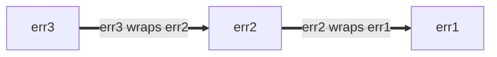

<!--* toc_depth: 3 *-->

# Go 語言風格最佳實踐

<https://google.github.io/styleguide/go/best-practices> (英文版)

[概覽](index.md) | [指南](guide.md) | [決策](decisions.md) |
[最佳實踐](best-practices.md)

**注意：** 這是一系列文件的一部分，概述了 Google 的 [Go 風格](index)。本文件**既不是 [規範性的](index#normative) 也不是 [權威性的](index#canonical)**，它是 [核心風格指南](guide) 的輔助文件。更多信息請參見 [概述](index#about)。

<a id="about"></a>

## 關於

本文件記錄了**如何最佳應用 Go 風格指南的指導**。這些建議旨在針對經常出現的常見情況，但可能不適用於每一種情況。在可能的情況下，討論了多種替代方法以及決定何時以及何時不應用它們的考量。

查看 [概述](index#about) 以獲得完整的風格指南文件集。

<a id="naming"></a>

## 命名

<a id="function-names"></a>

### 函數和方法名稱

<a id="function-name-repetition"></a>

#### 避免重複

在為函數或方法選擇名稱時，請考慮名稱將在何種上下文中被讀取。考慮以下建議，以避免在調用地點過度[重複](decisions#repetition)：

- 以下通常可以從函數和方法名稱中省略：

  - 輸入和輸出的類型（當沒有衝突時）
  - 方法接收者的類型
  - 輸入或輸出是否為指針

- 對於函數，不要[重複包的名稱](decisions#repetitive-with-package)。

  ```go
  // 不佳：
  package yamlconfig

  func ParseYAMLConfig(input string) (*Config, error)
  ```

  ```go
  // 較佳：
  package yamlconfig

  func Parse(input string) (*Config, error)
  ```

- 對於方法，不要重複方法接收者的名稱。

  ```go
  // 不佳：
  func (c *Config) WriteConfigTo(w io.Writer) (int64, error)
  ```

  ```go
  // 較佳：
  func (c *Config) WriteTo(w io.Writer) (int64, error)
  ```

- 不要重複作為參數傳遞的變量名稱。

  ```go
  // 不佳：
  func OverrideFirstWithSecond(dest, source *Config) error
  ```

  ```go
  // 較佳：
  func Override(dest, source *Config) error
  ```

- 不要重複返回值的名稱和類型。

  ```go
  // 不佳：
  func TransformYAMLToJSON(input *Config) *jsonconfig.Config
  ```

  ```go
  // 較佳：
  func Transform(input *Config) *jsonconfig.Config
  ```

當需要區分同名的函數時，可以包含額外的信息。

```go
// 較佳：
func (c *Config) WriteTextTo(w io.Writer) (int64, error)
func (c *Config) WriteBinaryTo(w io.Writer) (int64, error)
```

<a id="function-name-conventions"></a>

#### 命名慣例 Naming conventions

在為函數和方法選擇名稱時，有一些其他常見的慣例：

- 返回某物的函數給予類似名詞的名稱。

  ```go
  // 較佳：
  func (c *Config) JobName(key string) (value string, ok bool)
  ```

  這的推論是函數和方法名稱應該[避免使用前綴 `Get`](decisions#getters)。

  ```go
  // 不佳：
  func (c *Config) GetJobName(key string) (value string, ok bool)
  ```

- 做某事的函數給予類似動詞的名稱。

  ```go
  // 較佳：
  func (c *Config) WriteDetail(w io.Writer) (int64, error)
  ```

- 僅由涉及的類型不同的相同函數，在名稱的末尾包含類型名稱。

  ```go
  // 較佳：
  func ParseInt(input string) (int, error)
  func ParseInt64(input string) (int64, error)
  func AppendInt(buf []byte, value int) []byte
  func AppendInt64(buf []byte, value int64) []byte
  ```

  如果有一個明確的“主要”版本，可以從該版本的名稱中省略類型：

  ```go
  // 較佳：
  func (c *Config) Marshal() ([]byte, error)
  func (c *Config) MarshalText() (string, error)
  ```

<a id="naming-doubles"></a>

### 測試雙套件和類型 Test double packages and types

在為提供測試輔助工具，特別是[測試雙元件]的包和類型命名時，您可以應用幾種紀律。測試雙元件可以是存根（stub）、假物件（fake）、模擬物件（mock）或間諜（spy）。

這些例子大多使用存根。如果您的代碼使用假物件或其他類型的測試雙元件，請相應更新您的名稱。

[命名]: guide#naming
[測試雙元件]: https://abseil.io/resources/swe-book/html/ch13.html#basic_concepts

假設您有一個專注的包，提供類似於以下的生產代碼：

```go
package creditcard

import (
    "errors"

    "path/to/money"
)

// ErrDeclined indicates that the issuer declines the charge.
var ErrDeclined = errors.New("creditcard: declined")

// Card contains information about a credit card, such as its issuer,
// expiration, and limit.
type Card struct {
    // omitted
}

// Service allows you to perform operations with credit cards against external
// payment processor vendors like charge, authorize, reimburse, and subscribe.
type Service struct {
    // omitted
}

func (s *Service) Charge(c *Card, amount money.Money) error { /* omitted */ }
```

<a id="naming-doubles-helper-package"></a>

#### 創建測試輔助套件 Creating test helper packages

假設您想創建一個包含另一個包的測試雙元件的包。我們將使用上面的 `package creditcard` 作為這個例子：

一種方法是基於生產包為測試引入一個新的 Go 包。一個安全的選擇是將單詞 `test` 附加到原始包名（"creditcard" + "test"）：

```go
// 較佳：
package creditcardtest
```

除非另有明確說明，下面各節的所有示例都在 `package creditcardtest` 中。

<a id="naming-doubles-simple"></a>

#### 簡單情況 Simple case

您想為 `Service` 添加一組測試雙元件。因為 `Card` 實際上是一種簡單的數據類型，類似於協議緩衝消息，所以在測試中不需要特殊處理，因此不需要雙元件。如果您預計只有一種類型（如 `Service`）的測試雙元件，您可以採取簡潔的命名方法：

```go
// 較佳：
import (
    "path/to/creditcard"
    "path/to/money"
)

// Stub stubs creditcard.Service and provides no behavior of its own.
type Stub struct{}

func (Stub) Charge(*creditcard.Card, money.Money) error { return nil }
```

這絕對比像 `StubService` 或非常糟糕的 `StubCreditCardService` 這樣的命名選擇更好，因為基礎包名和其領域類型暗示了 `creditcardtest.Stub` 是什麼。

最後，如果包是用 Bazel 構建的，請確保新的 `go_library` 規則標記為 `testonly`：

```build
# 較佳：
go_library(
    name = "creditcardtest",
    srcs = ["creditcardtest.go"],
    deps = [
        ":creditcard",
        ":money",
    ],
    testonly = True,
)
```

上述方法是常規的，其他工程師將會相當理解。

另見：

- [Go 提示 #42：編寫用於測試的存根](https://google.github.io/styleguide/go/index.html#gotip)

#### 多種測試雙元件行為 Multiple test double behaviors

當一種存根不夠時（例如，您還需要一個總是失敗的），我們建議根據它們模擬的行為命名存根。在這裡，我們將 `Stub` 重命名為 `AlwaysCharges`，並引入一個名為 `AlwaysDeclines` 的新存根：

```go
// 較佳：
// AlwaysCharges stubs creditcard.Service and simulates success.
type AlwaysCharges struct{}

func (AlwaysCharges) Charge(*creditcard.Card, money.Money) error { return nil }

// AlwaysDeclines stubs creditcard.Service and simulates declined charges.
type AlwaysDeclines struct{}

func (AlwaysDeclines) Charge(*creditcard.Card, money.Money) error {
    return creditcard.ErrDeclined
}
```

<a id="naming-doubles-multiple-types"></a>

#### 多種類型的多個雙元件 Multiple doubles for multiple types

But now suppose that `package creditcard` contains multiple types worth creating
doubles for, as seen below with `Service` and `StoredValue`:

但現在假設 `package creditcard` 包含多個值得創建雙元件的類型，如下所示的 `Service` 和 `StoredValue`：

```go
package creditcard

type Service struct {
    // omitted
}

type Card struct {
    // omitted
}

// StoredValue manages customer credit balances.  This applies when returned
// merchandise is credited to a customer's local account instead of processed
// by the credit issuer.  For this reason, it is implemented as a separate
// service.
type StoredValue struct {
    // omitted
}

func (s *StoredValue) Credit(c *Card, amount money.Money) error { /* omitted */ }
```

在這種情況下，更明確的測試雙元件命名是合理的：

```go
// 較佳：
type StubService struct{}

func (StubService) Charge(*creditcard.Card, money.Money) error { return nil }

type StubStoredValue struct{}

func (StubStoredValue) Credit(*creditcard.Card, money.Money) error { return nil }
```

<a id="naming-doubles-local-variables"></a>

#### 測試中的局部變量 Local variables in tests

當您的測試中的變量指向雙元件時，選擇一個名稱，根據上下文最清楚地區分雙元件和其他生產類型。考慮一些您想要測試的生產代碼：

```go
package payment

import (
    "path/to/creditcard"
    "path/to/money"
)

type CreditCard interface {
    Charge(*creditcard.Card, money.Money) error
}

type Processor struct {
    CC CreditCard
}

var ErrBadInstrument = errors.New("payment: instrument is invalid or expired")

func (p *Processor) Process(c *creditcard.Card, amount money.Money) error {
    if c.Expired() {
        return ErrBadInstrument
    }
    return p.CC.Charge(c, amount)
}
```

在測試中，一個稱為 "spy" 的 `CreditCard` 測試雙元件與生產類型並置，因此在名稱前加上前綴可能會提高清晰度：

```go
// 較佳：
package payment

import "path/to/creditcardtest"

func TestProcessor(t *testing.T) {
    var spyCC creditcardtest.Spy

    proc := &Processor{CC: spyCC}

    // declarations omitted: card and amount
    if err := proc.Process(card, amount); err != nil {
        t.Errorf("proc.Process(card, amount) = %v, want %v", got, want)
    }

    charges := []creditcardtest.Charge{
        {Card: card, Amount: amount},
    }

    if got, want := spyCC.Charges, charges; !cmp.Equal(got, want) {
        t.Errorf("spyCC.Charges = %v, want %v", got, want)
    }
}
```

這比名稱沒有前綴時更清晰。

```go
// 不佳：
package payment

import "path/to/creditcardtest"

func TestProcessor(t *testing.T) {
    var cc creditcardtest.Spy

    proc := &Processor{CC: cc}

    // declarations omitted: card and amount
    if err := proc.Process(card, amount); err != nil {
        t.Errorf("proc.Process(card, amount) = %v, want %v", got, want)
    }

    charges := []creditcardtest.Charge{
        {Card: card, Amount: amount},
    }

    if got, want := cc.Charges, charges; !cmp.Equal(got, want) {
        t.Errorf("cc.Charges = %v, want %v", got, want)
    }
}
```

<a id="shadowing"></a>

### 變數遮蔽 Shadowing

**注意：** 本解釋使用了兩個非正式術語，_踩踏_ 和 _遮蔽_。它們不是 Go 語言規範中的官方概念。

像許多編程語言一樣，Go 擁有可變變量：對變量進行賦值會改變其值。

```go
// 較佳：
func abs(i int) int {
    if i < 0 {
        i *= -1
    }
    return i
}
```

當使用 [短變量聲明] 與 `:=` 運算符時，在某些情況下不會創建新變量。我們可以稱這為**踩踏**。當原始值不再需要時，這樣做是可以的。

```go
// 較佳：
// innerHandler is a helper for some request handler, which itself issues
// requests to other backends.
func (s *Server) innerHandler(ctx context.Context, req *pb.MyRequest) *pb.MyResponse {
    // Unconditionally cap the deadline for this part of request handling.
    ctx, cancel := context.WithTimeout(ctx, 3*time.Second)
    defer cancel()
    ctxlog.Info(ctx, "Capped deadline in inner request")

    // Code here no longer has access to the original context.
    // This is good style if when first writing this, you anticipate
    // that even as the code grows, no operation legitimately should
    // use the (possibly unbounded) original context that the caller provided.

    // ...
}
```

不過，在新的作用域中使用短變量聲明要小心：這會引入一個新變量。我們可以稱這為*遮蔽*原始變量。塊結束後的代碼指的是原始變量。這是一個錯誤的嘗試，有條件地縮短截止日期：

```go
// 不佳：
func (s *Server) innerHandler(ctx context.Context, req *pb.MyRequest) *pb.MyResponse {
    // Attempt to conditionally cap the deadline.
    if *shortenDeadlines {
        ctx, cancel := context.WithTimeout(ctx, 3*time.Second)
        defer cancel()
        ctxlog.Info(ctx, "Capped deadline in inner request")
    }

    // BUG: "ctx" here again means the context that the caller provided.
    // The above buggy code compiled because both ctx and cancel
    // were used inside the if statement.

    // ...
}
```

一個正確版本的代碼可能是：

```go
// 較佳：
func (s *Server) innerHandler(ctx context.Context, req *pb.MyRequest) *pb.MyResponse {
    if *shortenDeadlines {
        var cancel func()
        // Note the use of simple assignment, = and not :=.
        ctx, cancel = context.WithTimeout(ctx, 3*time.Second)
        defer cancel()
        ctxlog.Info(ctx, "Capped deadline in inner request")
    }
    // ...
}
```

在我們稱為踩踏的情況下，因為沒有新變量，所賦予的類型必須與原始變量的類型匹配。有了遮蔽，就引入了一個全新的實體，所以它可以有不同的類型。故意的遮蔽可以是一種有用的做法，但如果使用新名稱可以提高[清晰度](guide#clarity)，那麼您總是可以使用新名稱。

在非常小的作用域之外使用與標準包同名的變量並不是一個好主意，因為這會使該包中的自由函數和值無法訪問。相反地，當為您的包選擇名稱時，避免使用可能需要[導入重命名](decisions#import-renaming)或在客戶端導致遮蔽其他好的變量名稱的名稱。

```go
// 不佳：
func LongFunction() {
    url := "https://example.com/"
    // Oops, now we can't use net/url in code below.
}
```

[短變量聲明]: https://go.dev/ref/spec#Short_variable_declarations

<a id="util-packages"></a>

### Util 套件

Go 的套件有一個在 `package` 聲明上指定的名稱，與導入路徑分開。對於可讀性來說，套件名稱比路徑更重要。

Go 套件名稱應該[與套件提供的內容相關](decisions#package-names)。僅將一個套件命名為 `util`、`helper`、`common` 或類似的通常是一個糟糕的選擇（雖然可以用作名稱的**一部分**）。不具信息性的名稱使代碼更難閱讀，如果使用得太廣泛，它們可能會導致不必要的[導入衝突](decisions#import-renaming)。

相反，考慮調用點將會看起來像什麼。

```go
// 較佳：
db := spannertest.NewDatabaseFromFile(...)

_, err := f.Seek(0, io.SeekStart)

b := elliptic.Marshal(curve, x, y)
```

您甚至可以在不知道導入列表（`cloud.google.com/go/spanner/spannertest`、`io` 和 `crypto/elliptic`）的情況下大致知道這些各自做什麼。如果使用不夠專注的名稱，這些可能會讀作：

```go
// 不佳：
db := test.NewDatabaseFromFile(...)

_, err := f.Seek(0, common.SeekStart)

b := helper.Marshal(curve, x, y)
```

<a id="package-size"></a>

## 套件大小

如果您在問自己 Go 套件應該有多大，以及是否應該將相關類型放在同一個套件中或將它們分成不同的套件，一個好的起點是 [Go 博客文章關於套件名稱][blog-pkg-names]。儘管文章的標題只是關於命名，但它不僅僅是關於命名。它包含了一些有用的提示，並引用了幾篇有用的文章和演講。

這裡還有一些其他的考慮和筆記。

用戶可以在一個頁面上看到套件的 [godoc]，並且套件提供的類型所導出的任何方法都按類型分組。Godoc 也將構造函數與它們返回的類型分組。如果*客戶端代碼*可能需要兩個不同類型的值互相交互，對用戶來說，將它們放在同一個套件中可能會比較方便。

套件內的代碼可以訪問套件中未導出的標識符。如果您有一些相關的類型，它們的*實現*緊密耦合，將它們放在同一個套件中可以實現這種耦合，而不用在公共 API 中暴露這些細節。對這種耦合的一個好測試是想像兩個套件的假設用戶，這些套件涵蓋了緊密相關的主題：如果用戶必須導入兩個套件才能以任何有意義的方式使用其中任何一個，那麼將它們合併在一起通常是正確的做法。標準庫通常很好地展示了這種範圍和分層。

儘管如此，將整個項目放在一個套件中可能會使該套件過大。當某些東西在概念上是獨立的，給它自己的小套件可以使它更容易使用。套件的短名稱與客戶端所知的導出類型名稱一起工作，形成一個有意義的標識符：例如 `bytes.Buffer`、`ring.New`。[博客文章][blog-pkg-names]有更多例子。

Go 風格對文件大小很靈活，因為維護者可以在套件內將代碼從一個文件移動到另一個文件，而不影響調用者。但作為一般指導原則：通常不是一個好主意在一個文件中有數千行代碼，或者有許多微小的文件。與其他一些語言不同，沒有“一種類型，一個文件”的慣例。作為一個經驗法則，文件應該足夠專注，以至於維護者可以告訴文件中包含了什麼，並且文件應該足夠小，以便一旦到達那裡就容易找到。標準庫經常將大型套件分割為幾個源文件，按文件分組相關代碼。[套件 `bytes`] 的源代碼是一個很好的例子。具有長套件文檔的套件可能會選擇專門用一個名為 `doc.go` 的文件，其中包含[套件文檔](decisions#package-comments)、一個套件聲明，以及其他什麼都沒有，但這不是必需的。

在 Google 代碼庫和使用 Bazel 的項目中，Go 代碼的目錄布局與開源 Go 項目中的不同：您可以在單個目錄中有多個 `go_library` 目標。給每個套件自己的目錄的一個好理由是，如果您期望將來開源您的項目。

另見：

- [測試雙元件套件](#naming-doubles)

[blog-pkg-names]: https://go.dev/blog/package-names
[套件 `bytes`]: https://go.dev/src/bytes/
[godoc]: https://pkg.go.dev/

<a id="imports"></a>

## 引入 Imports

<a id="import-protos"></a>

### Protos and stubs

由於其跨語言特性，Proto 庫的引入與標準 Go 引入的處理方式不同。重新命名 proto 引入的慣例基於生成該套件的規則：

- 一般情況下，`go_proto_library` 規則使用 `pb` 後綴。
- 一般情況下，`go_grpc_library` 規則使用 `grpc` 後綴。

通常使用短的一個或兩個字母的前綴：

```go
// 較佳：
import (
    fspb "path/to/package/foo_service_go_proto"
    fsgrpc "path/to/package/foo_service_go_grpc"
)
```

如果一個套件只使用了一個 proto 或該套件與該 proto 緊密相關，則可以省略前綴：

如果 proto 中的符號是通用的或不是非常自描述的，或者如果使用縮寫縮短套件名稱不清晰，一個短詞可以作為前綴：

```go
// 較佳：
import (
    mapspb "path/to/package/maps_go_proto"
)
```

在這種情況下，如果相關代碼並不已經明確與地圖相關，`mapspb.Address` 可能比 `mpb.Address` 更清晰。

<a id="import-order"></a>

### 引入順序 Import ordering

引入通常按以下兩個（或更多）塊的順序分組：

1.  標準庫引入（例如，`"fmt"`）
1.  專案引入（例如，`"/path/to/somelib"`）
1.  （可選）Protobuf 引入（例如，`fpb "path/to/foo_go_proto"`）
1.  （可選）副作用引入（例如，`_ "path/to/package"`）

如果一個文件沒有上述可選類別中的一個分組，相關的引入將包含在專案引入組中。

任何清晰且易於理解的引入分組通常都是可以的。例如，一個團隊可能選擇將 gRPC 引入與 protobuf 引入分開。

> **注意：** 對於只維護兩個強制分組的代碼（一組用於標準庫，另一組用於所有其他引入），`goimports` 工具產生的輸出與此指導相符。
>
> 然而，`goimports` 對於強制分組之外的分組沒有認識；使用可選分組時，這些分組容易被該工具使無效。當使用可選分組時，作者和審查者都需要注意，以確保分組保持合規。
>
> 兩種方法都可以，但不要讓引入部分處於不一致、部分分組的狀態。

<a id="error-handling"></a>

## 錯誤處理 Error handling

在 Go 中，[錯誤是值]；它們由代碼創建並由代碼消費。錯誤可以是：

- 轉換為顯示給人看的診斷信息
- 由維護者使用
- 被終端用戶解釋

錯誤消息還會出現在包括日誌消息、錯誤轉儲和渲染的 UI 等不同的表面上。

處理（產生或消費）錯誤的代碼應該要有意識地進行。忽略或盲目傳播錯誤返回值可能很誘人。然而，總是值得考慮當前調用棧中的函數是否處於最有效處理錯誤的位置。這是一個大話題，很難給出類別性的建議。使用您的判斷，但請記住以下考慮：

- 創建錯誤值時，決定是否給它任何[結構](#error-structure)。
- 處理錯誤時，考慮[添加信息](#error-extra-info)，您擁有但調用者和/或被調用者可能沒有的信息。
- 另見有關[錯誤日誌記錄](#error-logging)的指南。

雖然通常不適合忽略錯誤，但在協調相關操作時，通常只有第一個錯誤是有用的，這是一個合理的例外。[`errgroup`] 套件為可以作為一組失敗或取消的一組操作提供了方便的抽象。

[錯誤是值]: https://go.dev/blog/errors-are-values
[`errgroup`]: https://pkg.go.dev/golang.org/x/sync/errgroup

另見：

- [Effective Go on errors](https://go.dev/doc/effective_go#errors)
- [A post by the Go Blog on errors](https://go.dev/blog/go1.13-errors)
- [Package `errors`](https://pkg.go.dev/errors)
- [Package `upspin.io/errors`](https://commandcenter.blogspot.com/2017/12/error-handling-in-upspin.html)
- [GoTip #89: When to Use Canonical Status Codes as Errors](https://google.github.io/styleguide/go/index.html#gotip)
- [GoTip #48: Error Sentinel Values](https://google.github.io/styleguide/go/index.html#gotip)
- [GoTip #13: Designing Errors for Checking](https://google.github.io/styleguide/go/index.html#gotip)

<a id="error-structure"></a>

### Error structure

如果呼叫者需要檢查錯誤（例如，區分不同的錯誤情況），請給予錯誤值結構，以便可以通過程式方式完成，而不是讓呼叫者進行字串匹配。這個建議適用於生產代碼以及關心不同錯誤情況的測試。

最簡單的結構化錯誤是無參數的全域值。

```go
type Animal string

var (
    // ErrDuplicate occurs if this animal has already been seen.
    ErrDuplicate = errors.New("duplicate")

    // ErrMarsupial occurs because we're allergic to marsupials outside Australia.
    // Sorry.
    ErrMarsupial = errors.New("marsupials are not supported")
)

func process(animal Animal) error {
    switch {
    case seen[animal]:
        return ErrDuplicate
    case marsupial(animal):
        return ErrMarsupial
    }
    seen[animal] = true
    // ...
    return nil
}
```

呼叫者可以簡單地將函數返回的錯誤值與已知的錯誤值之一進行比較：

```go
// 較佳：
func handlePet(...) {
    switch err := process(an); err {
    case ErrDuplicate:
        return fmt.Errorf("feed %q: %v", an, err)
    case ErrMarsupial:
        // Try to recover with a friend instead.
        alternate = an.BackupAnimal()
        return handlePet(..., alternate, ...)
    }
}
```

上述方法使用了哨兵值，其中錯誤必須等於（在 `==` 的意義上）預期值。在許多情況下，這是完全足夠的。如果 `process` 返回包裝錯誤（如下所述），您可以使用 [`errors.Is`]。

```go
// 較佳：
func handlePet(...) {
    switch err := process(an); {
    case errors.Is(err, ErrDuplicate):
        return fmt.Errorf("feed %q: %v", an, err)
    case errors.Is(err, ErrMarsupial):
        // ...
    }
}
```

Do not attempt to distinguish errors based on their string form. (See
[Go Tip #13: Designing Errors for Checking](https://google.github.io/styleguide/go/index.html#gotip)
for more.)

```go
// 不佳：
func handlePet(...) {
    err := process(an)
    if regexp.MatchString(`duplicate`, err.Error()) {...}
    if regexp.MatchString(`marsupial`, err.Error()) {...}
}
```

如果錯誤中有呼叫者需要以程式方式處理的額外資訊，理想情況下應以結構化方式呈現。例如，[`os.PathError`] 類型的文件說明將失敗操作的路徑名放在結構體欄位中，呼叫者可以輕鬆訪問。

其他錯誤結構可以根據需要使用，例如包含錯誤代碼和詳細字串的專案結構體。[`status` 套件][status] 是一種常見的封裝方式；如果選擇這種方法（您並不必須這樣做），請使用[標準代碼]。請參閱 [Go Tip #89: When to Use Canonical Status Codes as Errors](https://google.github.io/styleguide/go/index.html#gotip) 以了解是否應使用狀態代碼。

[`os.PathError`]: https://pkg.go.dev/os#PathError
[`errors.Is`]: https://pkg.go.dev/errors#Is
[`errors.As`]: https://pkg.go.dev/errors#As
[`package cmp`]: https://pkg.go.dev/github.com/google/go-cmp/cmp
[status]: https://pkg.go.dev/google.golang.org/grpc/status
[標準代碼]: https://pkg.go.dev/google.golang.org/grpc/codes

<a id="error-extra-info"></a>

### 為錯誤添加資訊

任何返回錯誤的函數都應該努力使錯誤值變得有用。通常，該函數位於調用鏈的中間，只是傳播它所調用的其他函數（可能甚至是來自另一個包）的錯誤。在這種情況下，有機會用額外的信息來註釋錯誤，但程序員應確保錯誤中有足夠的信息，而不添加重複或無關的細節。如果不確定，請嘗試在開發過程中觸發錯誤條件：這是一種評估錯誤觀察者（無論是人類還是代碼）最終會得到什麼的好方法。

約定和良好的文檔有助於此。例如，標準包 `os` 宣傳其錯誤在可用時包含路徑信息。這是一種有用的風格，因為調用者在返回錯誤時不需要用他們已經提供給失敗函數的訊息來註釋它。

```go
// 較佳：
if err := os.Open("settings.txt"); err != nil {
    return err
}

// Output:
//
// open settings.txt: no such file or directory
```

如果有關於錯誤的*意義*有什麼有趣的事情要說，當然可以添加。只需考慮哪個呼叫鏈的層級最適合理解這個意義。

```go
// 較佳：
if err := os.Open("settings.txt"); err != nil {
    // 我們傳達這個錯誤對我們的重要性。請注意，目前的函數可能會執行多個可能失敗的文件操作，
    // 因此這些註釋也可以用來向呼叫者澄清到底出了什麼問題。
    return fmt.Errorf("啟動代碼不可用: %v", err)
}

// 輸出:
//
// 啟動代碼不可用: open settings.txt: no such file or directory
```

對比這裡的冗餘信息：

```go
// 不佳：
if err := os.Open("settings.txt"); err != nil {
    return fmt.Errorf("無法打開 settings.txt: %w", err)
}

// 輸出:
//
// 無法打開 settings.txt: open settings.txt: no such file or directory
```

當向傳播的錯誤添加信息時，你可以選擇包裝錯誤或呈現一個新的錯誤。使用 `fmt.Errorf` 中的 `%w` 來包裝錯誤允許呼叫者訪問原始錯誤的數據。這在某些時候非常有用，但在其他情況下，這些細節對呼叫者來說可能是誤導或不感興趣的。請參閱[錯誤包裝的博客文章](https://blog.golang.org/go1.13-errors)以獲取更多信息。包裝錯誤還會以不明顯的方式擴展你的包的 API 表面，如果你更改包的實現細節，這可能會導致破壞。

除非你也記錄（並有測試驗證）你暴露的底層錯誤，否則最好避免使用 `%w`。如果你不期望你的呼叫者調用 `errors.Unwrap`、`errors.Is` 等等，那麼就不要使用 `%w`。

同樣的概念適用於[結構化錯誤](#error-structure)如 [`*status.Status`][status]（請參閱[標準代碼]）。例如，如果你的服務器向後端發送格式錯誤的請求並收到 `InvalidArgument` 代碼，假設客戶端沒有做錯任何事情，這個代碼不應該傳播給客戶端。相反，應該向客戶端返回一個 `Internal` 標準代碼。

然而，註釋錯誤有助於自動化日誌系統保留錯誤的狀態負載。例如，在內部函數中註釋錯誤是合適的：

```go
// 較佳：
func (s *Server) internalFunction(ctx context.Context) error {
    // ...
    if err != nil {
        return fmt.Errorf("無法找到遠程文件: %w", err)
    }
}
```

直接在系統邊界（通常是 RPC、IPC、存儲等）處的代碼應使用標準錯誤空間報告錯誤。這裡的代碼有責任處理特定領域的錯誤並以標準方式表示它們。例如：

```go
// 不佳：
func (*FortuneTeller) SuggestFortune(context.Context, *pb.SuggestionRequest) (*pb.SuggestionResponse, error) {
    // ...
    if err != nil {
        return nil, fmt.Errorf("無法找到遠程文件: %w", err)
    }
}
```

```go
// 較佳：
import (
    "google.golang.org/grpc/codes"
    "google.golang.org/grpc/status"
)
func (*FortuneTeller) SuggestFortune(context.Context, *pb.SuggestionRequest) (*pb.SuggestionResponse, error) {
    // ...
    if err != nil {
        // 或者使用 fmt.Errorf 和 %w 動詞，如果故意包裝一個呼叫者應該解包的錯誤。
        return nil, status.Errorf(codes.Internal, "無法找到財富數據庫", status.ErrInternal)
    }
}
```

另請參閱：

- [錯誤文檔約定](#documentation-conventions-errors)

<a id="error-percent-w"></a>

### %w 在錯誤中的位置

建議將 `%w` 放在錯誤字串的末尾。

錯誤可以使用 [`%w` 動詞](https://blog.golang.org/go1.13-errors) 包裝，或將它們放在實作 `Unwrap() error` 的[結構化錯誤](https://google.github.io/styleguide/go/index.html#gotip)中（例如：[`fs.PathError`](https://pkg.go.dev/io/fs#PathError)）。

包裝的錯誤會形成錯誤鏈：每一層新的包裝都會在錯誤鏈的前端新增一個新條目。錯誤鏈可以使用 `Unwrap() error` 方法遍歷。例如：

```go
err1 := fmt.Errorf("err1")
err2 := fmt.Errorf("err2: %w", err1)
err3 := fmt.Errorf("err3: %w", err2)
```

這形成了一個如下形式的錯誤鏈，



無論 `%w` 動詞放在哪裡，返回的錯誤總是代表錯誤鏈的前端，而 `%w` 是下一個子錯誤。同樣，`Unwrap() error` 總是從最新的錯誤遍歷到最舊的錯誤。

然而，`%w` 動詞的位置會影響錯誤鏈是按最新到最舊、最舊到最新還是既不是最新到最舊也不是最舊到最新的順序打印：

```go
// 較佳：
err1 := fmt.Errorf("err1")
err2 := fmt.Errorf("err2: %w", err1)
err3 := fmt.Errorf("err3: %w", err2)
fmt.Println(err3) // err3: err2: err1
// err3 是一個從最新到最舊的錯誤鏈，按最新到最舊的順序打印。
```

```go
// 不佳：
err1 := fmt.Errorf("err1")
err2 := fmt.Errorf("%w: err2", err1)
err3 := fmt.Errorf("%w: err3", err2)
fmt.Println(err3) // err1: err2: err3
// err3 是一個從最新到最舊的錯誤鏈，按最舊到最新的順序打印。
```

```go
// 不佳：
err1 := fmt.Errorf("err1")
err2 := fmt.Errorf("err2-1 %w err2-2", err1)
err3 := fmt.Errorf("err3-1 %w err3-2", err2)
fmt.Println(err3) // err3-1 err2-1 err1 err2-2 err3-2
// err3 是一個從最新到最舊的錯誤鏈，既不是按最新到最舊也不是按最舊到最新的順序打印。
```

因此，為了使錯誤文本反映錯誤鏈結構，建議將 `%w` 動詞放在末尾，形式為 `[...]: %w`。

<a id="error-logging"></a>

### 錯誤日誌

函式有時需要告訴外部系統發生了錯誤，但不會將錯誤傳遞給它們的呼叫者。此時記錄日誌是一個明顯的選擇；但要注意你記錄錯誤的內容和方式。

- 就像[好的測試失敗訊息]一樣，日誌訊息應該清楚地表達出問題所在，並透過包含相關資訊來幫助維護者診斷問題。

- 避免重複。如果你返回一個錯誤，通常最好不要自己記錄日誌，而是讓呼叫者處理它。呼叫者可以選擇記錄錯誤，或者使用 [`rate.Sometimes`] 來限制日誌記錄的頻率。其他選項包括嘗試恢復或甚至[停止程式]。無論如何，讓呼叫者控制有助於避免日誌垃圾。

  然而，這種方法的缺點是，任何日誌都是使用呼叫者的行號記錄的。

- 小心處理[個人識別資訊 (PII)]。許多日誌接收端並不適合存放敏感的終端使用者資訊。

- 謹慎使用 `log.Error`。ERROR 等級的日誌會觸發刷新，並且比較低等級的日誌更耗費資源。這可能對你的程式碼造成嚴重的效能影響。在決定使用錯誤等級還是警告等級時，考慮最佳實踐，即錯誤等級的訊息應該是可操作的，而不是比警告更「嚴重」。

- 在 Google 內部，我們有監控系統，可以設置更有效的警報，而不是寫入日誌檔案並希望有人注意到它。這類似但不完全等同於標準函式庫中的 [package `expvar`]。

[好的測試失敗訊息]: https://google.github.io/styleguide/go/decisions#useful-test-failures
[停止程式]: #checks-and-panics
[`rate.Sometimes`]: https://pkg.go.dev/golang.org/x/time/rate#Sometimes
[個人識別資訊 (PII)]: https://en.wikipedia.org/wiki/Personal_data
[package `expvar`]: https://pkg.go.dev/expvar

<a id="vlog"></a>

#### 自訂詳細等級

善用詳細日誌記錄（[`log.V`]）。詳細日誌記錄對於開發和追蹤非常有用。建立一個關於詳細等級的慣例會很有幫助。例如：

- 在 `V(1)` 寫入少量額外資訊
- 在 `V(2)` 追蹤更多資訊
- 在 `V(3)` 傾倒大量內部狀態

為了將詳細日誌記錄的成本降到最低，你應該確保即使在 `log.V` 關閉時也不會意外呼叫昂貴的函式。`log.V` 提供了兩種 API。較方便的一種有可能會導致這種意外的開銷。如果有疑慮，請使用稍微冗長的風格。

```go
// 較佳：
for _, sql := range queries {
  log.V(1).Infof("Handling %v", sql)
  if log.V(2) {
    log.Infof("Handling %v", sql.Explain())
  }
  sql.Run(...)
}
```

```go
// 不佳：
// 即使這個日誌沒有被打印，sql.Explain 也會被呼叫。
log.V(2).Infof("處理 %v", sql.Explain())
```

[`log.V`]: https://pkg.go.dev/github.com/golang/glog#V

<a id="program-init"></a>

### 程式初始化 (Program initialization)

程式初始化錯誤（例如錯誤的標誌和配置）應該向上傳遞到 `main`，`main` 應該調用 `log.Exit` 並附帶解釋如何修復錯誤的訊息。在這些情況下，一般不應使用 `log.Fatal`，因為指向檢查的堆疊追蹤不太可能像人類生成的可操作訊息那樣有用。

<a id="checks-and-panics"></a>

### 程式檢查和恐慌 (Program checks and panics)

如[反對恐慌的決定]所述，標準錯誤處理應圍繞錯誤返回值進行結構化。庫應該更傾向於向調用者返回錯誤，而不是中止程式，特別是對於臨時錯誤。

有時需要對不變量進行一致性檢查，如果違反則終止程式。一般來說，只有當不變量檢查失敗意味著內部狀態已經無法恢復時才會這樣做。在 Google 代碼庫中，最可靠的方法是調用 `log.Fatal`。在這些情況下使用 `panic` 不可靠，因為延遲函數可能會死鎖或進一步損壞內部或外部狀態。

同樣，抵制恢復恐慌以避免崩潰的誘惑，因為這樣做可能會導致傳播損壞的狀態。離恐慌越遠，你對程式狀態的了解就越少，程式可能持有鎖或其他資源。然後程式可能會出現其他意想不到的故障模式，使問題更難診斷。與其嘗試在代碼中處理意外的恐慌，不如使用監控工具來顯示意外的故障，並優先修復相關的錯誤。

**注意：** 標準的 [`net/http` 服務器] 違反了這個建議，並從請求處理程序中恢復恐慌。經驗豐富的 Go 工程師一致認為這是歷史性的錯誤。如果你從其他語言的應用服務器中抽樣服務器日誌，通常會發現大量未處理的堆棧跟踪。在你的服務器中避免這個陷阱。

[反對恐慌的決定]: https://google.github.io/styleguide/go/decisions#dont-panic
[`net/http` 服務器]: https://pkg.go.dev/net/http#Server

<a id="when-to-panic"></a>

### 何時恐慌 (When to panic)

標準庫在 API 誤用時會恐慌。例如，[`reflect`] 在許多情況下發出恐慌，當值以表明它被誤解的方式訪問時。這類似於核心語言錯誤的恐慌，例如訪問超出範圍的切片元素。代碼審查和測試應該發現這些錯誤，這些錯誤不應出現在生產代碼中。這些恐慌充當不依賴於庫的不變量檢查，因為標準庫無法訪問 Google 代碼庫使用的[分級 `log`] 包。

[`reflect`]: https://pkg.go.dev/reflect
[分級 `log`]: decisions#logging

另一種恐慌可能有用的情況，雖然不常見，是作為包的內部實現細節，總是在調用鏈中有匹配的恢復。解析器和類似的深度嵌套、緊密耦合的內部函數組可以從這種設計中受益，其中管道錯誤返回增加了複雜性而沒有價值。這種設計的關鍵屬性是這些恐慌永遠不允許跨包邊界傳播，並且不構成包的 API 的一部分。這通常通過頂層延遲恢復來實現，將傳播的恐慌轉換為在公共 API 表面返回的錯誤。

當編譯器無法識別不可達代碼時，例如使用不會返回的函數

```go
// 較佳：
func answer(i int) string {
    switch i {
    case 42:
        return "yup"
    case 54:
        return "base 13, huh"
    default:
        log.Fatalf("Sorry, %d is not the answer.", i)
        panic("unreachable")
    }
}
```

[在標誌解析之前不要調用 `log` 函數。](https://pkg.go.dev/github.com/golang/glog#pkg-overview)
如果你必須在 `init` 函數中終止，恐慌（panic）是可以接受的，代替記錄調用。

<a id="documentation"></a>

## Documentation (文件)

<a id="documentation-conventions"></a>

### Conventions (慣例)

本節補充了決策文件的[評論]部分。

以熟悉的風格記錄的 Go 代碼更易於閱讀，也不太可能被誤用，而不是被錯誤記錄或根本沒有記錄的代碼。可運行的[示例]會顯示在 Godoc 和代碼搜索中，是解釋如何使用代碼的絕佳方式。

[examples]: decisions#examples

<a id="documentation-conventions-params"></a>

#### Parameters and configuration (參數和配置)

並非每個參數都必須在文檔中列出。這適用於：

- 函數和方法參數
- 結構字段
- 選項的 API

通過說明它們為什麼有趣來記錄容易出錯或不明顯的字段和參數。

在以下代碼片段中，突出顯示的評論對讀者幾乎沒有用處：

```go
// 不佳：
// Sprintf formats according to a format specifier and returns the resulting
// string.
//
// format is the format, and data is the interpolation data.
func Sprintf(format string, data ...any) string
```

然而，這個片段展示了一個類似於前面的代碼場景，其中評論改為說明一些不明顯或對讀者有實質幫助的內容：

```go
// 較佳：
// Sprintf 根據格式規範進行格式化並返回結果字符串。
//
// 提供的數據用於插值格式字符串。如果數據與預期的格式動詞不匹配或數據量不滿足格式規範，該函數將根據上面描述的格式錯誤部分將格式錯誤警告內聯到輸出字符串中。
func Sprintf(format string, data ...any) string
```

在選擇記錄什麼以及記錄到什麼深度時，請考慮你的可能受眾。維護者、團隊的新成員、外部用戶，甚至是六個月後的你自己，可能會欣賞與你首次編寫文檔時所想的略有不同的信息。

另請參見：

- [GoTip #41: 識別函數調用參數]
- [GoTip #51: 配置模式]

[commentary]: decisions#commentary
[GoTip #41: 識別函數調用參數]: https://google.github.io/styleguide/go/index.html#gotip
[GoTip #51: 配置模式]: https://google.github.io/styleguide/go/index.html#gotip

<a id="documentation-conventions-contexts"></a>

#### Contexts (上下文)

上下文參數的取消會中斷提供給它的函數，這是隱含的。如果函數可以返回錯誤，通常是 `ctx.Err()`。

這一事實不需要重述：

```go
// 不佳：
// Run executes the worker's run loop.
//
// The method will process work until the context is cancelled and accordingly
// returns an error.
func (Worker) Run(ctx context.Context) error
```

因為這是隱含的，以下更好：

```go
// 較佳：
// Run executes the worker's run loop.
func (Worker) Run(ctx context.Context) error
```

當上下文行為不同或不明顯時，如果以下任何一項為真，則應明確記錄。

- 當上下文被取消時，函數返回 `ctx.Err()` 以外的錯誤：

  ```go
  // 較佳：
  // Run executes the worker's run loop.
  //
  // If the context is cancelled, Run returns a nil error.
  func (Worker) Run(ctx context.Context) error
  ```

- 函數有其他機制可能中斷它或影響其生命周期：

  ```go
  // 較佳：
  // Run 執行工作者的運行循環。
  //
  // Run 處理工作，直到上下文被取消或調用 Stop。
  // 上下文取消在內部異步處理：run 可能在所有工作停止之前返回。
  // Stop 方法是同步的，並等待運行循環中的所有操作完成。
  // 使用 Stop 進行優雅的關閉。
  func (Worker) Run(ctx context.Context) error

  func (Worker) Stop()
  ```

- 函數對上下文生命周期、血統或附加值有特殊期望：

  ```go
  // 較佳：
  // NewReceiver 開始接收發送到指定隊列的消息。
  // 上下文不應該有截止日期。
  func NewReceiver(ctx context.Context) *Receiver

  // Principal 返回發起調用的方的可讀名稱。
  // 上下文必須具有從 security.NewContext 附加的值。
  func Principal(ctx context.Context) (name string, ok bool)
  ```

**警告：** 避免設計使其調用者做出這樣要求（如上下文沒有截止日期）的 API。上述僅是如何記錄這種情況的示例，而不是對該模式的認可。

<a id="documentation-conventions-concurrency"></a>

#### Concurrency (並發)

Go 使用者假設概念上只讀操作是安全的，可以並發使用，且不需要額外的同步。

在這個 Godoc 中，可以安全地刪除關於並發的額外說明：

```go
// Len 返回緩衝區未讀部分的字節數；
// b.Len() == len(b.Bytes())。
//
// 它可以安全地被多個 goroutine 並發調用。
func (*Buffer) Len() int
```

然而，變更操作則不假設是安全的並發使用，並且需要使用者考慮同步。

同樣，關於並發的額外說明可以安全地刪除：

```go
// Grow 增加緩衝區的容量。
//
// 它不安全，不能被多個 goroutine 並發調用。
func (*Buffer) Grow(n int)
```

如果以下任何一項為真，強烈建議進行文檔記錄。

- 不清楚操作是只讀還是變更：

  ```go
  // 較佳：
  package lrucache

  // Lookup 返回緩存中與鍵相關聯的數據。
  //
  // 此操作不安全，不能並發使用。
  func (*Cache) Lookup(key string) (data []byte, ok bool)
  ```

為什麼？查找鍵時的緩存命中會在內部更改 LRU 緩存。這種實現方式對所有讀者來說可能並不明顯。

- 同步由 API 提供：

  ```go
  // 較佳：
  package fortune_go_proto

  // NewFortuneTellerClient 返回一個用於 FortuneTeller 服務的 *rpc.Client。
  // 它可以安全地被多個 goroutine 同時使用。
  func NewFortuneTellerClient(cc *rpc.ClientConn) *FortuneTellerClient
  ```

為什麼？Stubby 提供同步。

**注意：** 如果 API 是一種類型，並且 API 完全提供同步，通常只有類型定義記錄語義。

- API 消費者使用用戶實現的接口類型，並且接口的消費者有特定的並發要求：

  ```go
  // 較佳：
  package health

  // A Watcher reports the health of some entity (usually a backend service).
  //
  // Watcher 方法可以安全地被多個 goroutine 同時使用。
  type Watcher interface {
    // Watch 當 Watcher 的狀態發生變化時，會在傳入的通道上發送 true。
    Watch(changed chan<- bool) (unwatch func())

    // Health 如果被監視的實體是健康的，則返回 nil，否則返回一個非 nil 的錯誤，解釋為什麼實體不健康。
    Health() error
  }
  ```

為什麼？API 是否可以安全地被多個 goroutine 使用是其契約的一部分。

<a id="documentation-conventions-cleanup"></a>

#### Cleanup (清理)

記錄 API 的任何明確清理要求。否則，調用者將無法正確使用 API，導致資源洩漏和其他可能的錯誤。

指出由調用者負責的清理工作：

```go
// 較佳：
// NewTicker 返回一個新的 Ticker，其中包含一個通道，該通道會在每次滴答後發送當前時間。
//
// 完成後調用 Stop 以釋放 Ticker 的相關資源。
func NewTicker(d Duration) *Ticker

func (*Ticker) Stop()
```

If it is potentially unclear how to clean up the resources, explain how:

```go
// 較佳：
// Get 發送一個 GET 請求到指定的 URL。
//
// 當 err 為 nil 時，resp 總是包含一個非 nil 的 resp.Body。
// 調用者在讀取完 resp.Body 後應該關閉它。
//
//    resp, err := http.Get("http://example.com/")
//    if err != nil {
//        // handle error
//    }
//    defer resp.Body.Close()
//    body, err := io.ReadAll(resp.Body)
func (c *Client) Get(url string) (resp *Response, err error)
```

另請參見：

- [GoTip #110: 不要將 Exit 與 Defer 混用]

[GoTip #110: 不要將 Exit 與 Defer 混用]: https://google.github.io/styleguide/go/index.html#gotip

<a id="documentation-conventions-errors"></a>

#### Errors (錯誤)

記錄你的函數返回給調用者的重要錯誤哨兵值或錯誤類型，以便調用者可以預期他們可以在代碼中處理哪些類型的情況。

```go
// 較佳：
package os

// Read 從文件中讀取最多 len(b) 字節並將它們存儲在 b 中。它返回讀取的字節數和遇到的任何錯誤。
//
// 在文件結尾，Read 返回 0 和 io.EOF。
func (*File) Read(b []byte) (n int, err error) {
```

當函數返回特定錯誤類型時，正確註明錯誤是否為指針接收者：

```go
// 較佳：
package os

type PathError struct {
    Op   string
    Path string
    Err  error
}

// Chdir 更改當前工作目錄為指定目錄。
//
// 如果有錯誤，它將是 *PathError 類型。
func Chdir(dir string) error {
```

記錄返回值是否為指針接收者，使調用者能夠正確地使用 [`errors.Is`]、[`errors.As`] 和 [`package cmp`] 來比較錯誤。這是因為非指針值不等同於指針值。

**注意：** 在 `Chdir` 示例中，返回類型寫為 `error` 而不是 `*PathError`，這是由於[空接口值的工作方式](https://go.dev/doc/faq#nil_error)。

當行為適用於包中的大多數錯誤時，在[包的文檔](decisions#package-comments)中記錄整體錯誤約定：

```go
// 較佳：
// Package os 提供與操作系統功能的跨平台接口。
//
// 通常，錯誤中會包含更多信息。例如，如果一個需要文件名的調用失敗，如 Open 或 Stat，錯誤將在打印時包含失敗的文件名，並且將是 *PathError 類型，可以解包以獲取更多信息。
package os
```

深思熟慮地應用這些方法可以在不費太多力氣的情況下為錯誤添加[額外信息](#error-extra-info)，並幫助調用者避免添加冗餘的註釋。

另請參見：

- [Go Tip #106: 錯誤命名慣例](https://google.github.io/styleguide/go/index.html#gotip)
- [Go Tip #89: 何時使用標準狀態碼作為錯誤](https://google.github.io/styleguide/go/index.html#gotip)

<a id="documentation-preview"></a>

### Preview (預覽)

Go 提供了一個[文檔服務器](https://pkg.go.dev/golang.org/x/pkgsite/cmd/pkgsite)。建議在代碼審查過程中預覽你的代碼生成的文檔，這有助於驗證[godoc 格式]是否正確渲染。

[godoc formatting]: #godoc-formatting

<a id="godoc-formatting"></a>

### Godoc formatting (Godoc 格式化)

[Godoc] 提供了一些特定的語法來[格式化文檔]。

- 段落之間需要空行：

  ```go
  // 較佳：
  // LoadConfig 從指定的文件中讀取配置。
  //
  // 有關配置文件格式的詳細信息，請參見 some/shortlink。
  ```

- 測試文件可以包含[可運行的示例]，這些示例會附加到 godoc 中的相應文檔：

  ```go
  // 較佳：
  func ExampleConfig_WriteTo() {
    cfg := &Config{
      Name: "example",
    }
    if err := cfg.WriteTo(os.Stdout); err != nil {
      log.Exitf("Failed to write config: %s", err)
    }
    // Output:
    // {
    //   "name": "example"
    // }
  }
  ```

- 行首額外縮進兩個空格會按原樣格式化它們：

  ```go
  // 較佳：
  // Update 以原子交易方式運行該函數。
  //
  // 這通常與匿名的 TransactionFunc 一起使用：
  //
  //   if err := db.Update(func(state *State) { state.Foo = bar }); err != nil {
  //     //...
  //   }
  ```

請注意，將代碼放在可運行的示例中通常比將其包含在註釋中更合適。

這種逐字格式化可以用於 godoc 本身不支持的格式，例如列表和表格：

```go
// 較佳：
// LoadConfig 從指定的文件中讀取配置。
//
// LoadConfig 以特殊方式處理以下鍵：
//   "import" 將使此配置繼承自指定文件。
//   "env" 如果存在，將用系統環境填充。
```

- 以大寫字母開頭的單行，不包含標點符號（括號和逗號除外），並且後面跟著另一個段落，會被格式化為標題：

  ```go
  // 較佳：
  // The following line is formatted as a heading.
  //
  // Using headings
  //
  // Headings come with autogenerated anchor tags for easy linking.
  ```

[Godoc]: https://pkg.go.dev/
[格式化文檔]: https://go.dev/doc/comment
[可運行的示例]: decisions#examples

<a id="signal-boost"></a>

### Signal boosting (信號增強)

有時一行代碼看起來像是常見的東西，但實際上不是。最好的例子之一是 `err == nil` 檢查（因為 `err != nil` 更常見）。以下兩個條件檢查很難區分：

```go
// 較佳：
if err := doSomething(); err != nil {
    // ...
}
```

```go
// 不佳：
if err := doSomething(); err == nil {
    // ...
}
```

你可以通過添加註釋來“增強”條件的信號：

```go
// 較佳：
if err := doSomething(); err == nil { // if NO error
    // ...
}
```

這條註釋引起了對條件差異的注意。

<a id="vardecls"></a>

## Variable declarations (變數宣告)

<a id="vardeclinitialization"></a>

### Initialization (初始化)

為了一致性，當用非零值初始化新變數時，優先使用 `:=` 而不是 `var`。

```go
// 較佳：
i := 42
```

```go
// 不佳：
var i = 42
```

<a id="vardeclzero"></a>

### Non-pointer zero values (非指針零值)

以下宣告使用[零值]：

```go
// 較佳：
var (
    coords Point
    magic  [4]byte
    primes []int
)
```

[零值]: https://golang.org/ref/spec#The_zero_value

當你想傳達一個**已準備好供以後使用**的空值時，應該使用零值來宣告值。使用帶有顯式初始化的複合文字可能會很笨拙：

```go
// 不佳：
var (
    coords = Point{X: 0, Y: 0}
    magic  = [4]byte{0, 0, 0, 0}
    primes = []int(nil)
)
```

零值宣告的一個常見應用是在解組時用作變數的輸出：

```go
// 較佳：
var coords Point
if err := json.Unmarshal(data, &coords); err != nil {
```

如果你需要在結構中使用鎖或其他[不能被複製](decisions#copying)的字段，你可以將其設為值類型以利用零值初始化。這意味著包含該字段的類型現在必須通過指針而不是值來傳遞。該類型的方法必須使用指針接收者。

```go
// 較佳：
type Counter struct {
    // This field does not have to be "*sync.Mutex". However,
    // users must now pass *Counter objects between themselves, not Counter.
    mu   sync.Mutex
    data map[string]int64
}

// Note this must be a pointer receiver to prevent copying.
func (c *Counter) IncrementBy(name string, n int64)
```

對於包含不可複製字段的複合類型（如結構和數組）的局部變量，使用值類型是可以接受的。然而，如果該複合類型由函數返回，或者所有對它的訪問最終都需要取地址，則應該從一開始就將變量聲明為指針類型。同樣，protobufs 應該聲明為指針類型。

```go
// 較佳：
func NewCounter(name string) *Counter {
    c := new(Counter) // "&Counter{}" is also fine.
    registerCounter(name, c)
    return c
}

var myMsg = new(pb.Bar) // or "&pb.Bar{}".
```

這是因為 `*pb.Something` 滿足 [`proto.Message`] 而 `pb.Something` 則不滿足。

```go
// 不佳：
func NewCounter(name string) *Counter {
    var c Counter
    registerCounter(name, &c)
    return &c
}

var myMsg = pb.Bar{}
```

> **重要：** 映射類型必須在修改之前顯式初始化。然而，從零值映射中讀取是完全可以的。
>
> 對於映射和切片類型，如果代碼對性能特別敏感並且你提前知道大小，請參見[大小提示](#vardeclsize)部分。

<a id="vardeclcomposite"></a>

### Composite literals (複合文字)

以下是[複合文字]宣告：

```go
// 較佳：
var (
    coords   = Point{X: x, Y: y}
    magic    = [4]byte{'I', 'W', 'A', 'D'}
    primes   = []int{2, 3, 5, 7, 11}
    captains = map[string]string{"Kirk": "James Tiberius", "Picard": "Jean-Luc"}
)
```

當你知道初始元素或成員時，應該使用複合文字來宣告值。

相比之下，使用複合文字來宣告空值或無成員值，與[零值初始化](#vardeclzero)相比，可能會顯得視覺上雜亂。

當你需要一個指向零值的指針時，你有兩個選擇：空的複合文字和 `new`。兩者都可以，但 `new` 關鍵字可以提醒讀者，如果需要非零值，複合文字將不起作用：

```go
// 較佳：
var (
  buf = new(bytes.Buffer) // non-empty Buffers are initialized with constructors.
  msg = new(pb.Message) // non-empty proto messages are initialized with builders or by setting fields one by one.
)
```

[複合文字]: https://golang.org/ref/spec#Composite_literals

<a id="vardeclsize"></a>

### Size hints (大小提示)

以下是利用大小提示來預分配容量的宣告：

```go
// 較佳：
var (
    // Preferred buffer size for target filesystem: st_blksize.
    buf = make([]byte, 131072)
    // Typically process up to 8-10 elements per run (16 is a safe assumption).
    q = make([]Node, 0, 16)
    // Each shard processes shardSize (typically 32000+) elements.
    seen = make(map[string]bool, shardSize)
)
```

大小提示和預分配是重要的步驟**當與代碼及其集成的實證分析結合使用時**，可以創建性能敏感和資源高效的代碼。

大多數代碼不需要大小提示或預分配，可以允許運行時根據需要增長切片或映射。當最終大小已知時（例如在映射和切片之間轉換時），預分配是可以接受的，但這不是可讀性的要求，在小情況下可能不值得這樣做。

**警告：** 預分配超過所需的內存可能會浪費內存，甚至損害性能。如果有疑問，請參見[GoTip #3: Benchmarking Go Code]，並默認使用[零初始化](#vardeclzero)或[複合文字宣告](#vardeclcomposite)。

[GoTip #3: Benchmarking Go Code]: https://google.github.io/styleguide/go/index.html#gotip

<a id="decl-chan"></a>

### Channel direction (通道方向)

儘可能指定[通道方向]。

```go
// 較佳：
// sum computes the sum of all of the values. It reads from the channel until
// the channel is closed.
func sum(values <-chan int) int {
    // ...
}
```

這可以防止在沒有指定的情況下可能發生的隨意編程錯誤：

```go
// 不佳：
func sum(values chan int) (out int) {
    for v := range values {
        out += v
    }
    // values must already be closed for this code to be reachable, which means
    // a second close triggers a panic.
    close(values)
}
```

當指定方向時，編譯器會捕捉到這樣的簡單錯誤。
它還有助於傳達對類型的一定所有權。

另請參見 Bryan Mills 的演講 "Rethinking Classical Concurrency Patterns":
[slides][rethinking-concurrency-slides] [video][rethinking-concurrency-video].

[rethinking-concurrency-slides]: https://drive.google.com/file/d/1nPdvhB0PutEJzdCq5ms6UI58dp50fcAN/view?usp=sharing
[rethinking-concurrency-video]: https://www.youtube.com/watch?v=5zXAHh5tJqQ
[channel direction]: https://go.dev/ref/spec#Channel_types

<a id="funcargs"></a>

## Function argument lists (函數參數列表)

不要讓函數的簽名變得太長。隨著函數中參數的增加，單個參數的角色變得不那麼明確，相同類型的相鄰參數更容易混淆。參數數量多的函數不易記住，並且在調用時更難閱讀。

在設計 API 時，考慮將簽名變得複雜的高度可配置函數拆分為幾個更簡單的函數。如果需要，這些函數可以共享一個（未導出）實現。

當函數需要許多輸入時，考慮為某些參數引入[選項結構](#option-structure)或採用更高級的[可變參數選項](#variadic-options)技術。選擇哪種策略的主要考慮因素應該是函數調用在所有預期用例中的外觀。

以下建議主要適用於導出的 API，這些 API 被要求達到比未導出的 API 更高的標準。這些技術對於你的用例可能是不必要的。使用你的判斷，並平衡[清晰性](guide#clarity)和[最少機制](guide#least-mechanism)的原則。

另請參見：
[Go Tip #24: Use Case-Specific Constructions](https://google.github.io/styleguide/go/index.html#gotip)

[option struct]: #option-structure
[variadic options]: #variadic-options
[clarity]: guide#clarity
[least mechanism]: guide#least-mechanism

<a id="option-structure"></a>

### Option structure (選項結構)

選項結構是一種結構類型，它收集函數或方法的一些或全部參數，然後作為最後一個參數傳遞給函數或方法。（只有在導出函數中使用時，該結構才應導出。）

使用選項結構有很多好處：

- 結構字面量包括每個參數的字段和值，這使它們具有自我記錄功能且不易混淆。
- 不相關或“默認”的字段可以省略。
- 調用者可以共享選項結構並編寫助手來操作它。
- 結構比函數參數提供更清晰的每字段文檔。
- 選項結構可以隨時間增長而不影響調用點。

這是一個可以改進的函數示例：

```go
// 不佳：
func EnableReplication(ctx context.Context, config *replicator.Config, primaryRegions, readonlyRegions []string, replicateExisting, overwritePolicies bool, replicationInterval time.Duration, copyWorkers int, healthWatcher health.Watcher) {
    // ...
}
```

上面的函數可以使用選項結構重寫如下：

```go
// 較佳：
type ReplicationOptions struct {
    Config              *replicator.Config
    PrimaryRegions      []string
    ReadonlyRegions     []string
    ReplicateExisting   bool
    OverwritePolicies   bool
    ReplicationInterval time.Duration
    CopyWorkers         int
    HealthWatcher       health.Watcher
}

func EnableReplication(ctx context.Context, opts ReplicationOptions) {
    // ...
}
```

然後可以在不同的包中調用該函數：

```go
// 較佳：
func foo(ctx context.Context) {
    // Complex call:
    storage.EnableReplication(ctx, storage.ReplicationOptions{
        Config:              config,
        PrimaryRegions:      []string{"us-east1", "us-central2", "us-west3"},
        ReadonlyRegions:     []string{"us-east5", "us-central6"},
        OverwritePolicies:   true,
        ReplicationInterval: 1 * time.Hour,
        CopyWorkers:         100,
        HealthWatcher:       watcher,
    })

    // Simple call:
    storage.EnableReplication(ctx, storage.ReplicationOptions{
        Config:         config,
        PrimaryRegions: []string{"us-east1", "us-central2", "us-west3"},
    })
}
```

**注意：** [上下文從不包含在選項結構中](decisions#contexts)。

當以下某些情況適用時，通常首選此選項：

- 所有調用者都需要指定一個或多個選項。
- 許多調用者需要提供許多選項。
- 選項在用戶將調用的多個函數之間共享。

<a id="variadic-options"></a>

### Variadic options (可變參數選項)

使用可變參數選項，創建導出函數，這些函數返回可以傳遞給函數的[可變參數 (`...`) 參數](https://golang.org/ref/spec#Passing_arguments_to_..._parameters)的閉包。該函數將選項的值（如果有）作為其參數，並且返回的閉包接受一個可變引用（通常是指向結構類型的指針），該引用將根據輸入進行更新。

使用可變參數選項可以提供許多好處：

- 當不需要配置時，選項在調用點不佔用空間。
- 選項仍然是值，因此調用者可以共享它們、編寫助手並累積它們。
- 選項可以接受多個參數（例如 `cartesian.Translate(dx, dy int) TransformOption`）。
- 選項函數可以返回一個命名類型，以在 godoc 中將選項組合在一起。
- 包可以允許（或防止）第三方包定義（或防止定義）自己的選項。

**注意：** 使用可變參數選項需要大量額外的代碼（請參見以下示例），因此僅在優勢超過開銷時使用。

這是一個可以改進的函數示例：

```go
// 不佳：
func EnableReplication(ctx context.Context, config *placer.Config, primaryCells, readonlyCells []string, replicateExisting, overwritePolicies bool, replicationInterval time.Duration, copyWorkers int, healthWatcher health.Watcher) {
  ...
}
```

上面的例子可以使用可變參數選項重寫如下：

```go
// 較佳：
type replicationOptions struct {
    readonlyCells       []string
    replicateExisting   bool
    overwritePolicies   bool
    replicationInterval time.Duration
    copyWorkers         int
    healthWatcher       health.Watcher
}

// A ReplicationOption configures EnableReplication.
type ReplicationOption func(*replicationOptions)

// ReadonlyCells adds additional cells that should additionally
// contain read-only replicas of the data.
//
// Passing this option multiple times will add additional
// read-only cells.
//
// Default: none
func ReadonlyCells(cells ...string) ReplicationOption {
    return func(opts *replicationOptions) {
        opts.readonlyCells = append(opts.readonlyCells, cells...)
    }
}

// ReplicateExisting controls whether files that already exist in the
// primary cells will be replicated.  Otherwise, only newly-added
// files will be candidates for replication.
//
// Passing this option again will overwrite earlier values.
//
// Default: false
func ReplicateExisting(enabled bool) ReplicationOption {
    return func(opts *replicationOptions) {
        opts.replicateExisting = enabled
    }
}

// ... other options ...

// DefaultReplicationOptions control the default values before
// applying options passed to EnableReplication.
var DefaultReplicationOptions = []ReplicationOption{
    OverwritePolicies(true),
    ReplicationInterval(12 * time.Hour),
    CopyWorkers(10),
}

func EnableReplication(ctx context.Context, config *placer.Config, primaryCells []string, opts ...ReplicationOption) {
    var options replicationOptions
    for _, opt := range DefaultReplicationOptions {
        opt(&options)
    }
    for _, opt := range opts {
        opt(&options)
    }
}
```

然後可以在不同的包中調用該函數：

```go
// 較佳：
func foo(ctx context.Context) {
    // Complex call:
    storage.EnableReplication(ctx, config, []string{"po", "is", "ea"},
        storage.ReadonlyCells("ix", "gg"),
        storage.OverwritePolicies(true),
        storage.ReplicationInterval(1*time.Hour),
        storage.CopyWorkers(100),
        storage.HealthWatcher(watcher),
    )

    // Simple call:
    storage.EnableReplication(ctx, config, []string{"po", "is", "ea"})
}
```

當以下許多情況適用時，請優先選擇此選項：

- 大多數調用者不需要指定任何選項。
- 大多數選項很少使用。
- 有大量選項。
- 選項需要參數。
- 選項可能會失敗或設置不正確（在這種情況下，選項函數返回 `error`）。
- 選項需要大量文檔，這些文檔很難適合結構中。
- 用戶或其他包可以提供自定義選項。

這種風格的選項應該接受參數，而不是使用存在來表示它們的值；後者會使參數的動態組合變得更加困難。例如，二進制設置應該接受布爾值（例如 `rpc.FailFast(enable bool)` 比 `rpc.EnableFailFast()` 更可取）。枚舉選項應該接受枚舉常量（例如 `log.Format(log.Capacitor)` 比 `log.CapacitorFormat()` 更可取）。替代方法使得必須以編程方式選擇要傳遞的選項的用戶更加困難；這些用戶被迫更改參數的實際組合，而不是簡單地更改選項的參數。不要假設所有用戶都會靜態地知道所有選項集。

一般來說，選項應按順序處理。如果存在衝突或非累積選項被多次傳遞，則最後一個參數應獲勝。

在此模式中，選項函數的參數通常不導出，以限制選項僅在包內部定義。這是一個很好的默認設置，儘管有時允許其他包定義選項是合適的。

請參見 [Rob Pike's original blog post] 和 [Dave Cheney's talk] 以更深入地了解如何使用這些選項。

[Rob Pike's original blog post]: http://commandcenter.blogspot.com/2014/01/self-referential-functions-and-design.html
[Dave Cheney's talk]: https://dave.cheney.net/2014/10/17/functional-options-for-friendly-apis

<a id="complex-clis"></a>

## Complex command-line interfaces (複雜的命令行介面)

一些程序希望向用戶提供豐富的命令行介面，包括子命令。例如，`kubectl create`、`kubectl run` 和許多其他子命令都是由程序 `kubectl` 提供的。至少有以下常用庫可以實現這一點。

如果你沒有偏好或其他考慮因素相同，建議使用 [subcommands]，因為它是最簡單且易於正確使用的。然而，如果你需要它不提供的不同功能，請選擇其他選項之一。

- **[cobra]**

  - Flag convention: getopt
  - 在 Google 代碼庫外部常見。
  - 許多額外功能。
  - 使用中的陷阱（見下文）。

- **[subcommands]**

  - Flag convention: Go
  - 簡單且易於正確使用。
  - 如果不需要額外功能，建議使用。

**警告**: cobra 命令函數應使用 `cmd.Context()` 獲取上下文，而不是使用 `context.Background` 創建自己的根上下文。使用 subcommands 包的代碼已經作為函數參數接收到正確的上下文。

你不需要將每個子命令放在單獨的包中，通常也沒有必要這樣做。應用與任何 Go 代碼庫中相同的包邊界考慮。如果你的代碼既可以作為庫使用，也可以作為二進制文件使用，通常將 CLI 代碼和庫分開是有益的，使 CLI 成為其客戶端之一。（這並不是特定於具有子命令的 CLI，但在這裡提到是因為這是一個常見的情況。）

[subcommands]: https://pkg.go.dev/github.com/google/subcommands
[cobra]: https://pkg.go.dev/github.com/spf13/cobra

<a id="tests"></a>

## Tests

<a id="test-functions"></a>

### Leave testing to the `Test` function

<!-- Note to maintainers: This section overlaps with decisions#assert and
decisions#mark-test-helpers. The point is not to repeat information, but
to have one place that summarizes the distinction that newcomers to the
language often wonder about. -->

Go 區分了“測試助手”和“斷言助手”：

- **測試助手** 是執行設置或清理任務的函數。所有在測試助手中發生的失敗都預期是環境的失敗（而不是被測代碼的失敗）——例如，當測試數據庫無法啟動，因為這台機器上沒有更多的可用端口。對於這樣的函數，調用 `t.Helper` 是合適的，以[將它們標記為測試助手](decisions#mark-test-helpers)。有關更多詳細信息，請參見[測試助手中的錯誤處理](#test-helper-error-handling)。

- **斷言助手** 是檢查系統正確性並在期望未滿足時使測試失敗的函數。在 Go 中，[斷言助手不被認為是慣用的](decisions#assert)。

測試的目的是報告被測代碼的通過/失敗條件。理想的測試失敗位置是在 `Test` 函數內，因為這確保了[失敗消息](decisions#useful-test-failures)和測試邏輯是清晰的。

[mark them as a test helper]: decisions#mark-test-helpers
[error handling in test helpers]: #test-helper-error-handling
[not considered idiomatic]: decisions#assert
[failure messages]: decisions#useful-test-failures

As your testing code grows, it may become necessary to factor out some
functionality to separate functions. Standard software engineering
considerations still apply, as _test code is still code_. If the functionality
does not interact with the testing framework, then all of the usual rules apply.
When the common code interacts with the framework, however, some care must be
taken to avoid common pitfalls that can lead to uninformative failure messages
and unmaintainable tests.

If many separate test cases require the same validation logic, arrange the test
in one of the following ways instead of using assertion helpers or complex
validation functions:

- Inline the logic (both the validation and the failure) in the `Test`
  function, even if it is repetitive. This works best in simple cases.
- If inputs are similar, consider unifying them into a [table-driven test]
  while keeping the logic inlined in the loop. This helps to avoid repetition
  while keeping the validation and failure in the `Test`.
- If there are multiple callers who need the same validation function but
  table tests are not suitable (typically because the inputs are not simple
  enough or the validation is required as part of a sequence of operations),
  arrange the validation function so that it returns a value (typically an
  `error`) rather than taking a `testing.T` parameter and using it to fail the
  test. Use logic within the `Test` to decide whether to fail, and to provide
  [useful test failures]. You can also create test helpers to factor out
  common boilerplate setup code.

The design outlined in the last point maintains orthogonality. For example,
[package `cmp`] is not designed to fail tests, but rather to compare (and to
diff) values. It therefore does not need to know about the context in which the
comparison was made, since the caller can supply that. If your common testing
code provides a `cmp.Transformer` for your data type, that can often be the
simplest design. For other validations, consider returning an `error` value.

```go
// 較佳：
// polygonCmp returns a cmp.Option that equates s2 geometry objects up to
// some small floating-point error.
func polygonCmp() cmp.Option {
    return cmp.Options{
        cmp.Transformer("polygon", func(p *s2.Polygon) []*s2.Loop { return p.Loops() }),
        cmp.Transformer("loop", func(l *s2.Loop) []s2.Point { return l.Vertices() }),
        cmpopts.EquateApprox(0.00000001, 0),
        cmpopts.EquateEmpty(),
    }
}

func TestFenceposts(t *testing.T) {
    // This is a test for a fictional function, Fenceposts, which draws a fence
    // around some Place object. The details are not important, except that
    // the result is some object that has s2 geometry (github.com/golang/geo/s2)
    got := Fencepost(tomsDiner, 1*meter)
    if diff := cmp.Diff(want, got, polygonCmp()); diff != "" {
        t.Errorf("Fencepost(tomsDiner, 1m) returned unexpected diff (-want+got):\n%v", diff)
    }
}

func FuzzFencepost(f *testing.F) {
    // Fuzz test (https://go.dev/doc/fuzz) for the same.

    f.Add(tomsDiner, 1*meter)
    f.Add(school, 3*meter)

    f.Fuzz(func(t *testing.T, geo Place, padding Length) {
        got := Fencepost(geo, padding)
        // Simple reference implementation: not used in prod, but easy to
        // reason about and therefore useful to check against in random tests.
        reference := slowFencepost(geo, padding)

        // In the fuzz test, inputs and outputs can be large so don't
        // bother with printing a diff. cmp.Equal is enough.
        if !cmp.Equal(got, reference, polygonCmp()) {
            t.Errorf("Fencepost returned wrong placement")
        }
    })
}
```

The `polygonCmp` function is agnostic about how it's called; it doesn't take a
concrete input type nor does it police what to do in case two objects don't
match. Therefore, more callers can make use of it.

**Note:** There is an analogy between test helpers and plain library code. Code
in libraries should usually [not panic] except in rare circumstances; code
called from a test should not stop the test unless there is
[no point in proceeding].

[table-driven test]: decisions#table-driven-tests
[useful test failures]: decisions#useful-test-failures
[package `cmp`]: https://pkg.go.dev/github.com/google/go-cmp/cmp
[not panic]: decisions#dont-panic
[no point in proceeding]: #t-fatal

<a id="test-validation-apis"></a>

### Designing extensible validation APIs

Most of the advice about testing in the style guide is about testing your own
code. This section is about how to provide facilities for other people to test
the code they write to ensure that it conforms to your library's requirements.

<a id="test-validation-apis-what"></a>

#### Acceptance testing

Such testing is referred to as [acceptance testing]. The premise of this kind of
testing is that the person using the test does not know every last detail of
what goes on in the test; they just hand the inputs over to the testing facility
to do the work. This can be thought of as a form of [inversion of control].

In a typical Go test, the test function controls the program flow, and the
[no assert](decisions#assert) and [test functions](#test-functions) guidance
encourages you to keep it that way. This section explains how to author support
for these tests in a way that is consistent with Go style.

Before diving into how, consider an example from [`io/fs`], excerpted below:

```go
type FS interface {
    Open(name string) (File, error)
}
```

While there exist well-known implementations of `fs.FS`, a Go developer may be
expected to author one. To help validate the user-implemented `fs.FS` is
correct, a generic library has been provided in [`testing/fstest`] called
[`fstest.TestFS`]. This API treats the implementation as a blackbox to make sure
it upholds the most basic parts of the `io/fs` contract.

[acceptance testing]: https://en.wikipedia.org/wiki/Acceptance_testing
[inversion of control]: https://en.wikipedia.org/wiki/Inversion_of_control
[`io/fs`]: https://pkg.go.dev/io/fs
[`testing/fstest`]: https://pkg.go.dev/testing/fstest
[`fstest.TestFS`]: https://pkg.go.dev/testing/fstest#TestFS

<a id="test-validation-apis-writing"></a>

#### Writing an acceptance test

Now that we know what an acceptance test is and why you might use one, let's
explore building an acceptance test for `package chess`, a package used to
simulate chess games. Users of `chess` are expected to implement the
`chess.Player` interface. These implementations are the primary thing we will
validate. Our acceptance test concerns itself with whether the player
implementation makes legal moves, not whether the moves are smart.

1.  Create a new package for the validation behavior,
    [customarily named](#naming-doubles-helper-package) by appending the word
    `test` to the package name (for example, `chesstest`).

1.  Create the function that performs the validation by accepting the
    implementation under test as an argument and exercises it:

    ```go
    // ExercisePlayer tests a Player implementation in a single turn on a board.
    // The board itself is spot checked for sensibility and correctness.
    //
    // It returns a nil error if the player makes a correct move in the context
    // of the provided board. Otherwise ExercisePlayer returns one of this
    // package's errors to indicate how and why the player failed the
    // validation.
    func ExercisePlayer(b *chess.Board, p chess.Player) error
    ```

    The test should note which invariants are broken and how. Your design can
    choose between two disciplines for failure reporting:

    - **Fail fast**: return an error as soon as the implementation violates an
      invariant.

      This is the simplest approach, and it works well if the acceptance test
      is expected to execute quickly. Simple error [sentinels] and
      [custom types] can be used easily here, which conversely makes testing
      the acceptance test easy.

      ```go
      for color, army := range b.Armies {
          // The king should never leave the board, because the game ends at
          // checkmate.
          if army.King == nil {
              return &MissingPieceError{Color: color, Piece: chess.King}
          }
      }
      ```

    - **Aggregate all failures**: collect all failures, and report them all.

      This approach resembles the [keep going](decisions#keep-going) guidance
      in feel and may be preferable if the acceptance test is expected to
      execute slowly.

      How you aggregate the failures should be dictated by whether you want to
      give users the ability or yourself the ability to interrogate individual
      failures (for example, for you to test your acceptance test). Below
      demonstrates using a [custom error type][custom types] that
      [aggregates errors]:

      ```go
      var badMoves []error

      move := p.Move()
      if putsOwnKingIntoCheck(b, move) {
          badMoves = append(badMoves, PutsSelfIntoCheckError{Move: move})
      }

      if len(badMoves) > 0 {
          return SimulationError{BadMoves: badMoves}
      }
      return nil
      ```

The acceptance test should honor the [keep going](decisions#keep-going) guidance
by not calling `t.Fatal` unless the test detects a broken invariant in the
system being exercised.

For example, `t.Fatal` should be reserved for exceptional cases such as
[setup failure](#test-helper-error-handling) as usual:

```go
func ExerciseGame(t *testing.T, cfg *Config, p chess.Player) error {
    t.Helper()

    if cfg.Simulation == Modem {
        conn, err := modempool.Allocate()
        if err != nil {
            t.Fatalf("No modem for the opponent could be provisioned: %v", err)
        }
        t.Cleanup(func() { modempool.Return(conn) })
    }
    // Run acceptance test (a whole game).
}
```

This technique can help you create concise, canonical validations. But do not
attempt to use it to bypass the [guidance on assertions](decisions#assert).

The final product should be in a form similar to this for end users:

```go
// 較佳：
package deepblue_test

import (
    "chesstest"
    "deepblue"
)

func TestAcceptance(t *testing.T) {
    player := deepblue.New()
    err := chesstest.ExerciseGame(t, chesstest.SimpleGame, player)
    if err != nil {
        t.Errorf("Deep Blue player failed acceptance test: %v", err)
    }
}
```

[sentinels]: https://google.github.io/styleguide/go/index.html#gotip
[custom types]: https://google.github.io/styleguide/go/index.html#gotip
[aggregates errors]: https://google.github.io/styleguide/go/index.html#gotip

<a id="use-real-transports"></a>

### Use real transports (使用真實傳輸)

在測試組件集成時，尤其是使用 HTTP 或 RPC 作為組件之間的底層傳輸時，應優先使用真實的底層傳輸來連接到後端的測試版本。

例如，假設您要測試的代碼（有時稱為“被測系統”或 SUT）與實現 [long running operations] API 的後端交互。要測試您的 SUT，請使用連接到 [OperationsServer] 的 [test double](https://abseil.io/resources/swe-book/html/ch13.html#basic_concepts)（例如，模擬、存根或假冒）的真實 [OperationsClient]。

[test double]: https://abseil.io/resources/swe-book/html/ch13.html#basic_concepts
[long running operations]: https://pkg.go.dev/google.golang.org/genproto/googleapis/longrunning
[OperationsClient]: https://pkg.go.dev/google.golang.org/genproto/googleapis/longrunning#OperationsClient
[OperationsServer]: https://pkg.go.dev/google.golang.org/genproto/googleapis/longrunning#OperationsServer

這比手動實現客戶端更推薦，因為正確模仿客戶端行為的複雜性。通過使用具有測試特定服務器的生產客戶端，您可以確保您的測試使用盡可能多的真實代碼。

**提示：** 在可能的情況下，使用被測服務的作者提供的測試庫。

<a id="t-fatal"></a>

### `t.Error` vs. `t.Fatal`

如[決策](decisions#keep-going)中所述，測試通常不應在遇到第一個問題時中止。

然而，有些情況要求測試不能繼續進行。當某些測試設置失敗時，特別是在[測試設置助手](#test-helper-error-handling)中，調用 `t.Fatal` 是合適的，否則您無法運行其餘的測試。在表驅動測試中，`t.Fatal` 適用於在測試循環之前設置整個測試函數的失敗。影響測試表中單個條目的失敗，使得無法繼續該條目的測試，應報告如下：

- 如果您沒有使用 `t.Run` 子測試，請使用 `t.Error`，然後使用 `continue` 語句繼續下一個表條目。
- 如果您正在使用子測試（並且在調用 `t.Run` 內部），請使用 `t.Fatal`，這將結束當前的子測試並允許您的測試用例進入下一個子測試。

**警告：** 調用 `t.Fatal` 和類似函數並不總是安全的。[更多詳細信息在這裡](#t-fatal-goroutine)。

<a id="test-helper-error-handling"></a>

### Error handling in test helpers (測試助手中的錯誤處理)

**注意：** 本節討論 Go 使用術語[測試助手](decisions#mark-test-helpers)的意義：執行測試設置和清理的函數，而不是常見的斷言工具。更多討論請參見[測試函數](#test-functions)部分。

測試助手執行的操作有時會失敗。例如，設置包含文件的目錄涉及 I/O，這可能會失敗。當測試助手失敗時，通常意味著測試無法繼續，因為設置前提條件失敗。當這種情況發生時，請優先調用助手中的 `Fatal` 函數：

```go
// 較佳：
func mustAddGameAssets(t *testing.T, dir string) {
    t.Helper()
    if err := os.WriteFile(path.Join(dir, "pak0.pak"), pak0, 0644); err != nil {
        t.Fatalf("Setup failed: could not write pak0 asset: %v", err)
    }
    if err := os.WriteFile(path.Join(dir, "pak1.pak"), pak1, 0644); err != nil {
        t.Fatalf("Setup failed: could not write pak1 asset: %v", err)
    }
}
```

這保持了調用方的清潔性，而不是讓助手將錯誤返回給測試本身：

```go
// 不佳：
func addGameAssets(t *testing.T, dir string) error {
    t.Helper()
    if err := os.WriteFile(path.Join(d, "pak0.pak"), pak0, 0644); err != nil {
        return err
    }
    if err := os.WriteFile(path.Join(d, "pak1.pak"), pak1, 0644); err != nil {
        return err
    }
    return nil
}
```

**警告：** 調用 `t.Fatal` 和類似函數並不總是安全的。[更多詳細信息在這裡](#t-fatal-goroutine)。

失敗消息應包括發生了什麼的描述。這很重要，因為您可能會向許多用戶提供測試 API，特別是隨著助手中產生錯誤的步驟數量增加。當測試失敗時，用戶應該知道在哪裡以及為什麼失敗。

**提示：** Go 1.14 引入了一個 [`t.Cleanup`] 函數，可以用來註冊在測試完成時運行的清理函數。該函數也適用於測試助手。請參見 [GoTip #4: Cleaning Up Your Tests](https://google.github.io/styleguide/go/index.html#gotip) 以獲取有關簡化測試助手的指導。

下面在名為 `paint_test.go` 的虛構文件中的代碼片段演示了 `(*testing.T).Helper` 如何影響 Go 測試中的失敗報告：

```go
package paint_test

import (
    "fmt"
    "testing"
)

func paint(color string) error {
    return fmt.Errorf("no %q paint today", color)
}

func badSetup(t *testing.T) {
    // This should call t.Helper, but doesn't.
    if err := paint("taupe"); err != nil {
        t.Fatalf("Could not paint the house under test: %v", err) // line 15
    }
}

func mustGoodSetup(t *testing.T) {
    t.Helper()
    if err := paint("lilac"); err != nil {
        t.Fatalf("Could not paint the house under test: %v", err)
    }
}

func TestBad(t *testing.T) {
    badSetup(t)
    // ...
}

func TestGood(t *testing.T) {
    mustGoodSetup(t) // line 32
    // ...
}
```

以下是運行時此輸出的示例。請注意突出顯示的文本及其不同之處：

```text
=== RUN   TestBad
    paint_test.go:15: Could not paint the house under test: no "taupe" paint today
--- FAIL: TestBad (0.00s)
=== RUN   TestGood
    paint_test.go:32: Could not paint the house under test: no "lilac" paint today
--- FAIL: TestGood (0.00s)
FAIL
```

`paint_test.go:15` 的錯誤指的是 `badSetup` 中設置函數失敗的那一行：

`t.Fatalf("Could not paint the house under test: %v", err)`

而 `paint_test.go:32` 指的是 `TestGood` 中測試失敗的那一行：

`goodSetup(t)`

正確使用 `(*testing.T).Helper` 在以下情況下能更好地標示失敗的位置：

- 幫助函數增長
- 幫助函數調用其他幫助函數
- 測試函數中幫助函數的使用量增長

**提示：** 如果幫助函數調用 `(*testing.T).Error` 或 `(*testing.T).Fatal`，請在格式字符串中提供一些上下文，以幫助確定出了什麼問題以及為什麼。

**提示：** 如果幫助函數所做的任何事情都不會導致測試失敗，則不需要調用 `t.Helper`。通過從函數參數列表中刪除 `t` 來簡化其簽名。

[`t.Cleanup`]: https://pkg.go.dev/testing#T.Cleanup

<a id="t-fatal-goroutine"></a>

### Don't call `t.Fatal` from separate goroutines (不要從單獨的 goroutine 調用 `t.Fatal`)

如[在 testing 包中記錄的](https://pkg.go.dev/testing#T)，從運行 Test 函數（或子測試）的 goroutine 之外的任何 goroutine 調用 `t.FailNow`、`t.Fatal` 等都是不正確的。如果您的測試啟動了新的 goroutine，它們不得從這些 goroutine 內部調用這些函數。

[測試助手](#test-functions) 通常不會從新的 goroutine 發出失敗信號，因此它們可以使用 `t.Fatal`。如果有疑問，請調用 `t.Error` 並返回。

```go
// 較佳：
func TestRevEngine(t *testing.T) {
    engine, err := Start()
    if err != nil {
        t.Fatalf("Engine failed to start: %v", err)
    }

    num := 11
    var wg sync.WaitGroup
    wg.Add(num)
    for i := 0; i < num; i++ {
        go func() {
            defer wg.Done()
            if err := engine.Vroom(); err != nil {
                // This cannot be t.Fatalf.
                t.Errorf("No vroom left on engine: %v", err)
                return
            }
            if rpm := engine.Tachometer(); rpm > 1e6 {
                t.Errorf("Inconceivable engine rate: %d", rpm)
            }
        }()
    }
    wg.Wait()

    if seen := engine.NumVrooms(); seen != num {
        t.Errorf("engine.NumVrooms() = %d, want %d", seen, num)
    }
}
```

在測試或子測試中添加 `t.Parallel` 並不會使調用 `t.Fatal` 變得不安全。

當所有對 `testing` API 的調用都在[測試函數](#test-functions)中時，通常很容易發現不正確的用法，因為 `go` 關鍵字很明顯。傳遞 `testing.T` 參數會使跟踪這種用法變得更加困難。通常，傳遞這些參數的原因是引入測試助手，而這些助手不應依賴於被測系統。因此，如果測試助手[註冊致命測試失敗](#test-helper-error-handling)，它可以並且應該從測試的 goroutine 中這樣做。

<a id="t-field-names"></a>

### Use field names in struct literals (在結構體字面量中使用字段名稱)

在表驅動測試中，初始化測試案例結構體字面量時，最好指定字段名稱。當測試案例覆蓋大量垂直空間（例如超過 20-30 行）、當有相同類型的相鄰字段以及當您希望省略具有零值的字段時，這是很有幫助的。例如：

```go
// 較佳：
func TestStrJoin(t *testing.T) {
    tests := []struct {
        slice     []string
        separator string
        skipEmpty bool
        want      string
    }{
        {
            slice:     []string{"a", "b", ""},
            separator: ",",
            want:      "a,b,",
        },
        {
            slice:     []string{"a", "b", ""},
            separator: ",",
            skipEmpty: true,
            want:      "a,b",
        },
        // ...
    }
    // ...
}
```

<a id="t-common-setup-scope"></a>

### Keep setup code scoped to specific tests (將設置代碼限定在特定測試範圍內)

在可能的情況下，資源和依賴項的設置應盡可能限定在特定測試案例的範圍內。例如，給定一個設置函數：

```go
// mustLoadDataSet loads a data set for the tests.
//
// This example is very simple and easy to read. Often realistic setup is more
// complex, error-prone, and potentially slow.
func mustLoadDataset(t *testing.T) []byte {
    t.Helper()
    data, err := os.ReadFile("path/to/your/project/testdata/dataset")

    if err != nil {
        t.Fatalf("Could not load dataset: %v", err)
    }
    return data
}
```

在需要的測試函數中顯式調用 `mustLoadDataset`：

```go
// 較佳：
func TestParseData(t *testing.T) {
    data := mustLoadDataset(t)
    parsed, err := ParseData(data)
    if err != nil {
        t.Fatalf("Unexpected error parsing data: %v", err)
    }
    want := &DataTable{ /* ... */ }
    if got := parsed; !cmp.Equal(got, want) {
        t.Errorf("ParseData(data) = %v, want %v", got, want)
    }
}

func TestListContents(t *testing.T) {
    data := mustLoadDataset(t)
    contents, err := ListContents(data)
    if err != nil {
        t.Fatalf("Unexpected error listing contents: %v", err)
    }
    want := []string{ /* ... */ }
    if got := contents; !cmp.Equal(got, want) {
        t.Errorf("ListContents(data) = %v, want %v", got, want)
    }
}

func TestRegression682831(t *testing.T) {
    if got, want := guessOS("zpc79.example.com"), "grhat"; got != want {
        t.Errorf(`guessOS("zpc79.example.com") = %q, want %q`, got, want)
    }
}
```

測試函數 `TestRegression682831` 不使用數據集，因此不調用 `mustLoadDataset`，這可能會很慢且容易出錯：

```go
// 不佳：
var dataset []byte

func TestParseData(t *testing.T) {
    // As documented above without calling mustLoadDataset directly.
}

func TestListContents(t *testing.T) {
    // As documented above without calling mustLoadDataset directly.
}

func TestRegression682831(t *testing.T) {
    if got, want := guessOS("zpc79.example.com"), "grhat"; got != want {
        t.Errorf(`guessOS("zpc79.example.com") = %q, want %q`, got, want)
    }
}

func init() {
    dataset = mustLoadDataset()
}
```

用戶可能希望單獨運行某個函數，不應因這些因素而受到影響：

```shell
# No reason for this to perform the expensive initialization.
$ go test -run TestRegression682831
```

<a id="t-custom-main"></a>

### When to use a custom `TestMain` entrypoint 何時使用自定義 `TestMain` 入口點

如果**包中的所有測試**都需要共同的設置，並且**設置需要拆卸**，你可以使用[自定義 testmain 入口點]。這種情況可能發生在測試案例所需的資源設置特別昂貴，並且成本應該被攤銷的時候。通常在這種情況下，你已經從測試套件中提取了任何不相關的測試。它通常僅用於[功能測試]。

由於正確使用需要大量的注意，自定義 `TestMain` **不應該是你的首選**。首先考慮[攤銷共同測試設置]部分中的解決方案或普通的[測試助手]是否足夠滿足你的需求。

[自定義 testmain 入口點]: https://golang.org/pkg/testing/#hdr-Main
[功能測試]: https://en.wikipedia.org/wiki/Functional_testing
[攤銷共同測試設置]: #t-setup-amortization
[測試助手]: #t-common-setup-scope

```go
// 較佳：
var db *sql.DB

func TestInsert(t *testing.T) { /* omitted */ }

func TestSelect(t *testing.T) { /* omitted */ }

func TestUpdate(t *testing.T) { /* omitted */ }

func TestDelete(t *testing.T) { /* omitted */ }

// runMain sets up the test dependencies and eventually executes the tests.
// It is defined as a separate function to enable the setup stages to clearly
// defer their teardown steps.
func runMain(ctx context.Context, m *testing.M) (code int, err error) {
    ctx, cancel := context.WithCancel(ctx)
    defer cancel()

    d, err := setupDatabase(ctx)
    if err != nil {
        return 0, err
    }
    defer d.Close() // Expressly clean up database.
    db = d          // db is defined as a package-level variable.

    // m.Run() executes the regular, user-defined test functions.
    // Any defer statements that have been made will be run after m.Run()
    // completes.
    return m.Run(), nil
}

func TestMain(m *testing.M) {
    code, err := runMain(context.Background(), m)
    if err != nil {
        // Failure messages should be written to STDERR, which log.Fatal uses.
        log.Fatal(err)
    }
    // NOTE: defer statements do not run past here due to os.Exit
    //       terminating the process.
    os.Exit(code)
}
```

理想情況下，一個測試案例在自身調用之間以及與其他測試案例之間應該是獨立的。

至少，確保個別測試案例在修改了任何全局狀態後，能夠重置這些狀態（例如，如果測試正在與外部數據庫交互）。

<a id="t-setup-amortization"></a>

#### Amortizing common test setup 攤銷共同測試設置

如果以下所有條件都適用於共同設置，則使用 `sync.Once` 可能是合適的，但不是必需的：

- 它是昂貴的。
- 它僅適用於某些測試。
- 它不需要拆卸。

```go
// 較佳：
var dataset struct {
    once sync.Once
    data []byte
    err  error
}

func mustLoadDataset(t *testing.T) []byte {
    t.Helper()
    dataset.once.Do(func() {
        data, err := os.ReadFile("path/to/your/project/testdata/dataset")
        // dataset is defined as a package-level variable.
        dataset.data = data
        dataset.err = err
    })
    if err := dataset.err; err != nil {
        t.Fatalf("Could not load dataset: %v", err)
    }
    return dataset.data
}
```

當 `mustLoadDataset` 在多個測試函數中使用時，其成本被攤銷：

```go
// 較佳：
func TestParseData(t *testing.T) {
    data := mustLoadDataset(t)

    // As documented above.
}

func TestListContents(t *testing.T) {
    data := mustLoadDataset(t)

    // As documented above.
}

func TestRegression682831(t *testing.T) {
    if got, want := guessOS("zpc79.example.com"), "grhat"; got != want {
        t.Errorf(`guessOS("zpc79.example.com") = %q, want %q`, got, want)
    }
}
```

共同拆卸之所以棘手，是因為沒有統一的地方來註冊清理程序。如果設置函數（在這種情況下是 `loadDataset`）依賴於上下文，`sync.Once` 可能會有問題。這是因為兩個競爭調用設置函數中的第二個調用需要等待第一個調用完成後才能返回。這段等待時間不能輕易地遵守上下文的取消。

<a id="string-concat"></a>

## String concatenation 字串連接

在 Go 語言中，有幾種方法可以連接字串。以下是一些例子：

- The "+" operator
- `fmt.Sprintf`
- `strings.Builder`
- `text/template`
- `safehtml/template`

雖然沒有一刀切的規則來選擇哪種方法，但以下指導方針概述了每種方法的優先使用情況。

<a id="string-concat-simple"></a>

### Prefer "+" for simple cases 簡單情況下優先使用 "+"

當連接少量字串時，優先使用 "+". 這種方法在語法上是最簡單的，且不需要導入任何包。

```go
// 較佳：
key := "projectid: " + p
```

<a id="string-concat-fmt"></a>

### Prefer `fmt.Sprintf` when formatting 格式化時優先使用 `fmt.Sprintf`

格式化複雜字串時，優先使用 `fmt.Sprintf`。使用多個 "+" 操作符可能會使最終結果變得模糊。

```go
// 較佳：
str := fmt.Sprintf("%s [%s:%d]-> %s", src, qos, mtu, dst)
```

```go
// 不佳：
bad := src.String() + " [" + qos.String() + ":" + strconv.Itoa(mtu) + "]-> " + dst.String()
```

**最佳實踐:** 當字串構建操作的輸出是 `io.Writer` 時，不要僅僅為了將其發送到 Writer 而構建臨時字串。相反，應直接使用 `fmt.Fprintf` 將其輸出到 Writer。

當格式化更為複雜時，根據需要優先使用 [`text/template`] 或 [`safehtml/template`]。

[`text/template`]: https://pkg.go.dev/text/template
[`safehtml/template`]: https://pkg.go.dev/github.com/google/safehtml/template

<a id="string-concat-piecemeal"></a>

### Prefer `strings.Builder` for constructing a string piecemeal 偏好使用 `strings.Builder` 來逐步構建字串

偏好在逐步構建字串時使用 `strings.Builder`。
`strings.Builder` 需要攤銷線性時間，而 "+" 和 `fmt.Sprintf`
在順序調用以形成更大的字串時需要二次時間。

```go
// 較佳：
b := new(strings.Builder)
for i, d := range digitsOfPi {
    fmt.Fprintf(b, "the %d digit of pi is: %d\n", i, d)
}
str := b.String()
```

**注意:** 更多討論請參見
[GoTip #29: Building Strings Efficiently](https://google.github.io/styleguide/go/index.html#gotip)。

<a id="string-constants"></a>

### Constant strings

Prefer to use backticks (\`) when constructing constant, multi-line string
literals.

```go
// 較佳：
usage := `Usage:

custom_tool [args]`
```

```go
// 不佳：
usage := "" +
  "Usage:\n" +
  "\n" +
  "custom_tool [args]"
```

<!--

-->



<a id="globals"></a>

## Global state

Libraries should not force their clients to use APIs that rely on
[global state](https://en.wikipedia.org/wiki/Global_variable). They are advised
not to expose APIs or export
[package level](https://go.dev/ref/spec#TopLevelDecl) variables that control
behavior for all clients as parts of their API. The rest of the section uses
"global" and "package level state" synonymously.

Instead, if your functionality maintains state, allow your clients to create and
use instance values.

**Important:** While this guidance is applicable to all developers, it is most
critical for infrastructure providers who offer libraries, integrations, and
services to other teams.

```go
// 較佳：
// Package sidecar manages subprocesses that provide features for applications.
package sidecar

type Registry struct { plugins map[string]*Plugin }

func New() *Registry { return &Registry{plugins: make(map[string]*Plugin)} }

func (r *Registry) Register(name string, p *Plugin) error { ... }
```

Your users will instantiate the data they need (a `*sidecar.Registry`) and then
pass it as an explicit dependency:

```go
// 較佳：
package main

func main() {
  sidecars := sidecar.New()
  if err := sidecars.Register("Cloud Logger", cloudlogger.New()); err != nil {
    log.Exitf("could not setup cloud logger: %v", err)
  }
  cfg := &myapp.Config{Sidecars: sidecars}
  myapp.Run(context.Background(), cfg)
}
```

There are different approaches to migrating existing code to support dependency
passing. The main one you will use is passing dependencies as parameters to
constructors, functions, methods, or struct fields on the call chain.

See also:

- [Go Tip #5: Slimming Your Client Libraries](https://google.github.io/styleguide/go/index.html#gotip)
- [Go Tip #24: Use Case-Specific Constructions](https://google.github.io/styleguide/go/index.html#gotip)
- [Go Tip #40: Improving Time Testability with Function Parameters](https://google.github.io/styleguide/go/index.html#gotip)
- [Go Tip #41: Identify Function Call Parameters](https://google.github.io/styleguide/go/index.html#gotip)
- [Go Tip #44: Improving Time Testability with Struct Fields](https://google.github.io/styleguide/go/index.html#gotip)
- [Go Tip #80: Dependency Injection Principles](https://google.github.io/styleguide/go/index.html#gotip)

APIs that do not support explicit dependency passing become fragile as the
number of clients increases:

```go
// 不佳：
package sidecar

var registry = make(map[string]*Plugin)

func Register(name string, p *Plugin) error { /* registers plugin in registry */ }
```

Consider what happens in the case of tests exercising code that transitively
relies on a sidecar for cloud logging.

```go
// 不佳：
package app

import (
  "cloudlogger"
  "sidecar"
  "testing"
)

func TestEndToEnd(t *testing.T) {
  // The system under test (SUT) relies on a sidecar for a production cloud
  // logger already being registered.
  ... // Exercise SUT and check invariants.
}

func TestRegression_NetworkUnavailability(t *testing.T) {
  // We had an outage because of a network partition that rendered the cloud
  // logger inoperative, so we added a regression test to exercise the SUT with
  // a test double that simulates network unavailability with the logger.
  sidecar.Register("cloudlogger", cloudloggertest.UnavailableLogger)
  ... // Exercise SUT and check invariants.
}

func TestRegression_InvalidUser(t *testing.T) {
  // The system under test (SUT) relies on a sidecar for a production cloud
  // logger already being registered.
  //
  // Oops. cloudloggertest.UnavailableLogger is still registered from the
  // previous test.
  ... // Exercise SUT and check invariants.
}
```

Go tests are executed sequentially by default, so the tests above run as:

1.  `TestEndToEnd`
2.  `TestRegression_NetworkUnavailability`, which overrides the default value of
    cloudlogger
3.  `TestRegression_InvalidUser`, which requires the default value of
    cloudlogger registered in `package sidecar`

This creates an order-dependent test case, which breaks running with test
filters, and prevents tests from running in parallel or being sharded.

Using global state poses problems that lack easy answers for you and the API's
clients:

- What happens if a client needs to use different and separately operating
  sets of `Plugin`s (for example, to support multiple servers) in the same
  process space?

- What happens if a client wants to replace a registered `Plugin` with an
  alternative implementation in a test, like a [test double]?

  What happens if a client's tests require hermeticity between instances of a
  `Plugin`, or between all of the plugins registered?

- What happens if multiple clients `Register` a `Plugin` under the same name?
  Which one wins, if any?

  How should errors be [handled](decisions#handle-errors)? If the code panics
  or calls `log.Fatal`, will that always be
  [appropriate for all places in which API would be called](decisions#dont-panic)?
  Can a client verify it doesn't do something bad before doing so?

- Are there certain stages in a program's startup phases or lifetime during
  which `Register` can be called and when it can't?

  What happens if `Register` is called at the wrong time? A client could call
  `Register` in [`func init`](https://go.dev/ref/spec#Package_initialization),
  before flags are parsed, or after `main`. The stage at which a function is
  called affects error handling. If the author of an API assumes the API is
  _only_ called during program initialization without the requirement that it
  is, the assumption may nudge the author to design error handling to
  [abort the program](best-practices#program-init) by modeling the API as a
  `Must`-like function. Aborting is not appropriate for general-purpose
  library functions that can be used at any stage.

- What if the client's and the designer's concurrency needs are mismatched?

See also:

- [Go Tip #36: Enclosing Package-Level State](https://google.github.io/styleguide/go/index.html#gotip)
- [Go Tip #71: Reducing Parallel Test Flakiness](https://google.github.io/styleguide/go/index.html#gotip)
- [Go Tip #80: Dependency Injection Principles](https://google.github.io/styleguide/go/index.html#gotip)
- Error Handling:
  [Look Before You Leap](https://docs.python.org/3/glossary.html#term-LBYL)
  versus
  [Easier to Ask for Forgiveness than Permission](https://docs.python.org/3/glossary.html#term-EAFP)
- [Unit Testing Practices on Public APIs]

Global state has cascading effects on the
[health of the Google codebase](guide.md#maintainability). Global state should
be approached with **extreme scrutiny**.

[Global state comes in several forms](#globals-forms), and you can use a few
[litmus tests to identify when it is safe](#globals-litmus-tests).

[Unit Testing Practices on Public APIs]: index.md#unit-testing-practices

<a id="globals-forms"></a>

### Major forms of package state APIs

Several of the most common problematic API forms are enumerated below:

- Top-level variables irrespective of whether they are exported.

```go
// 不佳：
package logger

// Sinks manages the default output sources for this package's logging API.  This
// variable should be set at package initialization time and never thereafter.
var Sinks []Sink
```

See the [litmus tests](#globals-litmus-tests) to know when these are safe.

- The
  [service locator pattern](https://en.wikipedia.org/wiki/Service_locator_pattern).
  See the [first example](#globals). The service locator pattern itself is not
  problematic, rather the locator being defined as global.

- Registries for
  [callbacks](<https://en.wikipedia.org/wiki/Callback_(computer_programming)>)
  and similar behaviors.

```go
// 不佳：
package health

var unhealthyFuncs []func

func OnUnhealthy(f func()) {
  unhealthyFuncs = append(unhealthyFuncs, f)
}
```

- Thick-Client singletons for things like backends, storage, data access
  layers, and other system resources. These often pose additional problems
  with service reliability.

```go
// 不佳：
package useradmin

var client pb.UserAdminServiceClientInterface

func Client() *pb.UserAdminServiceClient {
    if client == nil {
        client = ...  // Set up client.
    }
    return client
}
```

> **Note:** Many legacy APIs in the Google codebase do not follow this guidance;
> in fact, some Go standard libraries allow for configuration via global values.
> Nevertheless, the legacy API's contravention of this guidance
> **[should not be used as precedent](guide#local-consistency)** for continuing
> the pattern.
>
> It is better to invest in proper API design today than pay for redesigning
> later.

<a id="globals-litmus-tests"></a>

### Litmus tests (檢驗測試)

[使用上述模式的 API](#globals-forms) 在以下情況下是不安全的：

- 儘管它們在其他方面相互獨立（例如，由不同的作者在完全不同的目錄中撰寫），但在相同程式中執行時，可能會有多個函數透過全域狀態相互作用。
- 獨立的測試案例透過全域狀態相互作用。
- API 的使用者可能會為了測試目的而交換或替換全域狀態，特別是以 [test double]（例如存根、假物件、間諜或模擬物）方式替換狀態的任何部分。
- 使用者在與全域狀態互動時必須考慮特殊的順序需求：例如 `func init`，以及 flags 是否已解析等。

只要避免以上情況，這些 API 在 **少數有限的情況下是安全的**，也就是當下列任一條件成立時：

- 全域狀態在邏輯上是常數 ([範例](https://github.com/klauspost/compress/blob/290f4cfacb3eff892555a491e3eeb569a48665e7/zstd/snappy.go#L413))。
- 套件可觀察的行為是無狀態的。例如，一個公開函數可能會使用私有的全域變數作為快取，但只要呼叫者無法區分快取命中與未命中，該函數就算無狀態。
- 全域狀態不會滲透到程式外部的事物，例如 sidecar 進程或共享檔案系統中的檔案。
- 不期望有可預測的行為 ([範例](https://pkg.go.dev/math/rand))。

> **注意：** > [Sidecar processes](https://www.oreilly.com/library/view/designing-distributed-systems/9781491983638/ch02.html)
> 可能 **不** 嚴格局限於單一進程。它們可以且通常會被多個應用程式進程共享。此外，這些 sidecar 常常與外部分散式系統互動。
>
> 此外，上述基本考量之外，同樣的無狀態、冪等且局部的規則也適用於 sidecar 進程本身的程式碼！

其中一個安全情況的範例是 [`package image`](https://pkg.go.dev/image) 與其 [`image.RegisterFormat`](https://pkg.go.dev/image#RegisterFormat) 函數。請參考上述檢驗測試，應用於處理 [PNG](https://pkg.go.dev/image/png) 格式的典型解碼器：

- 對於 `package image` 中使用已註冊解碼器的 API（例如 `image.Decode`）的多次呼叫不會互相干擾，測試亦然。唯一的例外是 `image.RegisterFormat`，但這已由下列要點緩解。
- 使用者極不可能會希望將解碼器替換成 [test double]，因為 PNG 解碼器典範了我們程式庫偏好實體物件的情況。然而，如果解碼器以狀態性的方式與作業系統資源（例如網絡）相互作用，使用者更有可能會用測試替身來替換解碼器。
- 在註冊時可能會出現衝突，但在實際運作中可能罕見。
- 這些解碼器是無狀態、冪等且純粹的。

<a id="globals-default-instance"></a>

### Providing a default instance (提供預設實例)

雖然不推薦，但若需要最大化使用者便利性，可以提供使用套件層級狀態的簡化 API。

在這類情況下，請依據以下指導原則並遵循 [litmus tests](#globals-litmus-tests)：

1.  套件必須提供客戶端能夠依據上述[描述](#globals-forms)建立獨立實例的能力。
2.  使用全域狀態的公共 API 必須僅作為先前 API 的薄型代理。一個不錯的例子是
    [`http.Handle`](https://pkg.go.dev/net/http#Handle) 在內部對套件變數
    [`http.DefaultServeMux`](https://pkg.go.dev/net/http#DefaultServeMux) 呼叫
    [`(*http.ServeMux).Handle`](https://pkg.go.dev/net/http#ServeMux.Handle)。
3.  除非函式庫正在進行重構以支援依賴注入，否則此套件層級的 API 只應由 [binary build targets] 使用，而不應由 [libraries] 使用。可以被其他套件匯入的基礎設施函式庫不得依賴其匯入套件的套件層級狀態。

    例如，一個實作 sidecar 的基礎設施提供者，如果預計以頂層 API 與其他團隊共享，應該提供相應的 API 以予支持：

    ```go
    // 較佳：
    package cloudlogger

    func New() *Logger { ... }

    func Register(r *sidecar.Registry, l *Logger) {
      r.Register("Cloud Logging", l)
    }
    ```

4.  此套件層級的 API 必須[文件化](#documentation-conventions)並且強制其不變性（例如，必須在程式執行的特定階段呼叫它，以及它是否可以被並行使用）。此外，它必須提供一個 API 來將全域狀態重置為已知的預設值（例如，以方便進行測試）。

[binary build targets]: https://github.com/bazelbuild/rules_go/blob/master/docs/go/core/rules.md#go_binary
[libraries]: https://github.com/bazelbuild/rules_go/blob/master/docs/go/core/rules.md#go_library

參考資料：

- [Go Tip #36: 包層級狀態的封閉](https://google.github.io/styleguide/go/index.html#gotip)
- [Go Tip #80: 依賴注入原則](https://google.github.io/styleguide/go/index.html#gotip)
