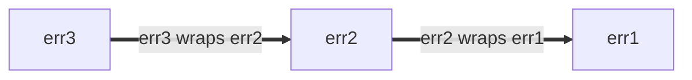

+++
title = '最佳實踐'
weight = 3
+++

<!--* toc_depth: 3 *-->
<!--
  本文件譯自 https://google.github.io/styleguide/go/best-practices,授權條款為
  Creative Commons Attribution 3.0 (CC-BY-3.0)。原文版權屬於 Google LLC,
  本中文版本為翻譯之衍生著作,僅供學習與內部參考。
-->

# Go 風格最佳實踐

<https://google.github.io/styleguide/go/best-practices>

[總覽](/) | [指南](/guide/) | [決策](/decisions/) |
[最佳實踐](/best-practices/)

<!--

-->

**注意:** 本文件屬於 Google 內部 [Go 風格](/) 系列文件之一。本份文件**既非 [規範性](/#normative) 也非 [典範性](/#canonical)**,屬於[核心風格指南](/guide/)的輔助文件。詳細說明請見[總覽](/#about)。

<a id="about"></a>

## 關於

本檔記錄了**如何最妥善地套用 Go 風格指南**的指引。這些指引針對的是常見、頻繁出現的情境,但未必適用所有狀況。可能時,我們會討論多種替代方案,並說明在何時適用、何時不適用的考量。

完整的風格文件清單請參考[總覽](/#about)。

<a id="naming"></a>

## 命名

<a id="function-names"></a>

### 函式與方法命名

<a id="function-name-repetition"></a>

#### 避免重複

選擇函式或方法名稱時,要考慮這個名字將被閱讀的情境。下列建議可協助避免在呼叫端出現多餘的[重複][repetition]:

[repetition]: /decisions/#repetition

- 下列資訊通常可從函式或方法名稱中省略:

  - 輸入與輸出的型別 (在不會衝突時)
  - 方法接收者的型別
  - 輸入或輸出是否為指標

- 對函式而言,不要[重複套件名稱](/decisions/#repetitive-with-package)。

  ```go
  // Bad:
  package yamlconfig

  func ParseYAMLConfig(input string) (*Config, error)
  ```

  ```go
  // Good:
  package yamlconfig

  func Parse(input string) (*Config, error)
  ```

- 對方法而言,不要重複方法接收者的名稱。

  ```go
  // Bad:
  func (c *Config) WriteConfigTo(w io.Writer) (int64, error)
  ```

  ```go
  // Good:
  func (c *Config) WriteTo(w io.Writer) (int64, error)
  ```

- 不要重複作為參數傳入的變數名稱。

  ```go
  // Bad:
  func OverrideFirstWithSecond(dest, source *Config) error
  ```

  ```go
  // Good:
  func Override(dest, source *Config) error
  ```

- 不要重複回傳值的名稱與型別。

  ```go
  // Bad:
  func TransformToJSON(input *Config) *jsonconfig.Config
  ```

  ```go
  // Good:
  func Transform(input *Config) *jsonconfig.Config
  ```

當需要區分名稱相似的函式時,可加入額外資訊以消除歧義。

```go
// Good:
func (c *Config) WriteTextTo(w io.Writer) (int64, error)
func (c *Config) WriteBinaryTo(w io.Writer) (int64, error)
```

<a id="function-name-conventions"></a>

#### 命名慣例

選擇函式與方法名稱時,還有一些常見的慣例:

- 會回傳結果的函式,使用名詞性的命名。

  ```go
  // Good:
  func (c *Config) JobName(key string) (value string, ok bool)
  ```

  由此延伸出的另一個原則是:函式與方法名稱應[避免使用 `Get` 前綴](/decisions/#getters)。

  ```go
  // Bad:
  func (c *Config) GetJobName(key string) (value string, ok bool)
  ```

- 會做某件事的函式,使用動詞性的命名。

  ```go
  // Good:
  func (c *Config) WriteDetail(w io.Writer) (int64, error)
  ```

- 行為相同、但牽涉不同型別的函式,將型別名稱加在函式名稱結尾。

  ```go
  // Good:
  func ParseInt(input string) (int, error)
  func ParseInt64(input string) (int64, error)
  func AppendInt(buf []byte, value int) []byte
  func AppendInt64(buf []byte, value int64) []byte
  ```

  如果其中有一個明顯的「主要」版本,該版本可省略型別名稱:

  ```go
  // Good:
  func (c *Config) Marshal() ([]byte, error)
  func (c *Config) MarshalText() (string, error)
  ```

<a id="naming-doubles"></a>

### 測試替身與輔助套件

對於提供測試輔助、特別是[測試替身 (test double)][test doubles] 的套件與型別[命名][naming],有幾個可遵循的原則。測試替身可能是 stub、fake、mock 或 spy。

底下範例多以 stub 為主。如果你的程式碼用的是 fake 或其他種類的測試替身,請相應地調整名稱。

[naming]: /guide/#naming
[test doubles]: https://abseil.io/resources/swe-book/html/ch13.html#basic_concepts

假設你有一個焦點明確、提供生產程式碼的套件,內容類似下列:

```go
package creditcard

import (
    "errors"

    "path/to/money"
)

// ErrDeclined indicates that the issuer declines the charge.
var ErrDeclined = errors.New("creditcard: declined")

// Card contains information about a credit card, such as its issuer,
// expiration, and limit.
type Card struct {
    // omitted
}

// Service allows you to perform operations with credit cards against external
// payment processor vendors like charge, authorize, reimburse, and subscribe.
type Service struct {
    // omitted
}

func (s *Service) Charge(c *Card, amount money.Money) error { /* omitted */ }
```

<a id="naming-doubles-helper-package"></a>

#### 建立測試輔助套件

假設你想為另一個套件建立測試替身套件,以下用上方的 `package creditcard` 為例。

其中一種做法是,以原本的生產套件為基礎建立一個新的測試用 Go 套件。一個安全的做法是把 `test` 字串接在原套件名稱之後 (「creditcard」+「test」):

```go
// Good:
package creditcardtest
```

除非另有明確說明,以下各小節的所有範例都位於 `package creditcardtest` 內。

<a id="naming-doubles-simple"></a>

#### 簡單情境

你想為 `Service` 加入一組測試替身。由於 `Card` 實際上是個單純的資料型別 (類似 Protocol Buffer 訊息),在測試中無需特別處理,因此不需要替身。如果你預期只會為一個型別 (例如 `Service`) 提供測試替身,可以採用較精簡的命名方式:

```go
// Good:
import (
    "path/to/creditcard"
    "path/to/money"
)

// Stub stubs creditcard.Service and provides no behavior of its own.
type Stub struct{}

func (Stub) Charge(*creditcard.Card, money.Money) error { return nil }
```

這比起 `StubService`,或者更糟的 `StubCreditCardService` 之類的命名都來得好,因為基底套件名稱與其領域型別已經能讓人推得 `creditcardtest.Stub` 是什麼意思。

最後,如果套件用 Bazel 建置,記得新的 `go_library` 規則要標記為 `testonly`:

```build
# Good:
go_library(
    name = "creditcardtest",
    srcs = ["creditcardtest.go"],
    deps = [
        ":creditcard",
        ":money",
    ],
    testonly = True,
)
```

上述做法是常見慣例,其他工程師會覺得相當熟悉、容易理解。

延伸閱讀:

- [Go Tip #42: Authoring a Stub for Testing](https://google.github.io/styleguide/go/index.html#gotip)

<a id="naming-doubles-multiple-behaviors"></a>

#### 多種測試替身行為

當一種 stub 不夠用時 (例如還需要一個一定會失敗的版本),建議依照所模擬的行為來為 stub 命名。底下我們把 `Stub` 改名為 `AlwaysCharges`,並加入一個新的 `AlwaysDeclines`:

```go
// Good:
// AlwaysCharges stubs creditcard.Service and simulates success.
type AlwaysCharges struct{}

func (AlwaysCharges) Charge(*creditcard.Card, money.Money) error { return nil }

// AlwaysDeclines stubs creditcard.Service and simulates declined charges.
type AlwaysDeclines struct{}

func (AlwaysDeclines) Charge(*creditcard.Card, money.Money) error {
    return creditcard.ErrDeclined
}
```

<a id="naming-doubles-multiple-types"></a>

#### 多種型別、多種替身

但假設 `package creditcard` 中包含多個值得做替身的型別,如下面同時有 `Service` 與 `StoredValue`:

```go
package creditcard

type Service struct {
    // omitted
}

type Card struct {
    // omitted
}

// StoredValue manages customer credit balances.  This applies when returned
// merchandise is credited to a customer's local account instead of processed
// by the credit issuer.  For this reason, it is implemented as a separate
// service.
type StoredValue struct {
    // omitted
}

func (s *StoredValue) Credit(c *Card, amount money.Money) error { /* omitted */ }
```

這種情況下,讓測試替身的命名更明確就有意義:

```go
// Good:
type StubService struct{}

func (StubService) Charge(*creditcard.Card, money.Money) error { return nil }

type StubStoredValue struct{}

func (StubStoredValue) Credit(*creditcard.Card, money.Money) error { return nil }
```

<a id="naming-doubles-local-variables"></a>

#### 測試中的區域變數

當測試中的變數指向替身時,選擇能依情境最清楚區分替身與正式型別的名字。考量下列待測程式碼:

```go
package payment

import (
    "path/to/creditcard"
    "path/to/money"
)

type CreditCard interface {
    Charge(*creditcard.Card, money.Money) error
}

type Processor struct {
    CC CreditCard
}

var ErrBadInstrument = errors.New("payment: instrument is invalid or expired")

func (p *Processor) Process(c *creditcard.Card, amount money.Money) error {
    if c.Expired() {
        return ErrBadInstrument
    }
    return p.CC.Charge(c, amount)
}
```

在測試中,一個叫 spy 的測試替身與正式型別並列,因此在名字前加前綴可以提升清晰度:

```go
// Good:
package payment

import "path/to/creditcardtest"

func TestProcessor(t *testing.T) {
    var spyCC creditcardtest.Spy
    proc := &Processor{CC: spyCC}

    // declarations omitted: card and amount
    if err := proc.Process(card, amount); err != nil {
        t.Errorf("proc.Process(card, amount) = %v, want nil", err)
    }

    charges := []creditcardtest.Charge{
        {Card: card, Amount: amount},
    }

    if got, want := spyCC.Charges, charges; !cmp.Equal(got, want) {
        t.Errorf("spyCC.Charges = %v, want %v", got, want)
    }
}
```

這比沒有前綴的版本清楚:

```go
// Bad:
package payment

import "path/to/creditcardtest"

func TestProcessor(t *testing.T) {
    var cc creditcardtest.Spy

    proc := &Processor{CC: cc}

    // declarations omitted: card and amount
    if err := proc.Process(card, amount); err != nil {
        t.Errorf("proc.Process(card, amount) = %v, want nil", err)
    }

    charges := []creditcardtest.Charge{
        {Card: card, Amount: amount},
    }

    if got, want := cc.Charges, charges; !cmp.Equal(got, want) {
        t.Errorf("cc.Charges = %v, want %v", got, want)
    }
}
```

<a id="shadowing"></a>

### 變數遮蔽 (shadowing)

**注意:** 本節用到兩個非正式的詞彙:*stomping* 與 *shadowing*。它們不是 Go 語言規範中正式的概念。

與許多程式語言一樣,Go 的變數是可變的,對變數賦值會改變其值。

```go
// Good:
func abs(i int) int {
    if i < 0 {
        i *= -1
    }
    return i
}
```

當以 `:=` 運算子使用[短變數宣告][short variable declarations]時,某些情況下並不會建立新變數。我們可以稱這種情況為 *stomping*。當原本的值已不再需要時,這樣寫是 OK 的。

```go
// Good:
// innerHandler is a helper for some request handler, which itself issues
// requests to other backends.
func (s *Server) innerHandler(ctx context.Context, req *pb.MyRequest) *pb.MyResponse {
    // Unconditionally cap the deadline for this part of request handling.
    ctx, cancel := context.WithTimeout(ctx, 3*time.Second)
    defer cancel()
    ctxlog.Info(ctx, "Capped deadline in inner request")

    // Code here no longer has access to the original context.
    // This is good style if when first writing this, you anticipate
    // that even as the code grows, no operation legitimately should
    // use the (possibly unbounded) original context that the caller provided.

    // ...
}
```

但要注意,在新的 scope 中使用短變數宣告會引入新變數,我們稱這種情況為 *shadowing* (遮蔽) 原本的變數。在該 scope 結束之後,程式碼仍指向原本的變數。下面是一個試圖有條件地縮短 deadline、卻寫錯的例子:

```go
// Bad:
func (s *Server) innerHandler(ctx context.Context, req *pb.MyRequest) *pb.MyResponse {
    // Attempt to conditionally cap the deadline.
    if *shortenDeadlines {
        ctx, cancel := context.WithTimeout(ctx, 3*time.Second)
        defer cancel()
        ctxlog.Info(ctx, "Capped deadline in inner request")
    }

    // BUG: "ctx" here again means the context that the caller provided.
    // The above buggy code compiled because both ctx and cancel
    // were used inside the if statement.

    // ...
}
```

正確的版本可能是:

```go
// Good:
func (s *Server) innerHandler(ctx context.Context, req *pb.MyRequest) *pb.MyResponse {
    if *shortenDeadlines {
        var cancel func()
        // Note the use of simple assignment, = and not :=.
        ctx, cancel = context.WithTimeout(ctx, 3*time.Second)
        defer cancel()
        ctxlog.Info(ctx, "Capped deadline in inner request")
    }
    // ...
}
```

在我們稱為 stomping 的情況中,因為沒有產生新變數,所以被賦值的型別必須與原本的變數相同。在 shadowing 中,則是引入了一個全新的實體,所以它可以是不同的型別。刻意的 shadowing 可以是一種有用的做法,但若能改個新名字提升[清晰性](/guide/#clarity),儘管使用新名字。

除了非常小的 scope 之外,儘量不要使用與標準套件同名的變數,因為這樣會使該套件中的免費函式 (free function) 與值無法存取。反過來,當你為自己的套件命名時,避免使用容易需要[匯入改名][import renaming]、或會在使用端遮蔽其他常用變數名稱的名字。

```go
// Bad:
func LongFunction() {
    url := "https://example.com/"
    // Oops, now we can't use net/url in code below.
}
```

[short variable declarations]: https://go.dev/ref/spec#Short_variable_declarations
[import renaming]: /decisions/#import-renaming

<a id="util-packages"></a>

### Util 套件

Go 套件在 `package` 宣告中指定的名字,與 import 路徑分開。對可讀性而言,套件名稱比路徑更重要。

Go 套件名稱應該[與套件提供的內容相關](/decisions/#package-names)。把套件取名為 `util`、`helper`、`common` 之類通常是不好的選擇 (雖然作為名稱的*一部分*是可以接受的)。語意不明的名字會讓程式碼更難讀,如果用得太廣泛,還容易導致無謂的[匯入衝突](/decisions/#import-renaming)。

相對地,試著想像呼叫端會長什麼樣子。

```go
// Good:
db := spannertest.NewDatabaseFromFile(...)

_, err := f.Seek(0, io.SeekStart)

b := elliptic.Marshal(curve, x, y)
```

即使不知道 import 清單 (`cloud.google.com/go/spanner/spannertest`、`io`、`crypto/elliptic`),你大致也能猜出每一行在做什麼。如果命名不夠聚焦,可能會看到:

```go
// Bad:
db := test.NewDatabaseFromFile(...)

_, err := f.Seek(0, common.SeekStart)

b := helper.Marshal(curve, x, y)
```

<a id="package-size"></a>

## 套件大小

如果你正在思考 Go 套件應該有多大、要把相關型別放在同一個套件中還是拆成多個套件,可以從 [Go blog 關於套件命名的文章][blog-pkg-names]開始看起。雖然文章標題談的是命名,但內容並不只是命名,還有許多有用的提示,並引用了多篇實用的文章與演講。

以下提供其他考量與註記。

使用者在 [godoc] 中是用一頁來看整個套件,套件提供的型別所匯出的方法,會依型別分組顯示;godoc 也會把建構函式 (constructor) 與其回傳的型別放在一起。如果*用戶端程式碼*很可能需要兩個不同型別的值彼此互動,把它們放在同一個套件,使用者用起來會比較方便。

同一個套件內的程式碼可以存取套件內的非匯出識別字。如果你有幾個型別的*實作*緊密耦合,把它們放在同一個套件中,就能達到這種耦合,而不必把細節透過公開 API 洩漏出去。檢驗這種耦合的好方法是想像一個假設的使用者:他要使用兩個主題密切相關的套件,如果他必須同時匯入兩個套件才能用到任何一邊有意義的功能,那把它們合併通常是對的選擇。標準函式庫整體上對這類「範圍與分層」拿捏得不錯。

話雖如此,把整個專案塞在單一套件裡,通常會讓該套件過於龐大。當某件事在概念上是獨立的,給它一個自己的小套件能讓使用更方便。在使用者眼中,套件名稱與其匯出型別名稱會合在一起組成一個有意義的識別字,例如 `bytes.Buffer`、`ring.New`。[Go blog 的套件命名文章][blog-pkg-names]裡有更多範例。

Go 風格對檔案大小相對寬鬆,因為維護者可以在不影響呼叫者的情況下,在套件內把程式碼從一份檔案搬到另一份。但作為一般原則:把幾千行程式碼塞在單一檔案裡通常不是好主意,但檔案太多、每份都很小也不好。Go 沒有像某些其他語言那樣的「一個型別一份檔案」慣例。經驗法則是:每份檔案應該夠專注,讓維護者能猜出某個東西在哪份檔案;每份檔案也要夠小,讓人在進到該檔案後容易找到。標準函式庫經常把大型套件拆成多份原始檔,以相關程式碼分組。[`package bytes`][package `bytes`] 的原始碼就是不錯的例子。對於有較長套件文件的套件,可以選擇用一個叫做 `doc.go` 的檔案,內容只放[套件文件](/decisions/#package-comments)與套件宣告,別無其他;但這並非強制。

在 Google 程式碼庫中,以及使用 Bazel 的專案內,Go 程式碼的目錄結構與一般開源 Go 專案不同:同一個目錄底下可以有多個 `go_library` 目標。如果你預期將來會把專案開源,讓每個套件自己擁有一個目錄會是個合理的理由。

下面是幾個非典範的參考範例,協助說明上述概念在實務中如何展現:

- 內含單一連貫概念,既不需要再加入也不需要再拆出來的小套件:

  - [`package csv`][package `csv`]:CSV 資料的編解碼,責任分別由 [reader.go] 與 [writer.go] 承擔。
  - [`package expvar`][package `expvar`]:白箱 (whitebox) 程式遙測,全部包在 [expvar.go] 內。

- 含一個較大領域與多個責任的中等大小套件:

  - [`package flag`][package `flag`]:命令列旗標管理,全部包在 [flag.go] 內。

- 將數個密切相關領域分散在多個檔案中的大型套件:

  - [`package http`][package `http`]:HTTP 的核心:[client.go][http-client] 提供 HTTP 用戶端;[server.go][http-server] 提供 HTTP 伺服器;[cookie.go] 處理 cookie。
  - [`package os`][package `os`]:跨平台作業系統抽象:[exec.go] 處理子行程;[file.go] 處理檔案;[tempfile.go] 處理暫存檔。

延伸閱讀:

- [測試替身套件](#naming-doubles)
- [Organizing Go Code (Blog Post)]
- [Organizing Go Code (Presentation)]

[blog-pkg-names]: https://go.dev/blog/package-names
[package `bytes`]: https://go.dev/src/bytes/
[Organizing Go Code (Blog Post)]: https://go.dev/blog/organizing-go-code
[Organizing Go Code (Presentation)]: https://go.dev/talks/2014/organizeio.slide
[package `csv`]: https://pkg.go.dev/encoding/csv
[reader.go]: https://go.googlesource.com/go/+/refs/heads/master/src/encoding/csv/reader.go
[writer.go]: https://go.googlesource.com/go/+/refs/heads/master/src/encoding/csv/writer.go
[package `expvar`]: https://pkg.go.dev/expvar
[expvar.go]: https://go.googlesource.com/go/+/refs/heads/master/src/expvar/expvar.go
[package `flag`]: https://pkg.go.dev/flag
[flag.go]: https://go.googlesource.com/go/+/refs/heads/master/src/flag/flag.go
[godoc]: https://pkg.go.dev/
[package `http`]: https://pkg.go.dev/net/http
[http-client]: https://go.googlesource.com/go/+/refs/heads/master/src/net/http/client.go
[http-server]: https://go.googlesource.com/go/+/refs/heads/master/src/net/http/server.go
[cookie.go]: https://go.googlesource.com/go/+/refs/heads/master/src/net/http/cookie.go
[package `os`]: https://pkg.go.dev/os
[exec.go]: https://go.googlesource.com/go/+/refs/heads/master/src/os/exec.go
[file.go]: https://go.googlesource.com/go/+/refs/heads/master/src/os/file.go
[tempfile.go]: https://go.googlesource.com/go/+/refs/heads/master/src/os/tempfile.go

<a id="imports"></a>

## 匯入 (imports)

<a id="import-protos"></a>

### Protocol Buffer 訊息與 stub

Protobuf 函式庫的 import 因為跨語言的特性,與一般 Go import 的處理方式不同。被改名後的 proto import,其慣例取決於產生該套件的規則:

- `pb` 後綴通常用於 `go_proto_library` 規則。
- `grpc` 後綴通常用於 `go_grpc_library` 規則。

通常會用一個簡短描述該套件的單字:

```go
// Good:
import (
    foopb "path/to/package/foo_service_go_proto"
    foogrpc "path/to/package/foo_service_go_grpc"
)
```

請遵循[套件命名](https://google.github.io/styleguide/go/decisions#package-names)的風格指引。優先使用完整的單字。短名字是好的,但避免歧義。拿不定主意時,使用 proto 套件名稱去掉 `_go` 之後加上 `pb` 後綴:

```go
// Good:
import (
    pushqueueservicepb "path/to/package/push_queue_service_go_proto"
)
```

**注意:** 過去的指引鼓勵非常短的名字 (例如 `xpb`,甚至只是 `pb`)。新的程式碼應使用更具描述性的名字。已使用短名字的既有程式碼不應作為範例,但也不需要強制更動。

<a id="import-order"></a>

### 匯入順序

請參考 [Go 風格決策:匯入分組](/decisions/#import-grouping)。

<a id="error-handling"></a>

## 錯誤處理

在 Go 中,[錯誤是值][errors are values]:它們由程式碼產生、由程式碼處理。錯誤可以是:

- 被轉換為診斷資訊以呈現給人類
- 被維護者使用
- 被終端使用者解讀

錯誤訊息也會出現在許多不同的介面上,例如日誌訊息、錯誤傾印、UI 等等。

處理錯誤 (產生或消費) 的程式碼應該是有意識的設計。直接忽略或盲目地往上回傳錯誤值很容易,但永遠值得思考:目前呼叫鏈中所在的這個函式,是否最適合處理這個錯誤?這是個很大的主題,難以給出絕對的建議,請依靠判斷,並謹記下列考量:

- 在建立錯誤值時,決定是否要給它[結構](#error-structure)。
- 在處理錯誤時,考慮[加入額外資訊](#error-extra-info),這些資訊是你有的、但呼叫端或被呼叫端可能沒有的。
- 也請參考[錯誤的紀錄](#error-logging)指引。

雖然通常不應忽略錯誤,但有一個合理的例外是:在協調一連串相關操作時,通常只需要第一個錯誤就足夠了。[`errgroup`] 套件為「整組可一起失敗或一起取消」的操作提供了便利的抽象。

[errors are values]: https://go.dev/blog/errors-are-values
[`errgroup`]: https://pkg.go.dev/golang.org/x/sync/errgroup

延伸閱讀:

- [Effective Go on errors](https://go.dev/doc/effective_go#errors)
- [Go Blog 關於錯誤的文章](https://go.dev/blog/go1.13-errors)
- [Package `errors`](https://pkg.go.dev/errors)
- [Package `upspin.io/errors`](https://commandcenter.blogspot.com/2017/12/error-handling-in-upspin.html)
- [GoTip #89: When to Use Canonical Status Codes as Errors](https://google.github.io/styleguide/go/index.html#gotip)
- [GoTip #48: Error Sentinel Values](https://google.github.io/styleguide/go/index.html#gotip)
- [GoTip #13: Designing Errors for Checking](https://google.github.io/styleguide/go/index.html#gotip)

<a id="error-structure"></a>

### 錯誤結構

如果呼叫端需要查詢錯誤 (例如要區分不同錯誤情境),就讓錯誤值具有結構,讓呼叫端可以用程式比對,而不是去做字串比對。這個建議同時適用於正式環境程式碼,以及在意不同錯誤情境的測試程式碼。

最簡單的結構化錯誤是不帶參數的全域值。

```go
type Animal string

var (
    // ErrDuplicate occurs if this animal has already been seen.
    ErrDuplicate = errors.New("duplicate")

    // ErrMarsupial occurs because we're allergic to marsupials outside Australia.
    // Sorry.
    ErrMarsupial = errors.New("marsupials are not supported")
)

func process(animal Animal) error {
    switch {
    case seen[animal]:
        return ErrDuplicate
    case marsupial(animal):
        return ErrMarsupial
    }
    seen[animal] = true
    // ...
    return nil
}
```

呼叫端只要把回傳的錯誤值與已知錯誤值比較即可:

```go
// Good:
func handlePet(...) {
    switch err := process(an); err {
    case ErrDuplicate:
        return fmt.Errorf("feed %q: %v", an, err)
    case ErrMarsupial:
        // Try to recover with a friend instead.
        alternate = an.BackupAnimal()
        return handlePet(..., alternate, ...)
    }
}
```

上述使用的是 sentinel 值,要求錯誤必須與預期值「相等」(以 `==` 的意義)。在許多情況下這已足夠。如果 `process` 回傳的是被包裝過的錯誤 (下面會討論),你可以用 [`errors.Is`]:

```go
// Good:
func handlePet(...) {
    switch err := process(an); {
    case errors.Is(err, ErrDuplicate):
        return fmt.Errorf("feed %q: %v", an, err)
    case errors.Is(err, ErrMarsupial):
        // ...
    }
}
```

不要嘗試以字串內容區分錯誤。(更多說明請參考 [Go Tip #13: Designing Errors for Checking](https://google.github.io/styleguide/go/index.html#gotip)。)

```go
// Bad:
func handlePet(...) {
    err := process(an)
    if regexp.MatchString(`duplicate`, err.Error()) {...}
    if regexp.MatchString(`marsupial`, err.Error()) {...}
}
```

如果錯誤中有額外資訊需要呼叫端以程式存取,理想上應以結構化方式呈現。例如,[`os.PathError`] 型別在文件中說明會把失敗操作的路徑放在某個 struct 欄位中,呼叫端可以輕易存取。

也可以視情況使用其他錯誤結構,例如包含錯誤碼與說明字串的專案自定 struct。[`Package status`][status] 是一個常見的封裝;如果你選擇這種方式 (並非必要),請使用[標準錯誤碼][canonical codes]。可參考 [Go Tip #89: When to Use Canonical Status Codes as Errors](https://google.github.io/styleguide/go/index.html#gotip),判斷使用 status code 是否合適。

[`os.PathError`]: https://pkg.go.dev/os#PathError
[`errors.Is`]: https://pkg.go.dev/errors#Is
[`errors.As`]: https://pkg.go.dev/errors#As
[`package cmp`]: https://pkg.go.dev/github.com/google/go-cmp/cmp
[status]: https://pkg.go.dev/google.golang.org/grpc/status
[canonical codes]: https://pkg.go.dev/google.golang.org/grpc/codes

<a id="error-extra-info"></a>

### 為錯誤加入資訊

為錯誤加入資訊時,避免重複底層錯誤已經提供的內容。例如 `os` 套件本身就會在錯誤中包含路徑資訊。

```go
// Good:
if err := os.Open("settings.txt"); err != nil {
  return fmt.Errorf("launch codes unavailable: %v", err)
}

// Output:
//
// launch codes unavailable: open settings.txt: no such file or directory
```

這裡 「launch codes unavailable」 為 `os.Open` 錯誤加入了與目前函式情境相關的具體意義,而沒有重複底層的檔案路徑資訊。

```go
// Bad:
if err := os.Open("settings.txt"); err != nil {
  return fmt.Errorf("could not open settings.txt: %v", err)
}

// Output:
//
// could not open settings.txt: open settings.txt: no such file or directory
```

如果包裝錯誤的目的只是為了表達「失敗了」而沒有新資訊,就不要加註解。錯誤的存在本身已經足以告訴呼叫端發生了失敗。

```go
// Bad:
return fmt.Errorf("failed: %v", err) // just return err instead
```

在用 `fmt.Errorf` 包裝錯誤時,[選擇 `%v` 還是 `%w`](https://go.dev/blog/go1.13-errors#whether-to-wrap) 是個微妙的決定,會大幅影響錯誤如何被傳遞、處理、檢視與記錄。核心原則是讓錯誤值對其觀察者有用,無論觀察者是人類還是程式碼。

1. **`%v` 用於簡單註解或新建錯誤**

   `%v` 動詞是任何 Go 值 (包含錯誤) 字串格式化的通用工具。在 `fmt.Errorf` 中使用時,它把錯誤的字串表達 (即 `Error()` 方法回傳的內容) 嵌入新的錯誤值中,並丟棄原本錯誤的結構化資訊。適合使用 `%v` 的場景:

   - 加入有意義、不重複的脈絡:如上例。

   - 紀錄或顯示錯誤:當主要目的是把人類可讀的錯誤訊息呈現在 log 或介面上,且不打算讓呼叫端用 `errors.Is` 或 `errors.As` 以程式檢查 (注意:`errors.Unwrap` 在這裡通常不建議,因為它無法處理 multi-error)。

   - 建立全新、獨立的錯誤:有時需要把錯誤轉換成新的錯誤訊息,從而隱藏原始錯誤的細節。這在系統邊界 (包含但不限於 RPC、IPC、儲存) 特別有益,我們會在這些邊界把領域特定錯誤翻譯為標準錯誤空間。

     ```go
     // Good:
     func (*FortuneTeller) SuggestFortune(context.Context, *pb.SuggestionRequest) (*pb.SuggestionResponse, error) {
       // ...
       if err != nil {
         return nil, fmt.Errorf("couldn't find fortune database: %v", err)
       }
     }
     ```

     上面這個範例也可以明確標註 RPC code `Internal`:

     ```go
     // Good:
     import (
       "google.golang.org/grpc/codes"
       "google.golang.org/grpc/status"
     )

     func (*FortuneTeller) SuggestFortune(context.Context, *pb.SuggestionRequest) (*pb.SuggestionResponse, error) {
       // ...
       if err != nil {
         // Or use fmt.Errorf with the %w verb if deliberately wrapping an
         // error which the caller is meant to unwrap.
         return nil, status.Errorf(codes.Internal, "couldn't find fortune database", status.ErrInternal)
       }
     }
     ```

1. **`%w` (wrap) 用於程式檢查與錯誤鏈接**

   `%w` 動詞專為錯誤包裝而設計。它建立一個新錯誤,並提供 `Unwrap()` 方法,讓呼叫端能用 `errors.Is` 與 `errors.As` 以程式檢查錯誤鏈。適合使用 `%w` 的場景:

   - 在保留原始錯誤以便程式檢查的同時加入脈絡:這是應用程式內部 helper 的主要使用情境。你想為錯誤加上額外脈絡 (例如失敗時正在做什麼),又同時希望讓呼叫端能檢查底層錯誤是否為某個特定 sentinel 或型別。

     ```go
     // Good:
     func (s *Server) internalFunction(ctx context.Context) error {
       // ...
       if err != nil {
         return fmt.Errorf("couldn't find remote file: %w", err)
       }
     }
     ```

     這樣高層函式即使錯誤已被包裝過,仍可以用 `errors.Is(err, fs.ErrNotExist)` 來檢查底層錯誤是否為 `fs.ErrNotExist`。

     在系統與外部系統互動的邊界 (RPC、IPC、儲存等),通常更好的做法是把領域特定錯誤翻譯為標準化的錯誤空間 (例如 gRPC status code),而不是單純用 `%w` 包裝原始底層錯誤。用戶端通常不在乎內部精確的檔案系統錯誤;他們在意的是標準化的結果 (例如 `Internal`、`NotFound`、`PermissionDenied`)。

   - 當你明確記錄並測試所暴露的底層錯誤時:如果你的套件 API 保證某些底層錯誤可以被解包並被呼叫端檢查 (例如「此函式可能回傳被包裝在更廣義錯誤裡的 `ErrInvalidConfig`」),那麼 `%w` 就合適。這就成為你的套件契約的一部分。

延伸閱讀:

- [錯誤文件慣例](#documentation-conventions-errors)
- [Go Blog 關於錯誤包裝的文章](https://blog.golang.org/go1.13-errors)

<a id="error-percent-w"></a>

### 錯誤中的 `%w` 擺放位置

如果你決定使用 `%w` 動詞做[錯誤包裝](https://go.dev/blog/go1.13-errors),建議把 `%w` 放在錯誤字串的結尾。

錯誤可以用 `%w` 動詞包裝,或放進實作了 `Unwrap() error` 的[結構化錯誤](https://google.github.io/styleguide/go/index.html#gotip) (例如 [`fs.PathError`](https://pkg.go.dev/io/fs#PathError))。

被包裝的錯誤會形成錯誤鏈:每加一層包裝,就在錯誤鏈最前端新增一個項目。錯誤鏈可以用 `Unwrap() error` 方法走訪。例如:

```go
err1 := fmt.Errorf("err1")
err2 := fmt.Errorf("err2: %w", err1)
err3 := fmt.Errorf("err3: %w", err2)
```

形成的錯誤鏈如下:



無論 `%w` 動詞放在哪裡,回傳的錯誤永遠代表錯誤鏈的最前端,而 `%w` 是其下一個子節點。同樣地,`Unwrap() error` 永遠是從最新到最舊的錯誤鏈方向走訪。

不過,`%w` 動詞的位置會影響錯誤鏈被印出來時的順序:從新到舊、從舊到新,或既不新到舊也不舊到新:

```go
// Good:
err1 := fmt.Errorf("err1")
err2 := fmt.Errorf("err2: %w", err1)
err3 := fmt.Errorf("err3: %w", err2)
fmt.Println(err3) // err3: err2: err1
// err3 is a newest-to-oldest error chain, that prints newest-to-oldest.
```

```go
// Bad:
err1 := fmt.Errorf("err1")
err2 := fmt.Errorf("%w: err2", err1)
err3 := fmt.Errorf("%w: err3", err2)
fmt.Println(err3) // err1: err2: err3
// err3 is a newest-to-oldest error chain, that prints oldest-to-newest.
```

```go
// Bad:
err1 := fmt.Errorf("err1")
err2 := fmt.Errorf("err2-1 %w err2-2", err1)
err3 := fmt.Errorf("err3-1 %w err3-2", err2)
fmt.Println(err3) // err3-1 err2-1 err1 err2-2 err3-2
// err3 is a newest-to-oldest error chain, that neither prints newest-to-oldest
// nor oldest-to-newest.
```

因此,為了讓錯誤文字能反映錯誤鏈結構,建議把 `%w` 放在最後,寫成 `[...]: %w` 的形式。

<a id="error-percent-w-sentinel-placement"></a>

#### Sentinel 錯誤的擺放位置

這個規則的例外是包裝 sentinel 錯誤時。Sentinel 錯誤是用來作為失敗主要分類的錯誤。它幫助觀察者快速理解失敗的本質 (例如「找不到」「無效引數」),不必去解析整個錯誤訊息。儘可能在錯誤字串前段就讓人辨識出錯誤類型是有益的。

Sentinel 錯誤的例子包括 os 錯誤 (例如 [`os.ErrInvalid`]) 與套件層級的錯誤。

在這些情境下,把 `%w` 動詞放在錯誤字串的開頭可以提升可讀性,因為立刻就能辨識錯誤類別:

```go
// Good:
package parser

var ErrParse = fmt.Errorf("parse error")

// This is another package error that could be returned.
var ErrParseInvalidHeader = fmt.Errorf("%w: invalid header", ErrParse)

func parseHeader() error {
  err := checkHeader()
  return fmt.Errorf("%w: invalid character in header: %v", ErrParseInvalidHeader, err)
}

err := fmt.Errorf("%w: couldn't find fortune database: %v", ErrInternal, err)
```

把 status 放在開頭,可確保最相關的分類資訊也最為顯眼。

```go
// Bad:
package parser

var ErrParse = fmt.Errorf("parse error")

// This is another package error that could be returned.
var ErrParseInvalidHeader = fmt.Errorf("%w: invalid header", ErrParse)

func parseHeader() error {
  err := checkHeader()
  return fmt.Errorf("invalid character in header: %v: %w", err, ErrParseInvalidHeader)
}

var ErrInternal = status.Error(codes.Internal, "internal")
err2 := fmt.Errorf("couldn't find fortune database: %v: %w", err, ErrInternal)
```

把它放在最後,會因為錯誤類別被埋在具體錯誤細節中,而難以辨識。

[`os.ErrInvalid`]: https://pkg.go.dev/os#ErrInvalid

延伸閱讀:

- [Go Tip #48: Error Sentinel Values]
- [Go Tip #106: Error Naming Conventions]

[commentary]: /decisions/#commentary
[Go Tip #48: Error Sentinel Values]: https://google.github.io/styleguide/go/index.html#gotip
[Go Tip #106: Error Naming Conventions]: https://google.github.io/styleguide/go/index.html#gotip

<a id="error-logging"></a>

### 紀錄錯誤

函式有時需要把錯誤告知外部系統,但不向上回傳給呼叫端。記錄日誌 (logging) 是顯而易見的選擇;但對於記錄什麼、如何記錄要有所留意。

- 像[好的測試失敗訊息][good test failure messages]一樣,log 訊息應該清楚表達出錯內容,並包含足以協助維護者診斷問題的相關資訊。

- 避免重複。如果你會把錯誤回傳出去,通常不要自己也記錄一次,而是讓呼叫端決定是否要記錄。呼叫端可以選擇記錄錯誤,或用 [`rate.Sometimes`] 之類限速。其他選項包括嘗試恢復或甚至[終止程式][stopping the program]。無論如何,把控制權交給呼叫端,有助於避免 log 洪水。

  這種做法的缺點是:任何 log 訊息都會用呼叫端的行號座標寫出。

- 注意 [PII]。許多 log 接收端並不適合存放使用者敏感資訊。

- 謹慎使用 `log.Error`。ERROR 等級的 log 會觸發 flush,比較低等級的 log 成本高,可能對程式效能造成嚴重影響。在錯誤等級與警告等級之間取捨時,請記住一個最佳實踐:錯誤等級的訊息應該是「可採取行動」的,而不只是「比警告嚴重」。

- 在 Google 內部,我們有監控系統可以提供比寫到 log 檔再寄望有人注意更有效的告警設定。這與標準函式庫的 [package `expvar`] 概念類似但不同。

[good test failure messages]: https://google.github.io/styleguide/go/decisions#useful-test-failures
[stopping the program]: #checks-and-panics
[`rate.Sometimes`]: https://pkg.go.dev/golang.org/x/time/rate#Sometimes
[PII]: https://en.wikipedia.org/wiki/Personal_data
[package `expvar`]: https://pkg.go.dev/expvar

<a id="vlog"></a>

#### 自訂詳細度

善用詳細日誌 ([`log.V`])。詳細日誌對開發與追蹤都有用。針對詳細度建立慣例會有幫助。例如:

- `V(1)` 寫一些額外資訊
- `V(2)` 追蹤更多資訊
- `V(3)` 傾印大型內部狀態

為了把詳細日誌的成本降到最低,你應確保即使 `log.V` 被關閉時,也不會意外呼叫昂貴的函式。`log.V` 提供兩種 API,較方便的那種有意外開銷的風險。拿不定主意時,使用稍微囉嗦但安全的寫法。

```go
// Good:
for _, sql := range queries {
  log.V(1).Infof("Handling %v", sql)
  if log.V(2) {
    log.Infof("Handling %v", sql.Explain())
  }
  sql.Run(...)
}
```

```go
// Bad:
// sql.Explain called even when this log is not printed.
log.V(2).Infof("Handling %v", sql.Explain())
```

[`log.V`]: https://pkg.go.dev/github.com/golang/glog#V

<a id="program-init"></a>

### 程式初始化

程式初始化錯誤 (例如錯誤的 flag 與設定) 應向上傳遞至 `main`,由 `main` 呼叫 `log.Exit`,並在訊息中說明如何修正錯誤。在這類情境中,通常不應使用 `log.Fatal`,因為指向檢查程式碼位置的堆疊追蹤,通常不會比一條人類撰寫、可付諸行動的訊息更有用。

<a id="checks-and-panics"></a>

### 程式檢查與 panic

如同[反對使用 panic 的決策][decision against panics]中所述,標準的錯誤處理應圍繞錯誤回傳值來組織。函式庫應優先回傳錯誤給呼叫端,而不是讓程式中止,尤其是面對暫時性錯誤時。

偶爾需要對某項不變條件 (invariant) 做一致性檢查,並在違反時終止程式。一般而言,只有在檢查失敗代表內部狀態已經無法挽救時才這樣做。在 Google 程式碼庫中,執行此目的最可靠的做法是呼叫 `log.Fatal`。在這類情況下使用 `panic` 並不可靠,因為 deferred 函式可能死鎖,或進一步把內部或外部狀態弄壞。

同樣地,抗拒「為了避免 crash 而 recover panic」的誘惑,因為這樣做有可能讓被破壞的狀態繼續傳遞下去。距離 panic 越遠,你對程式狀態知道得越少 — 程式可能還握著 lock 或其他資源。程式接著可能出現其他意想不到的失敗模式,讓問題更難診斷。與其在程式中嘗試處理意外的 panic,不如使用監控工具讓意外的失敗浮現,並以高優先級修正相關 bug。

**注意:** 標準的 [`net/http` server] 違反此建議,它會 recover 來自 request handler 的 panic。資深 Go 工程師之間的共識是:這在歷史上是個錯誤。如果你抽樣其他語言應用伺服器的 server log,常常會看到大量未被處理的堆疊追蹤,這是常態。請避免在你自己的伺服器中重蹈覆轍。

[decision against panics]: https://google.github.io/styleguide/go/decisions#dont-panic
[`net/http` server]: https://pkg.go.dev/net/http#Server

<a id="when-to-panic"></a>

### 何時可以使用 panic

標準函式庫會對 API 誤用 panic。例如 [`reflect`] 在許多看起來像被誤解誤用的存取場景時會 panic。這類似於語言核心 bug 的 panic,例如越界存取 slice。Code review 與測試應該要找到這些 bug,它們不該出現在正式環境中。這些 panic 起到的是不變條件檢查的作用,且不依賴任何函式庫,因為標準函式庫無法存取 Google 程式碼庫使用的[分等級的 `log`][levelled `log`] 套件。

[`reflect`]: https://pkg.go.dev/reflect
[levelled `log`]: /decisions/#logging

另一個雖然少見、但 panic 可能有用的情況是:作為某個套件內部實作的細節,且呼叫鏈中一定有對應的 `recover`。剖析器與類似的深度遞迴、緊密耦合的內部函式群,可以從這種設計中獲益,因為在這類程式中傳遞錯誤回傳值會增加複雜度卻沒有實質價值。

這種設計的關鍵特性是:**這些 panic 永遠不允許跨越套件邊界**,也不會成為套件 API 的一部分。通常的做法是用最上層的 deferred 函式呼叫 `recover`,在公開 API 邊界把傳遞的 panic 轉成回傳的錯誤。這要求 panic/recover 的程式碼能夠區分自己拋出的 panic 與其他來源的 panic:

```go
// Good:
type syntaxError struct {
  msg string
}

func parseInt(in string) int {
  n, err := strconv.Atoi(in)
  if err != nil {
    panic(&syntaxError{"not a valid integer"})
  }
}

func Parse(in string) (_ *Node, err error) {
  defer func() {
    if p := recover(); p != nil {
      sErr, ok := p.(*syntaxError)
      if !ok {
        panic(p) // Propagate the panic since it is outside our code's domain.
      }
      err = fmt.Errorf("syntax error: %v", sErr.msg)
    }
  }()
  ... // Parse input calling parseInt internally to parse integers
}
```

> **警告:** 採用此模式的程式碼,必須小心管理在 defer-managed 區段中執行的程式碼所對應的任何資源 (例如關閉、釋放或解鎖)。
>
> 請參考 [Go Tip #81: Avoiding Resource Leaks in API Design]

當編譯器無法判別程式碼不可達 (unreachable) 時,也會用到 panic,例如使用像 `log.Fatal` 這類不會回傳的函式時:

```go
// Good:
func answer(i int) string {
    switch i {
    case 42:
        return "yup"
    case 54:
        return "base 13, huh"
    default:
        log.Fatalf("Sorry, %d is not the answer.", i)
        panic("unreachable")
    }
}
```

[在 flag 解析之前不要呼叫 `log` 函式](https://pkg.go.dev/github.com/golang/glog#pkg-overview)。如果你必須在套件初始化函式 (`init` 或["must" 函式](/decisions/#must-functions)) 中讓程式中止,使用 panic 取代 fatal logging 呼叫是可以接受的。

延伸閱讀:

- 語言規範中的 [Handling panics](https://go.dev/ref/spec#Handling_panics) 與 [Run-time Panics](https://go.dev/ref/spec#Run_time_panics)
- [Defer, Panic, and Recover](https://go.dev/blog/defer-panic-and-recover)
- [On the uses and misuses of panics in Go](https://eli.thegreenplace.net/2018/on-the-uses-and-misuses-of-panics-in-go/)

[Go Tip #81: Avoiding Resource Leaks in API Design]: https://google.github.io/styleguide/go/index.html#gotip

<a id="documentation"></a>

## 文件

<a id="documentation-conventions"></a>

### 慣例

本節為決策文件中 [commentary] 一節的補充。

採用熟悉風格撰寫文件的 Go 程式碼,比起寫得不對或完全沒寫文件的程式碼,更容易閱讀,也較不容易被誤用。可執行的[範例][examples]會出現在 Godoc 與 Code Search 中,是說明如何使用程式碼的絕佳方式。

[examples]: /decisions/#examples

<a id="documentation-conventions-params"></a>

#### 參數與設定

不需要把每個參數都列在文件中。這適用於:

- 函式與方法的參數
- struct 的欄位
- 選項相關的 API

對容易出錯或不直觀的欄位與參數,以「為什麼這值得注意」的方式加以說明。

下面這段程式碼中,標示出來的註解對讀者並沒有提供多少有用資訊:

```go
// Bad:
// Sprintf formats according to a format specifier and returns the resulting
// string.
//
// format is the format, and data is the interpolation data.
func Sprintf(format string, data ...any) string
```

但下面這段範例則展示了類似情境,只是註解陳述了不直觀或對讀者有實質幫助的內容:

```go
// Good:
// Sprintf formats according to a format specifier and returns the resulting
// string.
//
// The provided data is used to interpolate the format string. If the data does
// not match the expected format verbs or the amount of data does not satisfy
// the format specification, the function will inline warnings about formatting
// errors into the output string as described by the Format errors section
// above.
func Sprintf(format string, data ...any) string
```

選擇文件內容與深度時,考量你可能的讀者群。維護者、團隊新成員、外部使用者、甚至六個月後的你自己,可能都希望看到與你現在腦中所想略有差異的資訊。

延伸閱讀:

- [GoTip #41: Identify Function Call Parameters]
- [GoTip #51: Patterns for Configuration]

[commentary]: /decisions/#commentary
[GoTip #41: Identify Function Call Parameters]: https://google.github.io/styleguide/go/index.html#gotip
[GoTip #51: Patterns for Configuration]: https://google.github.io/styleguide/go/index.html#gotip

<a id="documentation-conventions-contexts"></a>

#### Context

context 引數被取消時會中斷使用它的函式,這是被預期的行為。如果該函式可回傳錯誤,慣例上會回傳 `ctx.Err()`。

這個事實不需要在文件中重複說明:

```go
// Bad:
// Run executes the worker's run loop.
//
// The method will process work until the context is cancelled and accordingly
// returns an error.
func (Worker) Run(ctx context.Context) error
```

因為這已隱含於慣例,下列寫法較好:

```go
// Good:
// Run executes the worker's run loop.
func (Worker) Run(ctx context.Context) error
```

當 context 行為與預期不同或不直觀時,如果出現以下任一情況,就應在文件中明確說明:

- 函式在 context 取消時回傳的不是 `ctx.Err()` 之外的錯誤:

  ```go
  // Good:
  // Run executes the worker's run loop.
  //
  // If the context is cancelled, Run returns a nil error.
  func (Worker) Run(ctx context.Context) error
  ```

- 函式有其他可中斷它或影響其生命週期的機制:

  ```go
  // Good:
  // Run executes the worker's run loop.
  //
  // Run processes work until the context is cancelled or Stop is called.
  // Context cancellation is handled asynchronously internally: run may return
  // before all work has stopped. The Stop method is synchronous and waits
  // until all operations from the run loop finish. Use Stop for graceful
  // shutdown.
  func (Worker) Run(ctx context.Context) error

  func (Worker) Stop()
  ```

- 函式對 context 的生命週期、來源或附帶的值有特別期望:

  ```go
  // Good:
  // NewReceiver starts receiving messages sent to the specified queue.
  // The context should not have a deadline.
  func NewReceiver(ctx context.Context) *Receiver

  // Principal returns a human-readable name of the party who made the call.
  // The context must have a value attached to it from security.NewContext.
  func Principal(ctx context.Context) (name string, ok bool)
  ```

  **警告:** 避免設計這類對呼叫端有要求的 API (例如要求 context 不要有 deadline)。上述只是若無法避免時應如何記錄的範例,不是對此模式的背書。

<a id="documentation-conventions-concurrency"></a>

#### 並行性

Go 使用者預設「概念上是唯讀」的操作可被並行使用,不需要額外同步。

下列 Godoc 中關於並行性的額外備註可以安全地刪除:

```go
// Len returns the number of bytes of the unread portion of the buffer;
// b.Len() == len(b.Bytes()).
//
// It is safe to be called concurrently by multiple goroutines.
func (*Buffer) Len() int
```

但會修改狀態的操作則不被預設為並行安全,需要使用者考慮同步。

同樣地,下列關於並行性的備註可以安全刪除:

```go
// Grow grows the buffer's capacity.
//
// It is not safe to be called concurrently by multiple goroutines.
func (*Buffer) Grow(n int)
```

如果出現以下任一情況,強烈建議撰寫文件:

- 操作究竟是唯讀還是會修改狀態並不清楚:

  ```go
  // Good:
  package lrucache

  // Lookup returns the data associated with the key from the cache.
  //
  // This operation is not safe for concurrent use.
  func (*Cache) Lookup(key string) (data []byte, ok bool)
  ```

  為什麼?在 LRU 快取中查詢命中也會在內部修改狀態,這對所有讀者未必明顯。

- 同步是由 API 提供:

  ```go
  // Good:
  package fortune_go_proto

  // NewFortuneTellerClient returns an *rpc.Client for the FortuneTeller service.
  // It is safe for simultaneous use by multiple goroutines.
  func NewFortuneTellerClient(cc *rpc.ClientConn) *FortuneTellerClient
  ```

  為什麼?Stubby 提供同步機制。

  **注意:** 如果 API 是型別,且該型別整體上提供同步,慣例上只在型別定義處說明語意即可。

- API 接受由使用者實作的 interface 型別,且該 interface 的使用者對並行性有特別要求:

  ```go
  // Good:
  package health

  // A Watcher reports the health of some entity (usually a backend service).
  //
  // Watcher methods are safe for simultaneous use by multiple goroutines.
  type Watcher interface {
      // Watch sends true on the passed-in channel when the Watcher's
      // status has changed.
      Watch(changed chan<- bool) (unwatch func())

      // Health returns nil if the entity being watched is healthy, or a
      // non-nil error explaining why the entity is not healthy.
      Health() error
  }
  ```

  為什麼?API 是否可以由多個 goroutine 安全使用,屬於它契約的一部分。

<a id="documentation-conventions-cleanup"></a>

#### 清理 (cleanup)

明確記錄 API 所要求的明示清理步驟。否則呼叫端不會正確使用 API,可能導致資源洩漏或其他 bug。

點明應由呼叫端負責的清理:

```go
// Good:
// NewTicker returns a new Ticker containing a channel that will send the
// current time on the channel after each tick.
//
// Call Stop to release the Ticker's associated resources when done.
func NewTicker(d Duration) *Ticker

func (*Ticker) Stop()
```

如果清理方式可能不直觀,說明清楚:

```go
// Good:
// Get issues a GET to the specified URL.
//
// When err is nil, resp always contains a non-nil resp.Body.
// Caller should close resp.Body when done reading from it.
//
//    resp, err := http.Get("http://example.com/")
//    if err != nil {
//        // handle error
//    }
//    defer resp.Body.Close()
//    body, err := io.ReadAll(resp.Body)
func (c *Client) Get(url string) (resp *Response, err error)
```

延伸閱讀:

- [GoTip #110: Don't Mix Exit With Defer]

[GoTip #110: Don't Mix Exit With Defer]: https://google.github.io/styleguide/go/index.html#gotip

<a id="documentation-conventions-errors"></a>

#### 錯誤

把函式回傳給呼叫端的重要 sentinel 錯誤值或錯誤型別記錄下來,讓呼叫端能預期可在程式中處理哪些情況。

```go
// Good:
package os

// Read reads up to len(b) bytes from the File and stores them in b. It returns
// the number of bytes read and any error encountered.
//
// At end of file, Read returns 0, io.EOF.
func (*File) Read(b []byte) (n int, err error) {
```

當函式回傳特定錯誤型別時,正確標明該錯誤是不是指標接收者:

```go
// Good:
package os

type PathError struct {
    Op   string
    Path string
    Err  error
}

// Chdir changes the current working directory to the named directory.
//
// If there is an error, it will be of type *PathError.
func Chdir(dir string) error {
```

說明回傳的值是否為指標接收者,讓呼叫端能正確使用 [`errors.Is`]、[`errors.As`] 與 [`package cmp`] 比較錯誤。原因是非指標的值與指標的值並不相等。

**注意:** 在 `Chdir` 範例中,回傳型別寫成 `error` 而不是 `*PathError`,是因為 [nil interface 值的運作方式](https://go.dev/doc/faq#nil_error)。

當行為適用於套件內大多數錯誤時,在[套件文件](/decisions/#package-comments)中說明整體錯誤慣例:

```go
// Good:
// Package os provides a platform-independent interface to operating system
// functionality.
//
// Often, more information is available within the error. For example, if a
// call that takes a file name fails, such as Open or Stat, the error will
// include the failing file name when printed and will be of type *PathError,
// which may be unpacked for more information.
package os
```

審慎地運用上述方法,可以不費太多力氣就[為錯誤加入額外資訊](#error-extra-info),也讓呼叫端不必再加多餘註解。

延伸閱讀:

- [Go Tip #106: Error Naming Conventions](https://google.github.io/styleguide/go/index.html#gotip)
- [Go Tip #89: When to Use Canonical Status Codes as Errors](https://google.github.io/styleguide/go/index.html#gotip)

<a id="documentation-preview"></a>

### 文件預覽

Go 提供[文件伺服器](https://pkg.go.dev/golang.org/x/pkgsite/cmd/pkgsite)。建議在 code review 之前與過程中預覽程式碼產生的文件,以驗證 [godoc 格式][godoc formatting]能正確呈現。

[godoc formatting]: #godoc-formatting

<a id="godoc-formatting"></a>

### Godoc 格式

[Godoc] 提供一些特定語法以[排版文件][format documentation]。

- 段落之間需要一行空白行隔開:

  ```go
  // Good:
  // LoadConfig reads a configuration out of the named file.
  //
  // See some/shortlink for config file format details.
  ```

- 測試檔可以包含[可執行範例][runnable examples],它們會附在 godoc 中對應的文件之下:

  ```go
  // Good:
  func ExampleConfig_WriteTo() {
    cfg := &Config{
      Name: "example",
    }
    if err := cfg.WriteTo(os.Stdout); err != nil {
      log.Exitf("Failed to write config: %s", err)
    }
    // Output:
    // {
    //   "name": "example"
    // }
  }
  ```

- 把行多縮排兩個空白,會以原樣呈現 (verbatim formatting):

  ```go
  // Good:
  // Update runs the function in an atomic transaction.
  //
  // This is typically used with an anonymous TransactionFunc:
  //
  //   if err := db.Update(func(state *State) { state.Foo = bar }); err != nil {
  //     //...
  //   }
  ```

  不過要注意,把程式碼寫成可執行範例,通常比寫在註解裡更合適。

  這種原樣呈現的格式也可以用來排版 godoc 原生不支援的格式,例如清單與表格:

  ```go
  // Good:
  // LoadConfig reads a configuration out of the named file.
  //
  // LoadConfig treats the following keys in special ways:
  //   "import" will make this configuration inherit from the named file.
  //   "env" if present will be populated with the system environment.
  ```

- 一行以大寫字母開頭、除了括號與逗號外不含其他標點符號、且後面接著一個段落,會被排版為標題:

  ```go
  // Good:
  // The following line is formatted as a heading.
  //
  // Using headings
  //
  // Headings come with autogenerated anchor tags for easy linking.
  ```

[Godoc]: https://pkg.go.dev/
[format documentation]: https://go.dev/doc/comment
[runnable examples]: /decisions/#examples

<a id="signal-boost"></a>

### 訊號加強 (signal boosting)

有時某行程式碼看起來像常見寫法,但實際上不是。最典型的例子之一是 `err == nil` 檢查 (因為 `err != nil` 比較常見)。下列兩個條件式不容易區分:

```go
// Good:
if err := doSomething(); err != nil {
    // ...
}
```

```go
// Bad:
if err := doSomething(); err == nil {
    // ...
}
```

你可以加上註解來「加強」這個條件式的訊號:

```go
// Good:
if err := doSomething(); err == nil { // if NO error
    // ...
}
```

註解能引起讀者注意條件的差異。

<a id="vardecls"></a>

## 變數宣告

<a id="vardeclinitialization"></a>

### 初始化

為了一致性,當以非零值初始化新變數時,優先使用 `:=` 而非 `var`。

```go
// Good:
i := 42
```

```go
// Bad:
var i = 42
```

<a id="vardeclzero"></a>

### 以零值宣告變數

下列宣告使用[零值][zero value]:

```go
// Good:
var (
    coords Point
    magic  [4]byte
    primes []int
)
```

[zero value]: https://golang.org/ref/spec#The_zero_value

當你想表達一個**可供之後使用的空值**時,應以零值方式宣告。使用顯式初始化的複合字面量會顯得笨重:

```go
// Bad:
var (
    coords = Point{X: 0, Y: 0}
    magic  = [4]byte{0, 0, 0, 0}
    primes = []int(nil)
)
```

零值宣告的常見應用之一是把變數作為解 unmarshal 的輸出對象:

```go
// Good:
var coords Point
if err := json.Unmarshal(data, &coords); err != nil {
```

當你需要某個指標型別變數時,以下零值寫法也是可以的:

```go
// Good:
msg := new(pb.Bar) // or "&pb.Bar{}"
if err := proto.Unmarshal(data, msg); err != nil {
```

如果你的 struct 中需要一個 lock 或其他[不可被複製的欄位](/decisions/#copying),可以把它做成 value 型別,以利用零值初始化。這代表外層型別必須以指標而非值的形式傳遞,且其方法必須使用指標接收者。

```go
// Good:
type Counter struct {
    // This field does not have to be "*sync.Mutex". However,
    // users must now pass *Counter objects between themselves, not Counter.
    mu   sync.Mutex
    data map[string]int64
}

// Note this must be a pointer receiver to prevent copying.
func (c *Counter) IncrementBy(name string, n int64)
```

在區域變數中使用 value 型別的複合 (例如 struct、array) 也可接受,即使它們含有不可複製欄位。但若該複合會由函式回傳,或所有存取最終都要取位址,一開始就把變數宣告為指標型別更好。同理,protobuf 訊息應宣告為指標型別。

```go
// Good:
func NewCounter(name string) *Counter {
    c := new(Counter) // "&Counter{}" is also fine.
    registerCounter(name, c)
    return c
}

var msg = new(pb.Bar) // or "&pb.Bar{}".
```

這是因為 `*pb.Something` 滿足 [`proto.Message`],而 `pb.Something` 不滿足。

```go
// Bad:
func NewCounter(name string) *Counter {
    var c Counter
    registerCounter(name, &c)
    return &c
}

var msg = pb.Bar{}
```

[`proto.Message`]: https://pkg.go.dev/google.golang.org/protobuf/proto#Message

> **重要:** map 型別必須先明確初始化才能修改;但從零值 map 讀取則完全沒問題。
>
> 對於 map 與 slice 型別,如果程式碼對效能特別敏感且事先知道大小,請參考[大小提示](#vardeclsize)一節。

<a id="vardeclcomposite"></a>

### 複合字面量

下列為[複合字面量][composite literal]宣告:

```go
// Good:
var (
    coords   = Point{X: x, Y: y}
    magic    = [4]byte{'I', 'W', 'A', 'D'}
    primes   = []int{2, 3, 5, 7, 11}
    captains = map[string]string{"Kirk": "James Tiberius", "Picard": "Jean-Luc"}
)
```

當你已知初始元素或成員時,應該使用複合字面量宣告。

相對地,用複合字面量宣告空的或無成員的值,在視覺上會比用[零值初始化](#vardeclzero)更雜亂。

當你需要一個指向零值的指標時,有兩種選擇:空的複合字面量與 `new`。兩者都可以,但 `new` 關鍵字可以提醒讀者:若需要的是非零值,複合字面量並不能滿足:

```go
// Good:
var (
  buf = new(bytes.Buffer) // non-empty Buffers are initialized with constructors.
  msg = new(pb.Message) // non-empty proto messages are initialized with builders or by setting fields one by one.
)
```

[composite literal]: https://golang.org/ref/spec#Composite_literals

<a id="vardeclsize"></a>

### 大小提示

下列宣告利用大小提示預先配置容量:

```go
// Good:
var (
    // Preferred buffer size for target filesystem: st_blksize.
    buf = make([]byte, 131072)
    // Typically process up to 8-10 elements per run (16 is a safe assumption).
    q = make([]Node, 0, 16)
    // Each shard processes shardSize (typically 32000+) elements.
    seen = make(map[string]bool, shardSize)
)
```

只有當你**結合對程式碼及其整合的實證分析**時,大小提示與預先配置才是寫出對效能敏感、資源效率高的程式碼的重要步驟。

大多數程式碼不需要大小提示或預先配置,讓 runtime 視需要擴張 slice 或 map 即可。當最終大小已知 (例如在 map 與 slice 之間轉換) 時,預先配置是可以接受的,但這並非可讀性要求,在小情境下也可能讓程式碼更雜亂而不值得。

**警告:** 預先配置超出實際需求的記憶體,可能浪費機群中的記憶體,甚至傷害效能。拿不定主意時,請參考 [GoTip #3: Benchmarking Go Code],並預設使用[零值初始化](#vardeclzero)或[複合字面量宣告](#vardeclcomposite)。

[GoTip #3: Benchmarking Go Code]: https://google.github.io/styleguide/go/index.html#gotip

<a id="decl-chan"></a>

### Channel 方向

可能時,明確指定 [channel 方向][channel direction]。

```go
// Good:
// sum computes the sum of all of the values. It reads from the channel until
// the channel is closed.
func sum(values <-chan int) int {
    // ...
}
```

這可以避免不指定方向時容易出現的程式碼錯誤:

```go
// Bad:
func sum(values chan int) (out int) {
    for v := range values {
        out += v
    }
    // values must already be closed for this code to be reachable, which means
    // a second close triggers a panic.
    close(values)
}
```

當方向被明確指定時,編譯器可以攔下這類簡單錯誤;它也有助於把所有權的概念帶入型別中。

另請參考 Bryan Mills 的演講「Rethinking Classical Concurrency Patterns」:[投影片][rethinking-concurrency-slides] [影片][rethinking-concurrency-video]。

[rethinking-concurrency-slides]: https://drive.google.com/file/d/1nPdvhB0PutEJzdCq5ms6UI58dp50fcAN/view?usp=sharing
[rethinking-concurrency-video]: https://www.youtube.com/watch?v=5zXAHh5tJqQ
[channel direction]: https://go.dev/ref/spec#Channel_types

<a id="funcargs"></a>

## 函式參數列表

不要讓函式的簽章過長。當參數越加越多,個別參數的角色就越不清楚,鄰近的同型別參數也更容易混淆。參數眾多的函式較難記憶,在呼叫端也更難閱讀。

設計 API 時,可考慮把簽章日趨複雜、可設定性高的函式拆成多個更簡單的函式。如有需要,它們可以共用一個 (非匯出的) 實作。

當函式需要許多輸入時,考慮對其中一部分引數採用[選項 struct][option struct],或運用更進階的[可變引數選項][variadic options]技術。選擇哪種策略的主要考量,應該是函式呼叫在所有預期使用情境下看起來如何。

下列建議主要適用於匯出的 API,匯出的 API 比非匯出的有更高的標準。對你的使用情境而言,這些技術可能並非必要。請依照判斷,平衡[清晰性][clarity]與[最小機制][least mechanism]兩項原則。

延伸閱讀:[Go Tip #24: Use Case-Specific Constructions](https://google.github.io/styleguide/go/index.html#gotip)

[option struct]: #option-structure
[variadic options]: #variadic-options
[clarity]: /guide/#clarity
[least mechanism]: /guide/#least-mechanism

<a id="option-structure"></a>

### 選項 struct

選項 struct 是一個收納函式或方法部分或全部引數的 struct,作為函式或方法的最後一個引數傳入。(只有當該 struct 用於匯出函式時,才需要把它匯出。)

使用選項 struct 有許多好處:

- struct literal 中同時包含每個引數的欄位名稱與值,既具有自我說明性,也較難搞錯順序。
- 不相關或「採用預設值」的欄位可以省略。
- 呼叫端可以共用選項 struct,並寫 helper 操作它。
- struct 提供比函式引數更乾淨的「逐欄位」文件。
- 選項 struct 可以隨時間擴展,而不影響現有的呼叫端。

下面是一個可以改進的函式範例:

```go
// Bad:
func EnableReplication(ctx context.Context, config *replicator.Config, primaryRegions, readonlyRegions []string, replicateExisting, overwritePolicies bool, replicationInterval time.Duration, copyWorkers int, healthWatcher health.Watcher) {
    // ...
}
```

可以改寫為以選項 struct 形式如下:

```go
// Good:
type ReplicationOptions struct {
    Config              *replicator.Config
    PrimaryRegions      []string
    ReadonlyRegions     []string
    ReplicateExisting   bool
    OverwritePolicies   bool
    ReplicationInterval time.Duration
    CopyWorkers         int
    HealthWatcher       health.Watcher
}

func EnableReplication(ctx context.Context, opts ReplicationOptions) {
    // ...
}
```

接著可以在另一個套件中如此呼叫:

```go
// Good:
func foo(ctx context.Context) {
    // Complex call:
    storage.EnableReplication(ctx, storage.ReplicationOptions{
        Config:              config,
        PrimaryRegions:      []string{"us-east1", "us-central2", "us-west3"},
        ReadonlyRegions:     []string{"us-east5", "us-central6"},
        OverwritePolicies:   true,
        ReplicationInterval: 1 * time.Hour,
        CopyWorkers:         100,
        HealthWatcher:       watcher,
    })

    // Simple call:
    storage.EnableReplication(ctx, storage.ReplicationOptions{
        Config:         config,
        PrimaryRegions: []string{"us-east1", "us-central2", "us-west3"},
    })
}
```

**注意:** [Context 永遠不應放進選項 struct](/decisions/#contexts)。

當下列其中幾項成立時,通常會偏好這個選項:

- 所有呼叫端都需要指定其中一個或多個選項。
- 大量的呼叫端需要提供許多選項。
- 多個函式之間共享的選項都會被使用者呼叫。

<a id="variadic-options"></a>

### 可變引數選項

使用可變引數選項時,會建立一些匯出函式,它們回傳的 closure 可以傳入函式的[可變 (`...`) 參數][variadic (`...`) parameter]中。這些建立 closure 的函式以選項的值 (若有) 為其參數,而回傳的 closure 接受一個可變動的引用 (通常是指向某個 struct 型別的指標),並會根據輸入更新該引用。

[variadic (`...`) parameter]: https://golang.org/ref/spec#Passing_arguments_to_..._parameters

使用可變引數選項可以帶來許多好處:

- 不需要設定時,選項在呼叫端不佔任何篇幅。
- 選項仍是值,所以呼叫端可以共用、寫 helper、累積它們。
- 選項可以接受多個參數 (例如 `cartesian.Translate(dx, dy int) TransformOption`)。
- 選項函式可以回傳具名型別,以便在 godoc 中將相關選項分組。
- 套件可允許 (或防止) 第三方套件自定 (或無法自定) 它們自己的選項。

**注意:** 使用可變引數選項需要相當多的額外程式碼 (見下方範例),只有在好處超過開銷時才使用。

下面是可以改進的函式範例:

```go
// Bad:
func EnableReplication(ctx context.Context, config *placer.Config, primaryCells, readonlyCells []string, replicateExisting, overwritePolicies bool, replicationInterval time.Duration, copyWorkers int, healthWatcher health.Watcher) {
  ...
}
```

上例可以以可變引數選項改寫如下:

```go
// Good:
type replicationOptions struct {
    readonlyCells       []string
    replicateExisting   bool
    overwritePolicies   bool
    replicationInterval time.Duration
    copyWorkers         int
    healthWatcher       health.Watcher
}

// A ReplicationOption configures EnableReplication.
type ReplicationOption func(*replicationOptions)

// ReadonlyCells adds additional cells that should additionally
// contain read-only replicas of the data.
//
// Passing this option multiple times will add additional
// read-only cells.
//
// Default: none
func ReadonlyCells(cells ...string) ReplicationOption {
    return func(opts *replicationOptions) {
        opts.readonlyCells = append(opts.readonlyCells, cells...)
    }
}

// ReplicateExisting controls whether files that already exist in the
// primary cells will be replicated.  Otherwise, only newly-added
// files will be candidates for replication.
//
// Passing this option again will overwrite earlier values.
//
// Default: false
func ReplicateExisting(enabled bool) ReplicationOption {
    return func(opts *replicationOptions) {
        opts.replicateExisting = enabled
    }
}

// ... other options ...

// DefaultReplicationOptions control the default values before
// applying options passed to EnableReplication.
var DefaultReplicationOptions = []ReplicationOption{
    OverwritePolicies(true),
    ReplicationInterval(12 * time.Hour),
    CopyWorkers(10),
}

func EnableReplication(ctx context.Context, config *placer.Config, primaryCells []string, opts ...ReplicationOption) {
    var options replicationOptions
    for _, opt := range DefaultReplicationOptions {
        opt(&options)
    }
    for _, opt := range opts {
        opt(&options)
    }
}
```

接著可以在另一個套件中如此呼叫:

```go
// Good:
func foo(ctx context.Context) {
    // Complex call:
    storage.EnableReplication(ctx, config, []string{"po", "is", "ea"},
        storage.ReadonlyCells("ix", "gg"),
        storage.OverwritePolicies(true),
        storage.ReplicationInterval(1*time.Hour),
        storage.CopyWorkers(100),
        storage.HealthWatcher(watcher),
    )

    // Simple call:
    storage.EnableReplication(ctx, config, []string{"po", "is", "ea"})
}
```

當以下幾項成立時,優先採用此選項:

- 多數呼叫端不需要指定任何選項。
- 多數選項使用頻率不高。
- 選項數量眾多。
- 選項需要引數。
- 選項可能失敗或被錯誤設定 (這時選項函式可回傳 `error`)。
- 選項需要大量文件,難以塞進 struct。
- 使用者或其他套件可提供自訂選項。

採用此風格的選項應接受參數,而不是用「是否傳入」來表達其值;後者會讓動態組合引數困難得多。例如,二元設定應接受布林值 (`rpc.FailFast(enable bool)` 比 `rpc.EnableFailFast()` 好)。列舉性選項應接受列舉常數 (`log.Format(log.Capacitor)` 比 `log.CapacitorFormat()` 好)。否則對於必須以程式決定要傳哪些選項的使用者來說,他們被迫去更動實際的參數組合,而不是只調整選項的引數。不要假設所有使用者都能在編譯期就知道完整的選項集合。

一般而言,選項應依序處理。如有衝突,或某個非累計型選項被多次傳入,後傳入的引數應勝出。

此模式中,選項函式的參數通常是非匯出的,以將選項定義限制在套件內部。這是個良好的預設,但有時也適合允許其他套件定義選項。

請參考 [Rob Pike 原始的部落格文章][Rob Pike's original blog post] 與 [Dave Cheney 的演講][Dave Cheney's talk],對這類選項的使用有更深入的探討。

[Rob Pike's original blog post]: http://commandcenter.blogspot.com/2014/01/self-referential-functions-and-design.html
[Dave Cheney's talk]: https://dave.cheney.net/2014/10/17/functional-options-for-friendly-apis

<a id="complex-clis"></a>

## 複雜的命令列介面

某些程式希望提供豐富、含子命令的命令列介面給使用者。例如 `kubectl create`、`kubectl run` 等多個子命令都由 `kubectl` 程式提供。實務上至少有下列函式庫常被用來達成此目的。

如果你沒有偏好、且其他考量都相同,建議使用 [subcommands],因為它最簡單、也最容易正確使用。但如果你需要它沒提供的功能,請選擇其他選項之一。

- **[cobra]**

  - flag 慣例:getopt
  - 在 Google 程式碼庫之外常見。
  - 額外功能多。
  - 使用上有陷阱 (詳見下文)。

- **[subcommands]**

  - flag 慣例:Go
  - 簡單、容易正確使用。
  - 若不需要額外功能,推薦使用。

**警告:** cobra 命令函式應使用 `cmd.Context()` 取得 context,而不是用 `context.Background` 自己建立 root context。使用 subcommands 套件的程式碼則已透過函式參數收到正確的 context。

不要求每個子命令都放在獨立的套件中,通常也沒必要這樣做。對套件邊界的考量與其他 Go 程式碼相同。如果你的程式碼能同時作為函式庫與二進位執行檔使用,通常將 CLI 程式碼與函式庫分開有好處,讓 CLI 只是這個函式庫的眾多用戶端之一。(這不限於有子命令的 CLI,但這裡常見地被提及。)

[subcommands]: https://pkg.go.dev/github.com/google/subcommands
[cobra]: https://pkg.go.dev/github.com/spf13/cobra

<a id="tests"></a>

## 測試

<a id="test-functions"></a>

### 把測試交給 `Test` 函式

<!-- Note to maintainers: This section overlaps with decisions#assert and
decisions#mark-test-helpers. The point is not to repeat information, but
to have one place that summarizes the distinction that newcomers to the
language often wonder about. -->

Go 對「測試 helper」與「assertion helper」加以區分:

- **測試 helper** 是執行 setup 或 cleanup 工作的函式。在測試 helper 中發生的失敗,預期都是「環境」的失敗 (而不是受測程式碼的失敗) — 例如測試資料庫無法啟動,因為這台機器上沒有更多空閒的 port。對這類函式,呼叫 `t.Helper` [標記為測試 helper][mark them as a test helper] 通常是合適的。更多細節請參考[測試 helper 中的錯誤處理][error handling in test helpers]。

- **Assertion helper** 是檢查系統正確性、若不符合期望就讓測試失敗的函式。在 Go 中,assertion helper [被認為不慣用][not considered idiomatic]。

測試的目的是回報受測程式碼的成敗狀態。讓測試失敗的理想位置是在 `Test` 函式本身內,因為這能確保[失敗訊息][failure messages]與測試邏輯都很清楚。

[mark them as a test helper]: /decisions/#mark-test-helpers
[error handling in test helpers]: #test-helper-error-handling
[not considered idiomatic]: /decisions/#assert
[failure messages]: /decisions/#useful-test-failures

當測試程式碼成長時,有時必須把部分功能抽出獨立函式。一般軟體工程的考量仍然適用,因為*測試程式碼也是程式碼*。如果這些功能不與測試框架互動,所有平常的規則都適用。但當共用程式碼會與框架互動時,就要小心避免常見陷阱,以免最後得到沒有資訊量的失敗訊息與難以維護的測試。

如果許多獨立的 test case 需要相同的驗證邏輯,請以下列方式之一安排測試,而不是使用 assertion helper 或複雜的驗證函式:

- 把邏輯 (驗證與失敗回報) 內嵌在 `Test` 函式中,即使會重複也沒關係。在簡單情境下這最有效。
- 如果輸入相似,考慮把它們合併為[表格驅動測試][table-driven test],並把邏輯內嵌在迴圈中。這樣可以避免重複,同時把驗證與失敗保留在 `Test` 內。
- 如果有多個呼叫者需要相同的驗證函式,但表格測試不合適 (通常因為輸入不夠單純,或驗證需要作為一連串操作的一部分),把驗證函式設計成回傳值 (通常是 `error`),而不是接受 `testing.T` 並用它讓測試失敗。在 `Test` 中決定是否要失敗,並提供[有用的測試失敗訊息][useful test failures]。你也可以建立測試 helper 來抽離常見的 boilerplate setup 程式碼。

最後一點所描述的設計保有正交性。例如 [`package cmp`] 並非設計來讓測試失敗,而是用來比較 (與 diff) 值。它因此不必知道比較是在何種脈絡下進行,因為呼叫端可以提供。如果你的共用測試程式碼能為你的資料型別提供 `cmp.Transformer`,那通常會是最簡潔的設計。對於其他驗證,考慮回傳一個 `error` 值。

```go
// Good:
// polygonCmp returns a cmp.Option that equates s2 geometry objects up to
// some small floating-point error.
func polygonCmp() cmp.Option {
    return cmp.Options{
        cmp.Transformer("polygon", func(p *s2.Polygon) []*s2.Loop { return p.Loops() }),
        cmp.Transformer("loop", func(l *s2.Loop) []s2.Point { return l.Vertices() }),
        cmpopts.EquateApprox(0.00000001, 0),
        cmpopts.EquateEmpty(),
    }
}

func TestFenceposts(t *testing.T) {
    // This is a test for a fictional function, Fenceposts, which draws a fence
    // around some Place object. The details are not important, except that
    // the result is some object that has s2 geometry (github.com/golang/geo/s2)
    got := Fencepost(tomsDiner, 1*meter)
    if diff := cmp.Diff(want, got, polygonCmp()); diff != "" {
        t.Errorf("Fencepost(tomsDiner, 1m) returned unexpected diff (-want+got):\n%v", diff)
    }
}

func FuzzFencepost(f *testing.F) {
    // Fuzz test (https://go.dev/doc/fuzz) for the same.

    f.Add(tomsDiner, 1*meter)
    f.Add(school, 3*meter)

    f.Fuzz(func(t *testing.T, geo Place, padding Length) {
        got := Fencepost(geo, padding)
        // Simple reference implementation: not used in prod, but easy to
        // reason about and therefore useful to check against in random tests.
        reference := slowFencepost(geo, padding)

        // In the fuzz test, inputs and outputs can be large so don't
        // bother with printing a diff. cmp.Equal is enough.
        if !cmp.Equal(got, reference, polygonCmp()) {
            t.Errorf("Fencepost returned wrong placement")
        }
    })
}
```

`polygonCmp` 函式對自己如何被呼叫沒有預設;它不接受具體的輸入型別,也不規定兩個物件不相符時要怎麼處理。因此,更多的呼叫端都可以使用它。

**注意:** 測試 helper 與一般函式庫程式碼有相似之處。函式庫中的程式碼通常[不應 panic][not panic],除非在罕見情況;從測試呼叫的程式碼除非[沒必要繼續][no point in proceeding],否則不應終止測試。

[table-driven test]: /decisions/#table-driven-tests
[useful test failures]: /decisions/#useful-test-failures
[package `cmp`]: https://pkg.go.dev/github.com/google/go-cmp/cmp
[not panic]: /decisions/#dont-panic
[no point in proceeding]: #t-fatal

<a id="test-validation-apis"></a>

### 設計可擴充的驗證 API

風格指南中關於測試的多數建議,都是針對「測試你自己寫的程式碼」。本節談的是如何提供工具,讓別人能寫出符合你的函式庫要求的測試。

<a id="test-validation-apis-what"></a>

#### 接受度測試 (acceptance testing)

這類測試稱為[接受度測試 (acceptance testing)][acceptance testing]。這種測試的前提是:使用測試的人不需要知道測試裡每一個細節;他只要把輸入交給測試設施去處理即可。可以視為一種[控制反轉 (inversion of control)][inversion of control]。

在典型的 Go 測試中,測試函式控制程式流程,而[不要 assert](/decisions/#assert) 與[測試函式](#test-functions)的指引也鼓勵你保持這種寫法。本節說明如何以符合 Go 風格的方式,為這類測試撰寫支援。

在進入「怎麼做」之前,先看一個來自 [`io/fs`] 的例子 (節錄):

```go
type FS interface {
    Open(name string) (File, error)
}
```

雖然有許多眾所周知的 `fs.FS` 實作,Go 開發者也可能需要自己撰寫一個。為了協助驗證使用者實作的 `fs.FS` 是否正確,[`testing/fstest`] 中提供了一個通用函式庫 [`fstest.TestFS`]。這個 API 把實作視為黑箱,確保它符合 `io/fs` 契約中最基本的部分。

[acceptance testing]: https://en.wikipedia.org/wiki/Acceptance_testing
[inversion of control]: https://en.wikipedia.org/wiki/Inversion_of_control
[`io/fs`]: https://pkg.go.dev/io/fs
[`testing/fstest`]: https://pkg.go.dev/testing/fstest
[`fstest.TestFS`]: https://pkg.go.dev/testing/fstest#TestFS

<a id="test-validation-apis-writing"></a>

#### 撰寫接受度測試

我們已知道什麼是接受度測試以及為何要用它,接著為 `package chess` 寫一個接受度測試;`chess` 是個用於模擬西洋棋對局的套件。`chess` 的使用者預期會實作 `chess.Player` 介面,這些實作是我們主要要驗證的對象。我們的接受度測試只在意 player 的實作是否做出合法的步,而非聰明的步。

1. 為驗證行為建立一個新套件,[依慣例命名](#naming-doubles-helper-package)為原套件名稱加上 `test` (例如 `chesstest`)。

1. 建立執行驗證的函式,把待測實作當成引數接受,並去使用它:

   ```go
   // ExercisePlayer tests a Player implementation in a single turn on a board.
   // The board itself is spot checked for sensibility and correctness.
   //
   // It returns a nil error if the player makes a correct move in the context
   // of the provided board. Otherwise ExercisePlayer returns one of this
   // package's errors to indicate how and why the player failed the
   // validation.
   func ExercisePlayer(b *chess.Board, p chess.Player) error
   ```

   測試應指出哪一項不變條件被破壞、如何破壞。在失敗回報上,你的設計可以選擇兩種策略:

   - **快速失敗 (fail fast)**:一旦實作違反任何不變條件就立即回傳錯誤。

     這是最簡單的做法,如果預期接受度測試執行很快,效果不錯。簡單的錯誤 [sentinel][sentinels] 與[自訂型別][custom types]在這裡可以輕易使用,反過來也讓對接受度測試本身的測試變得容易。

     ```go
     for color, army := range b.Armies {
         // The king should never leave the board, because the game ends at
         // checkmate.
         if army.King == nil {
             return &MissingPieceError{Color: color, Piece: chess.King}
         }
     }
     ```

   - **彙整所有失敗 (aggregate all failures)**:收集所有失敗,一次回報。

     這個做法在感受上接近[「繼續往下走」(keep going)](/decisions/#keep-going) 指引,當預期接受度測試執行較慢時,可能更合適。

     如何彙整失敗,應該由「你想讓使用者或自己有沒有能力檢視單一失敗」(例如為了測試你的接受度測試) 決定。下面示範使用[自訂錯誤型別][custom types],可以[彙整錯誤][aggregates errors]:

     ```go
     var badMoves []error

     move := p.Move()
     if putsOwnKingIntoCheck(b, move) {
         badMoves = append(badMoves, PutsSelfIntoCheckError{Move: move})
     }

     if len(badMoves) > 0 {
         return SimulationError{BadMoves: badMoves}
     }
     return nil
     ```

接受度測試應遵守[「繼續往下走」(keep going)](/decisions/#keep-going) 指引:除非偵測到受測系統破壞了某項不變條件,否則不要呼叫 `t.Fatal`。

例如 `t.Fatal` 應像往常一樣保留給特殊情況,例如[setup 失敗](#test-helper-error-handling):

```go
func ExerciseGame(t *testing.T, cfg *Config, p chess.Player) error {
    t.Helper()

    if cfg.Simulation == Modem {
        conn, err := modempool.Allocate()
        if err != nil {
            t.Fatalf("No modem for the opponent could be provisioned: %v", err)
        }
        t.Cleanup(func() { modempool.Return(conn) })
    }
    // Run acceptance test (a whole game).
}
```

這個技巧可以協助你建立精煉、典範的驗證。但不要試圖用它來繞過[關於 assertion 的指引](/decisions/#assert)。

對終端使用者而言,最終成果應該類似下列:

```go
// Good:
package deepblue_test

import (
    "chesstest"
    "deepblue"
)

func TestAcceptance(t *testing.T) {
    player := deepblue.New()
    err := chesstest.ExerciseGame(t, chesstest.SimpleGame, player)
    if err != nil {
        t.Errorf("Deep Blue player failed acceptance test: %v", err)
    }
}
```

[sentinels]: https://google.github.io/styleguide/go/index.html#gotip
[custom types]: https://google.github.io/styleguide/go/index.html#gotip
[aggregates errors]: https://google.github.io/styleguide/go/index.html#gotip

<a id="use-real-transports"></a>

### 使用真實的傳輸層

當測試元件之間的整合 (尤其是元件之間以 HTTP 或 RPC 作為底層傳輸) 時,優先使用真實的底層傳輸去連接後端的測試版本。

例如,假設你想測試的程式碼 (有時被稱為「待測系統 (system under test)」或 SUT) 與一個實作 [long running operations] API 的後端互動。要測試你的 SUT,使用真實的 [OperationsClient] 連接到 [OperationsServer] 的[測試替身][test double] (例如 mock、stub 或 fake)。

[test double]: https://abseil.io/resources/swe-book/html/ch13.html#basic_concepts
[long running operations]: https://pkg.go.dev/google.golang.org/genproto/googleapis/longrunning
[OperationsClient]: https://pkg.go.dev/google.golang.org/genproto/googleapis/longrunning#OperationsClient
[OperationsServer]: https://pkg.go.dev/google.golang.org/genproto/googleapis/longrunning#OperationsServer

這比手寫一個用戶端更受推薦,因為要正確模仿用戶端行為相當複雜。透過搭配「正式用戶端 + 測試專用伺服器」,你可以確保測試使用了盡可能多的真實程式碼。

**提示:** 可能時,使用待測服務作者所提供的測試函式庫。

<a id="t-fatal"></a>

### `t.Error` vs. `t.Fatal`

如同[決策](/decisions/#keep-going)中所述,測試一般不應在遇到第一個問題時就中止。

不過,某些情境會要求測試不再繼續。當部分測試 setup 失敗時 (尤其是在[測試 setup helper][test setup helpers] 中),呼叫 `t.Fatal` 是合適的,因為沒有它就無法執行其餘測試。在 table-driven 測試中,`t.Fatal` 適合用在「測試迴圈之前、會準備整個測試函式」的失敗。對於只影響表中單一項目、無法繼續處理該項目的失敗,應依下列方式回報:

- 如果你沒有使用 `t.Run` 子測試,使用 `t.Error` 後接 `continue`,以進到下一筆表格項目。
- 如果你使用子測試 (在 `t.Run` 內),使用 `t.Fatal`,它會結束目前子測試,讓你的測試 case 進到下一個子測試。

**警告:** 並非所有情況都能安全地呼叫 `t.Fatal` 與類似函式。[更多細節在這裡](#t-fatal-goroutine)。

[test setup helpers]: #test-helper-error-handling

<a id="test-helper-error-handling"></a>

### 測試 helper 的錯誤處理

**注意:** 本節討論的[測試 helper][test helpers] 是 Go 用語意義下的:做測試 setup 與 cleanup 的函式,而不是常見的 assertion 工具。更多討論請參考[測試函式](#test-functions)一節。

[test helpers]: /decisions/#mark-test-helpers

測試 helper 執行的操作有時會失敗。例如:設定一個含檔案的目錄需要 I/O,可能失敗。當測試 helper 失敗時,通常代表測試無法繼續,因為某個 setup 前提條件失敗了。發生這種情況時,在 helper 內呼叫 `Fatal` 系列函式之一是較好的做法:

```go
// Good:
func mustAddGameAssets(t *testing.T, dir string) {
    t.Helper()
    if err := os.WriteFile(path.Join(dir, "pak0.pak"), pak0, 0644); err != nil {
        t.Fatalf("Setup failed: could not write pak0 asset: %v", err)
    }
    if err := os.WriteFile(path.Join(dir, "pak1.pak"), pak1, 0644); err != nil {
        t.Fatalf("Setup failed: could not write pak1 asset: %v", err)
    }
}
```

這樣呼叫端會比 helper 把錯誤回傳給測試本身來得乾淨:

```go
// Bad:
func addGameAssets(t *testing.T, dir string) error {
    t.Helper()
    if err := os.WriteFile(path.Join(d, "pak0.pak"), pak0, 0644); err != nil {
        return err
    }
    if err := os.WriteFile(path.Join(d, "pak1.pak"), pak1, 0644); err != nil {
        return err
    }
    return nil
}
```

**警告:** 並非所有情況都能安全地呼叫 `t.Fatal` 與類似函式。[更多細節](#t-fatal-goroutine)在這裡。

失敗訊息應包含發生事件的描述。這很重要,因為當 helper 中產生錯誤的步驟越多,你提供的測試 API 也可能被許多使用者使用。當測試失敗時,使用者應該知道發生在哪裡、為什麼。

**提示:** Go 1.14 引入了 [`t.Cleanup`] 函式,可註冊在測試結束時執行的 cleanup 函式。該函式也適用於測試 helper。請參考 [GoTip #4: Cleaning Up Your Tests](https://google.github.io/styleguide/go/index.html#gotip),簡化測試 helper 的指引。

下方位於虛構檔案 `paint_test.go` 的範例,示範 `(*testing.T).Helper` 如何影響 Go 測試的失敗回報:

```go
package paint_test

import (
    "fmt"
    "testing"
)

func paint(color string) error {
    return fmt.Errorf("no %q paint today", color)
}

func badSetup(t *testing.T) {
    // This should call t.Helper, but doesn't.
    if err := paint("taupe"); err != nil {
        t.Fatalf("Could not paint the house under test: %v", err) // line 15
    }
}

func goodSetup(t *testing.T) {
    t.Helper()
    if err := paint("lilac"); err != nil {
        t.Fatalf("Could not paint the house under test: %v", err)
    }
}

func TestBad(t *testing.T) {
    badSetup(t)
    // ...
}

func TestGood(t *testing.T) {
    goodSetup(t) // line 32
    // ...
}
```

執行時的輸出範例如下,注意行號的差異:

```text
=== RUN   TestBad
    paint_test.go:15: Could not paint the house under test: no "taupe" paint today
--- FAIL: TestBad (0.00s)
=== RUN   TestGood
    paint_test.go:32: Could not paint the house under test: no "lilac" paint today
--- FAIL: TestGood (0.00s)
FAIL
```

`paint_test.go:15` 的錯誤指向 `badSetup` 中失敗的 setup 函式那一行:

`t.Fatalf("Could not paint the house under test: %v", err)`

而 `paint_test.go:32` 指向 `TestGood` 中失敗的測試本身那一行:

`goodSetup(t)`

正確使用 `(*testing.T).Helper` 能在以下情況把失敗位置更準確地歸因:

- helper 函式逐漸變大
- helper 函式呼叫其他 helper
- helper 在測試函式內被使用得更頻繁

**提示:** 如果 helper 呼叫了 `(*testing.T).Error` 或 `(*testing.T).Fatal`,在格式字串中提供一些脈絡,以協助判斷出了什麼錯、為什麼。

**提示:** 如果 helper 不會做任何可能讓測試失敗的事,它就不需要呼叫 `t.Helper`。把它的簽章從函式參數列中移除 `t`,以簡化簽章。

[`t.Cleanup`]: https://pkg.go.dev/testing#T.Cleanup

<a id="t-fatal-goroutine"></a>

### 不要在另一個 goroutine 中呼叫 `t.Fatal`

如同 [testing 套件文件](https://pkg.go.dev/testing#T) 所述,從執行 Test 函式 (或子測試) 的 goroutine 之外的任何 goroutine 呼叫 `t.FailNow`、`t.Fatal` 等都是不正確的。如果你的測試啟動了新 goroutine,它們不能在內部呼叫這些函式。

[測試 helper](#test-functions) 通常不會從新 goroutine 回報失敗,因此可以使用 `t.Fatal`。如果不確定,改用 `t.Error` 然後 return 即可。

```go
// Good:
func TestRevEngine(t *testing.T) {
    engine, err := Start()
    if err != nil {
        t.Fatalf("Engine failed to start: %v", err)
    }

    num := 11
    var wg sync.WaitGroup
    wg.Add(num)
    for i := 0; i < num; i++ {
        go func() {
            defer wg.Done()
            if err := engine.Vroom(); err != nil {
                // This cannot be t.Fatalf.
                t.Errorf("No vroom left on engine: %v", err)
                return
            }
            if rpm := engine.Tachometer(); rpm > 1e6 {
                t.Errorf("Inconceivable engine rate: %d", rpm)
            }
        }()
    }
    wg.Wait()

    if seen := engine.NumVrooms(); seen != num {
        t.Errorf("engine.NumVrooms() = %d, want %d", seen, num)
    }
}
```

對測試或子測試呼叫 `t.Parallel`,並不會讓 `t.Fatal` 變得不安全。

當所有對 `testing` API 的呼叫都在[測試函式](#test-functions)內時,通常很容易發現使用錯誤,因為 `go` 關鍵字一目了然。但如果到處傳遞 `testing.T` 引數,要追蹤這類使用就比較困難。傳這些引數通常是為了引入測試 helper,而那些 helper 不應依賴受測系統。因此,如果測試 helper 要[註冊 fatal 測試失敗](#test-helper-error-handling),它可以、也應該在測試的 goroutine 中執行。

<a id="t-field-names"></a>

### 在 struct literal 中使用欄位名稱

<a id="t-field-labels"></a>

在 table-driven 測試中,初始化 test case struct literal 時,優先指定欄位名稱。當測試 case 佔用大量垂直空間 (例如超過 20-30 行)、有相鄰欄位型別相同、或你想省略零值欄位時,這特別有幫助。例如:

```go
// Good:
func TestStrJoin(t *testing.T) {
    tests := []struct {
        slice     []string
        separator string
        skipEmpty bool
        want      string
    }{
        {
            slice:     []string{"a", "b", ""},
            separator: ",",
            want:      "a,b,",
        },
        {
            slice:     []string{"a", "b", ""},
            separator: ",",
            skipEmpty: true,
            want:      "a,b",
        },
        // ...
    }
    // ...
}
```

<a id="t-common-setup-scope"></a>

### 把 setup 程式碼限制在特定測試範圍內

可能時,資源與相依的 setup 應盡量緊密貼合特定 test case。例如,給定一個 setup 函式:

```go
// mustLoadDataSet loads a data set for the tests.
//
// This example is very simple and easy to read. Often realistic setup is more
// complex, error-prone, and potentially slow.
func mustLoadDataset(t *testing.T) []byte {
    t.Helper()
    data, err := os.ReadFile("path/to/your/project/testdata/dataset")

    if err != nil {
        t.Fatalf("Could not load dataset: %v", err)
    }
    return data
}
```

在需要它的測試函式中明確呼叫 `mustLoadDataset`:

```go
// Good:
func TestParseData(t *testing.T) {
    data := mustLoadDataset(t)
    parsed, err := ParseData(data)
    if err != nil {
        t.Fatalf("Unexpected error parsing data: %v", err)
    }
    want := &DataTable{ /* ... */ }
    if got := parsed; !cmp.Equal(got, want) {
        t.Errorf("ParseData(data) = %v, want %v", got, want)
    }
}

func TestListContents(t *testing.T) {
    data := mustLoadDataset(t)
    contents, err := ListContents(data)
    if err != nil {
        t.Fatalf("Unexpected error listing contents: %v", err)
    }
    want := []string{ /* ... */ }
    if got := contents; !cmp.Equal(got, want) {
        t.Errorf("ListContents(data) = %v, want %v", got, want)
    }
}

func TestRegression682831(t *testing.T) {
    if got, want := guessOS("zpc79.example.com"), "grhat"; got != want {
        t.Errorf(`guessOS("zpc79.example.com") = %q, want %q`, got, want)
    }
}
```

測試函式 `TestRegression682831` 並不使用該資料集,因此不呼叫可能很慢、又容易失敗的 `mustLoadDataset`:

```go
// Bad:
var dataset []byte

func TestParseData(t *testing.T) {
    // As documented above without calling mustLoadDataset directly.
}

func TestListContents(t *testing.T) {
    // As documented above without calling mustLoadDataset directly.
}

func TestRegression682831(t *testing.T) {
    if got, want := guessOS("zpc79.example.com"), "grhat"; got != want {
        t.Errorf(`guessOS("zpc79.example.com") = %q, want %q`, got, want)
    }
}

func init() {
    dataset = mustLoadDataset()
}
```

使用者可能希望單獨執行某個函式,不應因下列因素受到牽連:

```shell
# No reason for this to perform the expensive initialization.
$ go test -run TestRegression682831
```

<a id="t-custom-main"></a>

#### 何時使用自訂 `TestMain` 進入點

如果**整個套件中所有測試**都需要共同 setup,而且這個 setup **需要 teardown**,你可以使用[自訂 testmain 進入點][custom testmain entrypoint]。這通常發生在 setup 資源特別昂貴、需要分攤成本時。在這個情況下,你通常已經把無關的測試從測試套件中抽離。它通常只用於[功能測試][functional tests]。

使用自訂 `TestMain` **不應是你的第一選擇**,因為要正確使用需要不少注意。先考量[*分攤共同測試 setup*][*amortizing common test setup*] 一節中的方式,或一般的[測試 helper][test helper] 是否就足以滿足需求。

[custom testmain entrypoint]: https://golang.org/pkg/testing/#hdr-Main
[functional tests]: https://en.wikipedia.org/wiki/Functional_testing
[*amortizing common test setup*]: #t-setup-amortization
[test helper]: #t-common-setup-scope

```go
// Good:
var db *sql.DB

func TestInsert(t *testing.T) { /* omitted */ }

func TestSelect(t *testing.T) { /* omitted */ }

func TestUpdate(t *testing.T) { /* omitted */ }

func TestDelete(t *testing.T) { /* omitted */ }

// runMain sets up the test dependencies and eventually executes the tests.
// It is defined as a separate function to enable the setup stages to clearly
// defer their teardown steps.
func runMain(ctx context.Context, m *testing.M) (code int, err error) {
    ctx, cancel := context.WithCancel(ctx)
    defer cancel()

    d, err := setupDatabase(ctx)
    if err != nil {
        return 0, err
    }
    defer d.Close() // Expressly clean up database.
    db = d          // db is defined as a package-level variable.

    // m.Run() executes the regular, user-defined test functions.
    // Any defer statements that have been made will be run after m.Run()
    // completes.
    return m.Run(), nil
}

func TestMain(m *testing.M) {
    code, err := runMain(context.Background(), m)
    if err != nil {
        // Failure messages should be written to STDERR, which log.Fatal uses.
        log.Fatal(err)
    }
    // NOTE: defer statements do not run past here due to os.Exit
    //       terminating the process.
    os.Exit(code)
}
```

理想上,test case 之間 (與自身重複呼叫之間) 應該是封閉 (hermetic) 的。

至少,務必確保個別 test case 在修改了任何全域狀態後 (例如測試在操作外部資料庫) 都會把它重設回去。

<a id="t-setup-amortization"></a>

#### 分攤共同測試 setup

如果共同 setup 滿足下列條件,使用 `sync.Once` 可能合適 (但非必要):

- 它很昂貴。
- 它只適用於部分測試。
- 它不需要 teardown。

```go
// Good:
var dataset struct {
    once sync.Once
    data []byte
    err  error
}

func mustLoadDataset(t *testing.T) []byte {
    t.Helper()
    dataset.once.Do(func() {
        data, err := os.ReadFile("path/to/your/project/testdata/dataset")
        // dataset is defined as a package-level variable.
        dataset.data = data
        dataset.err = err
    })
    if err := dataset.err; err != nil {
        t.Fatalf("Could not load dataset: %v", err)
    }
    return dataset.data
}
```

當 `mustLoadDataset` 被多個測試函式使用時,其成本會被分攤:

```go
// Good:
func TestParseData(t *testing.T) {
    data := mustLoadDataset(t)

    // As documented above.
}

func TestListContents(t *testing.T) {
    data := mustLoadDataset(t)

    // As documented above.
}

func TestRegression682831(t *testing.T) {
    if got, want := guessOS("zpc79.example.com"), "grhat"; got != want {
        t.Errorf(`guessOS("zpc79.example.com") = %q, want %q`, got, want)
    }
}
```

共同 teardown 之所以棘手,是因為沒有統一的地方註冊 cleanup 程序。如果 setup 函式 (這裡是 `mustLoadDataset`) 依賴 context,`sync.Once` 可能成為問題,因為兩個競爭呼叫中,後者必須等待前者完成才能回傳。這段等待無法輕易地遵守 context 的取消。

<a id="string-concat"></a>

## 字串串接

Go 有多種方式串接字串。例子包括:

- `+` 運算子
- `fmt.Sprintf`
- `strings.Builder`
- `text/template`
- `safehtml/template`

雖然沒有放諸四海皆準的規則,以下指引概述每種方法各自適合的情境。

<a id="string-concat-simple"></a>

### 簡單情境用 `+`

串接少量字串時,優先用 `+`。這在語法上最簡單,且不需要 import。

```go
// Good:
key := "projectid: " + p
```

<a id="string-concat-fmt"></a>

### 需要格式化時用 `fmt.Sprintf`

當要組合一個含格式化的複雜字串時,優先使用 `fmt.Sprintf`。用很多 `+` 運算子可能會模糊最終結果。

```go
// Good:
str := fmt.Sprintf("%s [%s:%d]-> %s", src, qos, mtu, dst)
```

```go
// Bad:
bad := src.String() + " [" + qos.String() + ":" + strconv.Itoa(mtu) + "]-> " + dst.String()
```

**最佳實踐:** 當字串建構結果是要寫入 `io.Writer` 時,不要用 `fmt.Sprintf` 先建立暫存字串再送進去。改用 `fmt.Fprintf` 直接寫入 Writer。

當格式化更複雜時,視情況優先選擇 [`text/template`] 或 [`safehtml/template`]。

[`text/template`]: https://pkg.go.dev/text/template
[`safehtml/template`]: https://pkg.go.dev/github.com/google/safehtml/template

<a id="string-concat-piecemeal"></a>

### 一段段組裝字串時用 `strings.Builder`

一段段組裝字串時,優先使用 `strings.Builder`。`strings.Builder` 攤銷後的時間複雜度是線性,而 `+` 與 `fmt.Sprintf` 連續呼叫組成較大字串時是平方級。

```go
// Good:
b := new(strings.Builder)
for i, d := range digitsOfPi {
    fmt.Fprintf(b, "the %d digit of pi is: %d\n", i, d)
}
str := b.String()
```

**注意:** 更多討論請參考 [GoTip #29: Building Strings Efficiently](https://google.github.io/styleguide/go/index.html#gotip)。

<a id="string-constants"></a>

### 常數字串

組合常數、多行字串字面量時,優先使用反引號 (\`)。

```go
// Good:
usage := `Usage:

custom_tool [args]`
```

```go
// Bad:
usage := "" +
  "Usage:\n" +
  "\n" +
  "custom_tool [args]"
```

<!--

-->

<a id="globals"></a>

## 全域狀態

函式庫不應強迫其用戶端使用依賴[全域狀態](https://en.wikipedia.org/wiki/Global_variable)的 API。建議不要把控制所有用戶端行為的[套件層級](https://go.dev/ref/spec#TopLevelDecl)變數作為其 API 的一部分暴露或匯出。本節以下「全域」與「套件層級狀態」是同義詞。

如果你的功能需要維護狀態,讓用戶端建立並使用實例值。

**重要:** 雖然此指引適用於所有開發者,但對提供函式庫、整合與服務給其他團隊的基礎設施提供者尤其關鍵。

```go
// Good:
// Package sidecar manages subprocesses that provide features for applications.
package sidecar

type Registry struct { plugins map[string]*Plugin }

func New() *Registry { return &Registry{plugins: make(map[string]*Plugin)} }

func (r *Registry) Register(name string, p *Plugin) error { ... }
```

你的使用者會建立他們需要的資料 (`*sidecar.Registry`),然後把它作為明示相依傳入:

```go
// Good:
package main

func main() {
  sidecars := sidecar.New()
  if err := sidecars.Register("Cloud Logger", cloudlogger.New()); err != nil {
    log.Exitf("Could not setup cloud logger: %v", err)
  }
  cfg := &myapp.Config{Sidecars: sidecars}
  myapp.Run(context.Background(), cfg)
}
```

要把現有程式碼遷移成支援相依傳入,有不同的作法。最常用的是把相依作為參數傳入呼叫鏈上的建構函式、函式、方法或 struct 欄位中。

延伸閱讀:

- [Go Tip #5: Slimming Your Client Libraries](https://google.github.io/styleguide/go/index.html#gotip)
- [Go Tip #24: Use Case-Specific Constructions](https://google.github.io/styleguide/go/index.html#gotip)
- [Go Tip #40: Improving Time Testability with Function Parameters](https://google.github.io/styleguide/go/index.html#gotip)
- [Go Tip #41: Identify Function Call Parameters](https://google.github.io/styleguide/go/index.html#gotip)
- [Go Tip #44: Improving Time Testability with Struct Fields](https://google.github.io/styleguide/go/index.html#gotip)
- [Go Tip #80: Dependency Injection Principles](https://google.github.io/styleguide/go/index.html#gotip)

不支援明示相依傳入的 API,會隨著用戶端數量增加而變得脆弱:

```go
// Bad:
package sidecar

var registry = make(map[string]*Plugin)

func Register(name string, p *Plugin) error { /* registers plugin in registry */ }
```

考量這種情況:測試程式碼間接依賴一個用於雲端日誌的 sidecar。

```go
// Bad:
package app

import (
  "cloudlogger"
  "sidecar"
  "testing"
)

func TestEndToEnd(t *testing.T) {
  // The system under test (SUT) relies on a sidecar for a production cloud
  // logger already being registered.
  ... // Exercise SUT and check invariants.
}

func TestRegression_NetworkUnavailability(t *testing.T) {
  // We had an outage because of a network partition that rendered the cloud
  // logger inoperative, so we added a regression test to exercise the SUT with
  // a test double that simulates network unavailability with the logger.
  sidecar.Register("cloudlogger", cloudloggertest.UnavailableLogger)
  ... // Exercise SUT and check invariants.
}

func TestRegression_InvalidUser(t *testing.T) {
  // The system under test (SUT) relies on a sidecar for a production cloud
  // logger already being registered.
  //
  // Oops. cloudloggertest.UnavailableLogger is still registered from the
  // previous test.
  ... // Exercise SUT and check invariants.
}
```

Go 測試預設依序執行,因此上面的測試會以下列順序跑:

1. `TestEndToEnd`
2. `TestRegression_NetworkUnavailability`,它覆寫了 cloudlogger 的預設值
3. `TestRegression_InvalidUser`,它需要 `package sidecar` 中註冊的 cloudlogger 預設值

這就建立了「順序依賴」的 test case,會在使用測試 filter 時失靈,並且讓測試無法並行或分片執行。

使用全域狀態會給你和 API 用戶端帶來不易回答的問題:

- 如果用戶端需要在同一個 process 空間中,使用一組以上彼此獨立運作的 `Plugin` 集合 (例如為了支援多個伺服器),會發生什麼事?

- 如果用戶端想在測試中以替代實作 (例如[測試替身][test double]) 取代已註冊的 `Plugin`,會發生什麼事?

  如果用戶端的測試需要在 `Plugin` 實例之間、或所有已註冊外掛之間保持封閉性,會發生什麼事?

- 如果多個用戶端用相同名稱呼叫 `Register` 註冊 `Plugin`,哪一個會勝出 (如果有的話)?

  錯誤該如何[處理](/decisions/#handle-errors)?如果程式碼 panic 或呼叫 `log.Fatal`,這對 [API 可能被呼叫的所有地方](/decisions/#dont-panic)都合適嗎?用戶端能在動作前驗證自己不會做出壞事嗎?

- 是否在程式啟動階段或生命週期的某些時段才能呼叫 `Register`,其他時候不行?

  如果在錯誤的時間呼叫 `Register` 會發生什麼?用戶端可能在 [`func init`](https://go.dev/ref/spec#Package_initialization)、flag 解析之前、或 `main` 之後呼叫 `Register`。函式被呼叫的階段會影響錯誤處理。如果 API 作者假設 API *只* 會在程式初始化時被呼叫,但其實沒有強制這項要求,這個假設可能讓作者把錯誤處理設計成[讓程式中止](/best-practices/#program-init),把 API 模型化為類似 `Must` 的函式。對於可在任何階段被呼叫的通用函式庫函式,中止並不合適。

- 如果用戶端與設計者的並行需求不一致,該怎麼辦?

延伸閱讀:

- [Go Tip #36: Enclosing Package-Level State](https://google.github.io/styleguide/go/index.html#gotip)
- [Go Tip #71: Reducing Parallel Test Flakiness](https://google.github.io/styleguide/go/index.html#gotip)
- [Go Tip #80: Dependency Injection Principles](https://google.github.io/styleguide/go/index.html#gotip)
- 錯誤處理:[Look Before You Leap](https://docs.python.org/3/glossary.html#term-LBYL) vs [Easier to Ask for Forgiveness than Permission](https://docs.python.org/3/glossary.html#term-EAFP)
- [Unit Testing Practices on Public APIs]

全域狀態會對 [Google 程式碼庫的健康](/guide/#maintainability)產生連鎖影響。對待全域狀態應採取**極為嚴謹**的態度。

[全域狀態有多種形式](#globals-forms),也有一些[判定何時安全的試紙測試](#globals-litmus-tests)可用。

[Unit Testing Practices on Public APIs]: /#unit-testing-practices

<a id="globals-forms"></a>

### 套件狀態 API 的主要形式

下方列出幾種最常見的問題型 API 形式:

- 頂層變數,無論是否匯出。

  ```go
  // Bad:
  package logger

  // Sinks manages the default output sources for this package's logging API.  This
  // variable should be set at package initialization time and never thereafter.
  var Sinks []Sink
  ```

  參考[試紙測試](#globals-litmus-tests)以判斷何時安全。

- [服務定位器模式 (service locator pattern)](https://en.wikipedia.org/wiki/Service_locator_pattern)。見[第一個範例](#globals)。服務定位器模式本身不是問題,問題在於 locator 被定義成全域。

- 用於[回呼 (callback)](https://en.wikipedia.org/wiki/Callback_\(computer_programming\)) 與類似行為的註冊表 (registry)。

  ```go
  // Bad:
  package health

  var unhealthyFuncs []func

  func OnUnhealthy(f func()) {
    unhealthyFuncs = append(unhealthyFuncs, f)
  }
  ```

- 用於後端、儲存、資料存取層與其他系統資源的 thick-client 單例 (singleton)。這些通常還會在服務可靠性上引發其他問題。

  ```go
  // Bad:
  package useradmin

  var client pb.UserAdminServiceClientInterface

  func Client() *pb.UserAdminServiceClient {
      if client == nil {
          client = ...  // Set up client.
      }
      return client
  }
  ```

> **注意:** Google 程式碼庫中許多遺留 API 並不遵守此指引;事實上,某些 Go 標準函式庫也允許透過全域值設定。儘管如此,這些遺留 API 違反指引的情況**[不應作為延續此模式的先例](/guide/#local-consistency)**。
>
> 今天就投入良好的 API 設計,勝過日後再付出重構成本。

<a id="globals-litmus-tests"></a>

### 試紙測試

[使用上述模式的 API](#globals-forms) 在以下情況下不安全:

- 多個函式在同一程式中執行時,雖然彼此獨立 (例如由不同作者撰寫於差異很大的目錄),卻透過全域狀態互相影響。
- 獨立的 test case 透過全域狀態彼此影響。
- API 使用者為了測試,容易想替換或更換全域狀態,特別是把任何部分換成[測試替身][test double] (stub、fake、spy 或 mock)。
- 使用者必須考慮與全域狀態互動的特殊順序需求:`func init`、flag 是否已解析等等。

只要避開上述情況,**有少數情境下這些 API 是安全的**,具體來說當下列任一條件成立時:

- 全域狀態在邏輯上是常數 ([範例](https://github.com/klauspost/compress/blob/290f4cfacb3eff892555a491e3eeb569a48665e7/zstd/snappy.go#L413))。
- 套件可觀察的行為是無狀態的。例如某個公開函式可能用一個私有全域變數作為快取,只要呼叫端無法區分快取命中與未命中,該函式就是無狀態的。
- 全域狀態不會滲漏到程式外部的東西,例如 sidecar 行程或共享檔案系統上的檔案。
- 沒有可預測行為的期待 ([範例](https://pkg.go.dev/math/rand))。

> **注意:** [Sidecar 行程](https://www.oreilly.com/library/view/designing-distributed-systems/9781491983638/ch02.html)**未必**嚴格地是 process-local。它們經常與多個應用行程共用,而且常常與外部分散式系統互動。
>
> 此外,除了上述基本考量外,同樣的「無狀態、冪等、本地」規則也適用於 sidecar 行程本身的程式碼!

一個安全範例是 [`package image`](https://pkg.go.dev/image) 與其 [`image.RegisterFormat`](https://pkg.go.dev/image#RegisterFormat) 函式。把上面的試紙測試套用到一個典型解碼器 (例如處理 [PNG](https://pkg.go.dev/image/png) 格式的解碼器):

- 多次呼叫 `package image` 中使用已註冊解碼器的 API (例如 `image.Decode`),不會彼此干擾,測試也不會。唯一例外是 `image.RegisterFormat`,但這由下面幾點所緩解。
- 使用者非常不太可能想以[測試替身][test double]取代解碼器,因為 PNG 解碼器是我們程式碼庫中「偏好真實物件」原則的範例。但若解碼器會與作業系統資源 (例如網路) 有狀態地互動,使用者較可能想用測試替身。
- 雖然可以想像註冊衝突,但實務上應該很少。
- 解碼器是無狀態、冪等且純函式式的。

<a id="globals-default-instance"></a>

### 提供預設實例

雖然不建議,但若你需要為使用者最大化便利性,提供一個使用套件層級狀態的精簡 API 是可以接受的。

請依[試紙測試](#globals-litmus-tests)並遵守下列指引:

1. 套件必須提供用戶端建立隔離實例的能力,如[上述](#globals-forms)。
2. 使用全域狀態的公開 API,必須是上述 API 的薄代理層。一個好例子是 [`http.Handle`](https://pkg.go.dev/net/http#Handle) 內部呼叫套件變數 [`http.DefaultServeMux`](https://pkg.go.dev/net/http#DefaultServeMux) 上的 [`(*http.ServeMux).Handle`](https://pkg.go.dev/net/http#ServeMux.Handle)。
3. 此套件層級 API 只應由[二進位建置目標][binary build targets]使用,而非[函式庫][libraries],除非函式庫正在進行支援相依傳入的重構。可被其他套件 import 的基礎設施函式庫,不得依賴它們所 import 套件的套件層級狀態。

   例如,實作要與其他團隊共享的 sidecar 的基礎設施提供者,應提供如下的 API:

   ```go
   // Good:
   package cloudlogger

   func New() *Logger { ... }

   func Register(r *sidecar.Registry, l *Logger) {
     r.Register("Cloud Logging", l)
   }
   ```

4. 此套件層級 API 必須[記錄文件](#documentation-conventions)並強制其不變條件 (例如:可以在程式生命週期的哪個階段被呼叫、是否能並行使用)。此外,它必須提供把全域狀態重設為已知良好預設值的 API (例如為了便於測試)。

[binary build targets]: https://github.com/bazelbuild/rules_go/blob/master/docs/go/core/rules.md#go_binary
[libraries]: https://github.com/bazelbuild/rules_go/blob/master/docs/go/core/rules.md#go_library

延伸閱讀:

- [Go Tip #36: Enclosing Package-Level State](https://google.github.io/styleguide/go/index.html#gotip)
- [Go Tip #80: Dependency Injection Principles](https://google.github.io/styleguide/go/index.html#gotip)

<a id="interfaces"></a>

## 介面 (interface)

Go 的 interface 強大,但容易被過度使用或誤解。因為 Go 的 interface 是隱式滿足,它是一種結構性的工具,而非宣告式的工具。下列指引提供如何在不對程式碼庫過度設計的前提下,設計與回傳 interface 的最佳實踐。

請參考[「決策」中的 interface 章節](/decisions/#interfaces)取得摘要。

<a id="avoid-unnecessary-interfaces"></a>

### 避免不必要的 interface

最常見的錯誤,是在[真有需要](/guide/#simplicity)之前就建立 interface。

1. **不要把概念與關鍵字混淆:** 即使你正在設計一個「服務」、「儲存庫」或類似模式,並不代表你需要一個具名的 interface 型別 (例如 `type Service interface`)。先聚焦於行為與其具體實作。

2. **重用既有 interface:** 如果已經有 interface,特別是在生成程式碼中 (例如 RPC 用戶端或伺服器),就用它 ([測試 RPC][testing RPC])。不要為了抽象化或測試,把生成的 RPC 程式碼包成新的、手寫的 interface。改為[使用真實的傳輸層](#use-real-transports)。

3. **不要為了測試開後門:** 不要從消費 interface 的 API 中匯出該 interface 的[測試替身][test double]實作。應改為設計能用真正實作的[公開 API][public API] 進行測試的 API。

   每個匯出型別都會增加讀者的認知負擔。當你把測試替身與真正實作一起匯出,你就強迫讀者去理解三個實體 (interface、真正實作、測試替身),而不是一個。

   只有在你有[實質需求](/guide/#least-mechanism)需要支援替換時,才匯出測試替身的 interface。

當建立 interface 確實合理時:

1. **多個實作:** 當有兩個以上的具體型別必須由同一段邏輯處理 (例如同時支援 [json.Encoder](https://pkg.go.dev/encoding/json#Encoder) 與 [gob.GobEncoder](https://pkg.go.dev/encoding/gob#GobEncoder) 的東西),API 消費者可以定義一個 interface。

2. **解耦套件:** 為了打破兩個套件之間的循環相依 (見[範例](#avoiding-circular-dependencies)),API 提供者可以定義一個 interface。

   **注意:** 仔細遵守關於[套件大小](#package-size)的指引。引入 interface 來打破相依循環,通常是套件結構不當的訊號。

3. **隱藏複雜度:** 當具體型別有龐大的 API 表面,但某個函式只需要其中一兩個方法時,API 消費者可以定義一個 interface。

<a id="interface-ownership-and-visibility"></a>

### Interface 的所有權與可見性

1. **不要不必要地匯出 interface 型別:** 如果 interface 只在套件內部用來滿足某段特定邏輯,讓它保持非匯出。匯出 interface 等於承諾要為外部呼叫者維護這個 API。

2. **由消費端定義 interface:** 在 Go 中,interface 一般屬於使用它的套件,而非實作它的套件。消費端應只定義它實際使用的方法 ([GoTip #78: Minimal Viable Interfaces]),呼應「[interface 越大,抽象越弱](https://go-proverbs.github.io/)」這條箴言。

   不過有些常見情境,通常由生產端 (提供邏輯的套件) 匯出 interface 會合理:

   - **interface 即產品:** 當一個套件主要目的是提供一個讓眾多不同實作必須遵守的共同協議時,由生產端定義 interface。例如 [io.Writer](https://pkg.go.dev/io#Writer)、[hash.Hash](https://pkg.go.dev/hash#Hash)。「協議」概念包含關於關鍵行為的[文件](#documentation) (例如預期使用情境、邊界情況、並行性),需要集中、典範地說明。從 protobuf 生成的 interface 是另一個顯著例子,它不是抽象某種特定行為,而是定義邊界。其目的是確保你的伺服器實作完全符合 `.proto` 檔中定義的 schema。在這裡,interface 作為服務與其用戶端之間嚴格的合約。

     對大型系統而言,如果 interface 放在巨大實作套件中,每個用戶端都會被迫 import 整個世界,只為了參照該 interface。你可以把 interface 定義在一個獨立、無實作的套件中,避免不必要的符號與潛在循環相依。這也是 protobuf 生成程式碼採用的相同哲學。

   - **避免 interface 膨脹:** 在大型程式碼庫中,如果許多套件都使用同一個 `AuthService`,卻又各自定義一個相同的 `type Authorizer interface`,維護就會困難。雖然 Go 通常偏好「[寧可少量複製,也不要少量相依](https://go-proverbs.github.io/)」,但要記住:在多個套件間維護完美鏡像的 interface (見上一點) 也可能造成不必要的負擔。

   - **解決循環相依:** 見下方的[範例](#avoiding-circular-dependencies)。

<a id="designing-effective-interfaces"></a>

### 設計有效的 interface

1. **interface 要小:** [interface 越大,越難實作,也越難寫出能利用它的程式碼](https://go-proverbs.github.io/)。需要時,小 interface 可以較容易組合成大的。

2. **文件:** 把每個 interface 都當成你的抽象的「使用手冊」。文件深度應與 interface 的認知負擔成正比,而不只是看方法數量。即使 interface 只有像 [io.Writer](https://pkg.go.dev/io#Writer) 的單一 `Write`,只要程式設計者預期會與該型別互動,API 都必須有充分文件。

   - **單方法 interface:** 把文件寫在型別本身通常就夠了 (例如 io.Writer)。說明它的合約、邊界情況與預期錯誤。
   - **多方法 interface:** 每個方法都需要自己的文件。
   - **非匯出 interface:** 仍然考慮加上文件。它們通常是把複雜內部邏輯黏合在一起的東西,而且因為對外不可見,容易變成未來維護者 (包括未來的你) 眼中的神祕程式碼。

3. **接受 interface,回傳具體型別:** 回傳具體型別讓呼叫端能使用該值的全部功能,而不被綁在某個特定 interface 抽象上 ([GoTip #49: Accept Interfaces, Return Concrete Types])。

有幾個常見情境,回傳 interface 是慣用的選擇:

1. **封裝:** 雖然 interface 嚴格上無法隱藏匯出方法 (它們仍可透過型別斷言 (type assertion) 取得),回傳 interface 仍是限制預設 API 表面、引導呼叫端行為的強大工具。最常見的例子就是 `error` interface;你[幾乎不會回傳具體錯誤型別](/decisions/#errors)如 `*MyCustomError`。

   考慮一個 `ThrottledReader`,它實作 `io.Reader`,但也有一個用於內部 bucket 管理的 `Refill` 方法。回傳具體 `*ThrottledReader` 會誘使呼叫端自己管理 bucket,可能導致競態條件或破壞速率限制邏輯。藉由回傳 interface,你告訴呼叫端:你的工作只是消費這個 reader。如果你嘗試把它型別斷言回 `ThrottledReader` 來呼叫 `Refill` 操作內部 bucket,就是違反契約。

   ```go
   // Good:
   type ThrottledReader struct {
       source     io.Reader
       limit      int  // bytes per second
       balance    int  // current allowance of bytes
       lastRefill time.Time
   }

   // Read implements the io.Reader interface with rate-limiting logic.
   func (t *ThrottledReader) Read(p []byte) (int, error) { ... }

   // Refill manually adds tokens to the bucket.
   // INTERNAL USE ONLY: Calling this from outside breaks the rate limit logic.
   func (t *ThrottledReader) Refill(amount int) {
       t.balance = min(t.balance + amount, t.limit)
   }

   // New returns the io.Reader with rate-limiting.
   func New(r io.Reader, bytesPerSec int) io.Reader {
       return &ThrottledReader{
           source:     r,
           limit:      bytesPerSec,
           balance:    bytesPerSec, // start with a full bucket
           lastRefill: time.Now(),
       }
   }
   ```

   這引出一個自然的問題:如果 `Refill` 那麼危險,為什麼還要匯出?在複雜系統中,常常需要內部協調。例如一個 `AggregateReader` 管理多個 `ThrottledReader`,以確保所有 stream 加總後的頻寬仍在全域上限之內。這個協調者需要呼叫 `Refill` 分配 token,但處理資料的非進階使用者完全不該看到這項能力。

   **注意:** 在為了隱藏實作而回傳 interface 之前,問自己:「使用者呼叫這些額外方法,真的會破壞系統的完整性,或實質地限制可維護性嗎?」如果額外細節讓使用者繞過安全檢查,或暴露具體型別會讓未來無法在不破壞性變更的情況下更換底層提供者,那麼可以回傳 interface。不要無意義地僵化封裝。

2. **某些模式:** 如果一個函式設計上會在執行期決定要回傳幾個不同具體型別之一,它就必須回傳 interface。在 command、chaining、factory 與[策略 (strategy) 模式](https://en.wikipedia.org/wiki/Strategy_pattern)中通常如此。考慮這段依請求格式選擇編碼器的程式碼:

   ```go
   // Good:
   func NewWriter(format string) io.Writer {
       switch format {
       case "json":
           return &jsonWriter{}
       case "xml":
           return &xmlWriter{}
       default:
           return &textWriter{}
       }
   }
   ```

   下面這個 chaining API 範例展示了回傳 interface 如何啟用多型行為。允許呼叫端使用 `client.Do(req)` 或 `client.WithAuth("token").Do(req)`,你就可以在不破壞呼叫端程式碼的情況下替換實作。

   ```go
   // Good:
   type Client interface {
       WithAuth(token string) Client
       Do(req *Request) error
   }
   ```

   這些只是建議而非規則。如果單一、健全的具體型別就能在內部處理該抽象,不要強行引入 interface。例如,標準的 [database/sql](https://pkg.go.dev/database/sql#DB) 函式庫匯出單一具體 `DB` 型別,而不是強行用 interface 處理 `MySQLDB`、`OracleDB` 之類。

3. <span id="avoiding-circular-dependencies">**避免循環相依:**</span> 如果回傳具體型別會需要 import 一個已經 import 你目前套件的套件,你就必須回傳 interface 以打破循環相依。

   例如:

   ```go
   // Bad:
   package app

   import "myproject/plugin"

   type Config struct {
       APIKey string
   }

   func Start() {
       p := plugin.New()
   }
   ```

   ```go
   // Bad:
   package plugin

   import "myproject/app"  // ERROR: Import cycle!

   func New() *app.Config {
       return &app.Config{APIKey: "secret"}
   }
   ```

   這個情況中,`plugin` 的 `New` 無法回傳 `*app.Config`,因為會造成循環 import。要打破它,我們利用 interface 是隱式滿足這個事實。把「契約」搬到中性的位置,或讓生產端回傳消費端早已理解的 interface。

   如果 `plugin` 的 `New` 改為回傳 interface 而非具體 `*app.Config` struct,就不需要 import 套件 `app`。

   ```go
   package plugin

   type Configurer interface {
       APIKey() string
   }

   type localConfig struct {
       key string
   }

   func (c localConfig) APIKey() string { return c.key }

   // New returns the interface Configurer instead of the concrete app.Config
   func New() Configurer {
       return &localConfig{key: "secret"}
   }
   ```

   ```go
   package app

   import "myproject/plugin"

   func Start() {
       conf := plugin.New()  // 'conf' is now a Configurer interface
       fmt.Println(conf.APIKey())
   }
   ```

   **注意:** 仔細遵守關於[套件大小](#package-size)的指引。引入 interface 來打破相依循環,通常是套件結構不當的訊號。整合過的套件,通常勝過太多無法獨立成立的小套件。

[GoTip #78: Minimal Viable Interfaces]: https://google.github.io/styleguide/go/index.html#gotip
[GoTip #49: Accept Interfaces, Return Concrete Types]: https://google.github.io/styleguide/go/index.html#gotip
[testing RPC]: https://codelabs.developers.google.com/grpc/getting-started-grpc-go#3
[test double]: https://abseil.io/resources/swe-book/html/ch13.html
[public API]: https://abseil.io/resources/swe-book/html/ch12.html#test_via_public_apis
